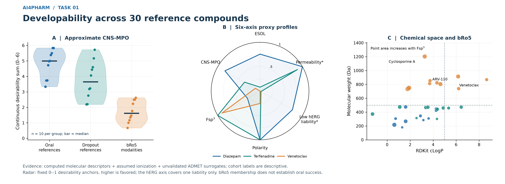
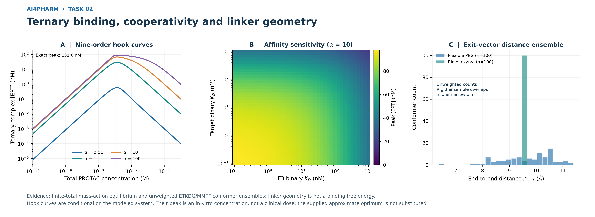
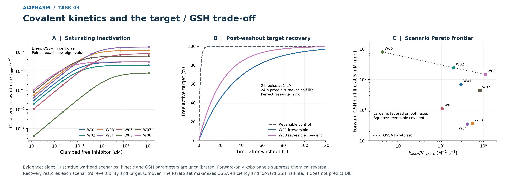
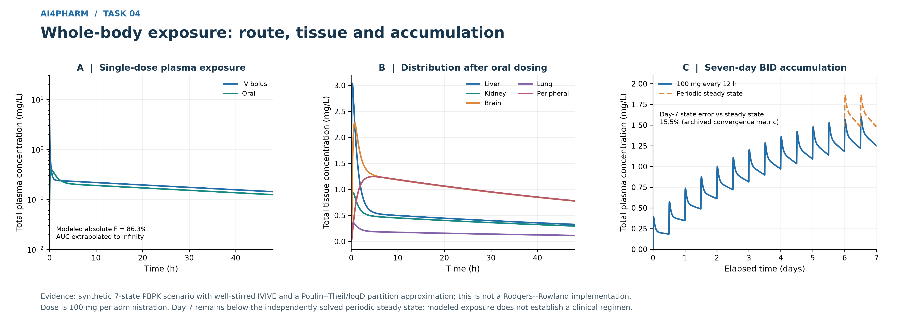
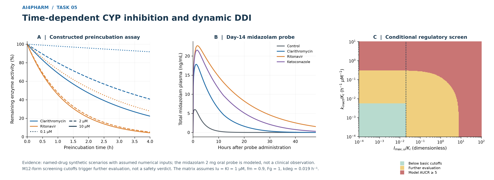
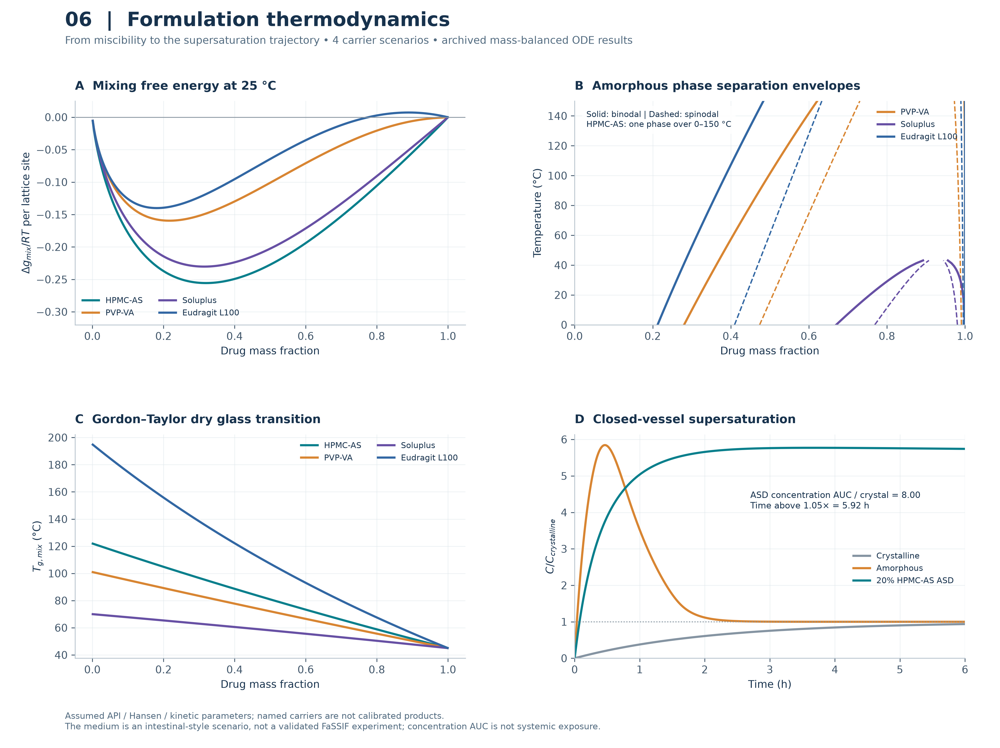
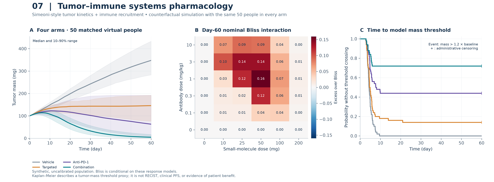
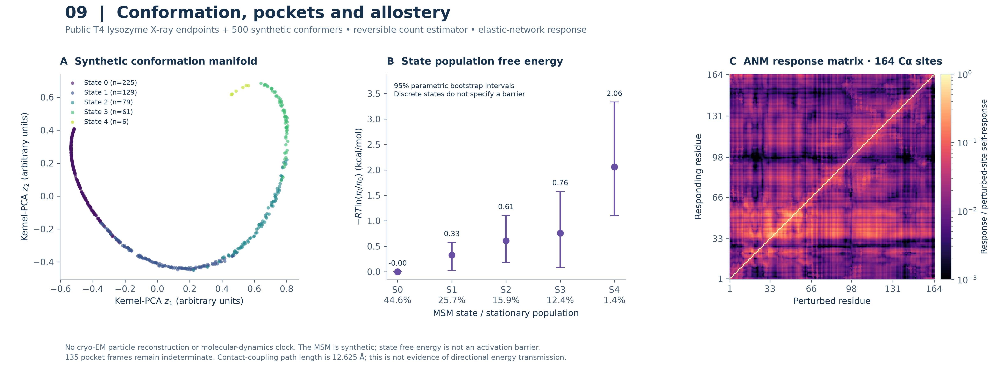
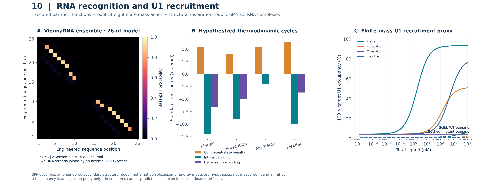

# AI4Pharm: ten computational dimensions of translational developability

**Integrated academic report · 21 September 2026**

[中文版](AI4PHARM_DECADE_TREATISE_ZH.md) · [Repository and execution entry](README.md) · [Ten project archives](projects/)

“Decade” in the requested filename denotes ten modules; it does not denote ten years of research. This report integrates the mathematics, archived calculations and experimental development interfaces of the suite. Its intended use is **auditable research and experimental prioritization on local computing resources**. It does not report clinical validation, newly measured pharmacology, a qualified manufacturing process or a unified calibrated digital twin.

## Reading map

[Research architecture](#architecture) · [1 MPO](#task1) · [2 TPD](#task2) · [3 Covalent kinetics](#task3) · [4 PBPK](#task4) · [5 CYP DDI](#task5) · [6 ASD](#task6) · [7 QSP](#task7) · [8 ADC](#task8) · [9 Structural allostery](#task9) · [10 RNA](#task10) · [Translation and verification](#translation)

<a id="architecture"></a>
## Research architecture: what is integrated

A lead becomes useful only when its chemistry, delivery, exposure, target engagement and biological response align. These requirements operate on different state variables and time scales. A molecular desirability score, a ternary-complex concentration, a tumor mass and a splicing probability cannot be added to form an interpretable universal quality score.

The omnibus entry point, [run_ai4pharm_omnibus_suite.py](run_ai4pharm_omnibus_suite.py), organizes the existing modules and their inspectable outputs. This is software and evidence integration. **Task 5 actually calls Task 4's PBPK derivative.** Other cross-module connections below are development interfaces that still need compound identity, compatible units, matched experimental conditions and calibration.

| Task | State or principal object | Archived computation | Evidence needed for a development decision |
|---|---|---|---|
| 1 | Structures, descriptors, desirability | 30 curated parent structures | Assay labels, pKa/logD, permeability and safety measurements |
| 2 | Free/binary/ternary species | Nine-order ligand sweep; 200 linker samples | Affinities, productive ubiquitination and target turnover |
| 3 | Free/bound/covalently modified target | Eight hypothetical warheads | Condition-specific kinetic and chemical-reactivity measurements |
| 4 | Seven drug amount states | IV, oral, repeated-dose and periodic solutions | Clearance, partitioning, binding and observed PK |
| 5 | PBPK plus six enzyme pools | 24 matched dynamic AUCR comparisons | Measured inhibition, turnover, metabolites and external DDI data |
| 6 | Phase composition and four mass pools | 324 phase rows; 69 integrations | API/polymer identity, phase behavior and dissolution measurements |
| 7 | PK, tumor damage and CTL | 50 paired virtual people, four regimens | Longitudinal tumor/immune observations and dose-response data |
| 8 | DAR species, cell and tissue amounts | 24 stochastic replicates; spatial transport | DAR-resolved analytics, payload release and spatial viability |
| 9 | Coordinates, states and response matrices | 500 synthetic conformers; five-state MSM | Target-specific conformational, kinetic and ligandability evidence |
| 10 | RNA partition functions and binding states | 14 folding runs; 976 equilibrium conditions | RNA binding, splice reporters and transcriptome selectivity |

Throughout, **literature fact**, **executed calculation**, **assumed parameter**, **model inference** and **experiment required** are separate categories. A public structure is experimental evidence for deposited coordinates; it does not make a synthetic trajectory experimental. An accurate numerical solver verifies equations; it does not establish that those equations describe a patient. Missing, invalid, censored and non-identifiable outputs remain distinct from zero.

Mathematical conventions are local to each chapter. Concentrations must be converted before transfer: $1\ \mathrm{nM}=10^{-9}\ \mathrm{M}$, $1\ \mathrm{\mu M}=10^{-6}\ \mathrm{M}$, and $C[\mathrm{nM}]=10^6C[\mathrm{mg/L}]/MW[\mathrm{g/mol}]$. Molar free energies use $RT$; single-molecule energies use $k_BT$. Arguments of logarithms and exponentials are dimensionless. A total concentration must not silently replace an unbound concentration.

<a id="task1"></a>
## 1. Molecular developability, MPO and bRo5

### From a preference function to an interpretable score

The panel contains ten oral references, ten toxicity-related references and ten bRo5 modalities. Structures are identity-checked and archetype labels are excluded from scoring. For a property preferred at small values, define

$$L(x;a,b)=\min\{1,\max[0,(b-x)/(b-a)]\},\qquad U=1-L,$$
$$W(x;a,b,c,d)=\min\{U(x;a,b),L(x;c,d)\}.$$

The implemented CNS-MPO sum is

$$M=L(P;3,5)+L(D;2,4)+L(MW;360,500)+W(TPSA;20,40,90,120)+L(HBD;0.5,3.5)+L(pK_a;8,10).$$

Every term lies in $[0,1]$, so $0\le M\le6$. The plateau and ramps encode preferences, not likelihoods. The original design context is CNS discovery; extrapolating its rank to large peripheral drugs changes the decision problem. The separately named custom variant is not substituted for the original cLogP preference. [Wager et al., CNS-MPO](https://doi.org/10.1021/cn100008c).

For a dominant base, $f_N=(1+10^{pK_a-pH})^{-1}$; for a dominant acid, $f_N=(1+10^{pH-pK_a})^{-1}$. If the ionized form partitions negligibly into octanol, $D\approx P f_N$, giving $\log D\approx\log P+\log f_N$. This approximation explains how assumed pKa propagates into the score; it fails when multiple microstates or ionized partitioning matter.

The ESOL equation is

$$\log_{10}(S/\mathrm{M})=0.16-0.63P-0.0062MW+0.066RotB-0.74AP.$$

Here $AP$ is aromatic heavy-atom fraction. Converting mol/L to µg/mL gives $S_{\mu g/mL}=10^{\log S}MW\times1000$. Coefficients originate from ESOL, while this implementation uses RDKit descriptors; identical coefficients do not establish identical predictions to the original software. [Delaney, ESOL](https://doi.org/10.1021/ci034243x).

### Calculated results and their boundary

The archived median CNS-MPO values are **4.990, 3.647 and 1.617** for oral, toxicity and bRo5 reference groups. These are overlapping distributions on a deliberately selected panel, not an externally validated classification test. The six-axis oral radar uses a separate custom score,

$$S_{oral}=100\operatorname{mean}(d_{sol},d_{perm},1-hERG_{proxy},d_{TPSA},d_{Fsp^3},d_{aromatic}).$$

The hERG, Caco-2 and HIA components are **unfitted heuristics**. Their bounded values, units and visual separation do not establish risk probabilities, transport coefficients or percentage absorption. $Fsp^3$ and aromatic-ring count are structural descriptors. ETKDG/MMFF internal hydrogen-bond geometry is an algorithmic conformer proxy; it does not measure environment-dependent chameleonicity. Failed geometry and the unsupported absolute chameleonic index remain missing.

**Parameter provenance and next decision.** Structures have frozen public provenance; ionization and several ADMET transformations are assumptions. The useful industrial interface is a compound-registration and assay-prioritization table. Measure pKa/logD, condition-specific solubility, bidirectional permeability with recovery, metabolic stability and hERG concentration-response. A predictive model then needs scaffold-separated external evaluation and an applicability domain. A low CNS score for venetoclax is not evidence against its peripheral oral use.

[Results](projects/task01_lead_developability/results_task1/developability_results.csv) · [Model card](projects/task01_lead_developability/MODEL_CARD.md) · [Full technical report](projects/task01_lead_developability/DEVELOPABILITY_MPO_REPORT_EN.md)



<a id="task2"></a>
## 2. Ternary equilibrium, cooperativity and targeted degradation

### Conservation gives the exact equilibrium and optimum

Let $p,e,t$ denote free PROTAC, E3 and target, and let $C=[EPT]$. Binary dissociation constants are $K_E,K_T$ and thermodynamic cooperativity is $\alpha>0$:

$$[EP]=ep/K_E,\quad[PT]=tp/K_T,\quad C=\alpha ept/(K_EK_T),$$
$$P_0=p+[EP]+[PT]+C,\quad E_0=e+[EP]+C,\quad T_0=t+[PT]+C.$$

Both assembly paths imply conditional dissociation constants $K_T/\alpha$ and $K_E/\alpha$, preserving the thermodynamic cycle. Eliminating free proteins gives

$$q(p)=\frac{(K_E+p)(K_T+p)}{\alpha p},\qquad Cq=(E_0-C)(T_0-C).$$

The physical root, rationalized to avoid subtractive cancellation, is

$$C=\frac{2E_0T_0}{E_0+T_0+q+\sqrt{(E_0-T_0)^2+2q(E_0+T_0)+q^2}}.$$

The map to total ligand is

$$P_0=p+(E_0-C)\frac{p}{K_E+p}+(T_0-C)\frac{p}{K_T+p}+C.$$

Since $q=(p+K_E+K_T+K_EK_T/p)/\alpha$, its derivative vanishes at $p_*=\sqrt{K_EK_T}$. The resulting maximum occurs at

$$P_{0,*}=\sqrt{K_EK_T}+\frac{E_0\sqrt{K_T}+T_0\sqrt{K_E}}{\sqrt{K_E}+\sqrt{K_T}}.$$

At this point the two binary occupancy fractions sum to one, removing the coefficient of $C$ from $P_0$. Thus the total optimum is independent of $\alpha$ **for this specified network**, although peak height and width change. The requested $\sqrt{(K_E+E_0)(K_T+T_0)}$ is not the general solution.

At low $p$, $C\sim\alpha E_0T_0p/(K_EK_T)$; at high $p$, $C\sim\alpha E_0T_0/p$. A hook therefore appears eventually for finite positive cooperativity in this two-binary-arm model. The argument does not establish a universal hook for all molecular glues or in every feasible concentration range.

### Executed equilibrium and degradation scenarios

With $E_0=T_0=100$ nM, $K_E=10$ nM and $K_T=100$ nM, the exact optimum is **131.623 nM**, versus **148.324 nM** from the supplied expression. Peak ternary concentrations are **0.570646, 29.0536, 66.1477 and 87.6755 nM** for $\alpha=0.01,1,10,100$. The respective 80%-of-own-maximum windows are biochemical shape descriptors, not clinical dosage windows.

The target-turnover extension is

$$\dot T_{total}=-V_{max}\frac{C}{K_m+C}+k_{base}(T_{initial}-T_{total}).$$

$V_{max}$ has concentration/time units; it is not a first-order constant. Re-equilibration as target is removed assumes fast binding, fixed E3 and catalytic PROTAC recycling. Productive ubiquitination and proteasomal processing are lumped into the effective flux. The default has $k_{base}=0$, which should not be mistaken for measured cellular resynthesis.

Two capped linker proxies each have 100 ETKDG/MMFF samples. Mean attachment-point distances are **9.6715 Å** for PEG and **9.6050 Å** for the rigid alkynyl example. They are not whole-PROTAC protein-to-protein distances. Algorithmic sample fractions do not support $-RT\ln p$ as a binding entropy without thermodynamic population weights; nor do they predict $\alpha$. Structural cooperativity has experimental precedent, but its value remains assumed here. [Gadd et al., ternary-complex structure](https://doi.org/10.1038/nchembio.2329).

**Parameter provenance and next decision.** All default affinities, turnover and protein concentrations are scenarios. Obtain binary and ternary binding data, cellular free exposure, time-resolved degradation and recovery, E3/target abundance and ubiquitination competence. The industry-facing question is whether affinity, geometry or turnover limits a measured degrader, not whether its synthetic peak can be labeled an optimal human dose.

[Equilibrium metrics](projects/task02_tpd/data_task2/equilibrium_metrics.csv) · [Linker samples](projects/task02_tpd/data_task2/linker_conformers.csv) · [Full technical report](projects/task02_tpd/TPD_TERNARY_COOPERATIVITY_REPORT_EN.md)



<a id="task3"></a>
## 3. Covalent inhibition, residence and GSH competition

### The full kinetic system and its reductions

For free target $F$, reversible complex $B$ and covalent complex $C$, mass action gives

$$\dot F=-k_{on}IF+k_{off}B,$$
$$\dot B=k_{on}IF-(k_{off}+k_{inact})B+k_{rev}C,\qquad\dot C=k_{inact}B-k_{rev}C.$$

Summing yields $\dot F+\dot B+\dot C=0$. Under irreversible chemistry, clamped free inhibitor and rapid pre-equilibrium, $B/(F+B)=I/(K_D+I)$, where $K_D=k_{off}/k_{on}$. Therefore $U=F+B$ obeys $\dot U=-k_{obs}U$ with

$$k_{obs}\approx\frac{k_{inact}I}{K_D+I}.$$

Rapid equilibrium is an assumption. Under a quasi-steady-state reduction, $K_{I,QSSA}=(k_{off}+k_{inact})/k_{on}$. For the unreduced irreversible two-state transient, put $a=k_{on}I$ and $s=a+k_{off}+k_{inact}$; the exact slow rate is

$$\lambda_{slow}=\frac{2ak_{inact}}{s+\sqrt{s^2-4ak_{inact}}}.$$

Its low-concentration slope is $k_{inact}/K_{I,QSSA}$. A fitted hyperbola need not equal this eigenvalue at intermediate concentrations. The archived fits explicitly distinguish $K_D$, $K_{I,QSSA}$ and fitted $K_I$.

Turnover adds synthesis $k_{syn}=k_{deg}E_{baseline}$ to $\dot F$ and loss $-k_{deg}$ to every target state. After perfect washout, an irreversible reduced model gives

$$F(t)=E_{baseline}-[E_{baseline}-F(0)]e^{-k_{deg}t}.$$

The noncovalent intrinsic residence $1/k_{off}$, chemical opening lifetime $1/k_{rev}$ and protein/adduct lifetime $1/k_{deg}$ answer different questions. For interacting bound states, mean residence is a first-passage quantity $\tau=\mathbf1^T(-Q)^{-1}p_{bound}(0)$, including reversal, rebinding within the complex and turnover.

### Electronic scenarios and the reactivity trade-off

Eight hypothetical warheads have RDKit/EHT calculations. With $\mu=(E_H+E_L)/2$ and $\eta=(E_L-E_H)/2$, the reported conventions are $\omega=\mu^2/(2\eta)$ and softness $1/(2\eta)$. A LUMO atomic population is a frozen-orbital local descriptor, not an experimentally validated Fukui function. The scenario barrier uses declared warhead baselines and a bounded LUMO correction; no transition state or IRC has been calculated.

At a 1 M standard concentration, a bimolecular Eyring scenario has $k_2=(k_BT/h)\exp(-\Delta G^\ddagger/RT)/C^\circ$. Multiplying by the assumed GSH thiolate fraction gives an apparent second-order rate. With buffered 5 mM GSH and **irreversible or forward-only** trapping,

$$I(t)=I_0e^{-k_{GSH}[GSH]t},\qquad t_{1/2}=\frac{\ln2}{k_{GSH}[GSH]}.$$

The actual W03/W07/W08 scenarios include reversible GSH adducts. Set $a=k_{GSH}[GSH]$, $b=k_{reverse,GSH}$ and $p=a/(a+b)$. For initially unbound drug, adduct concentration satisfies $C_{SG}(t)/I_0=p[1-e^{-(a+b)t}]$ and $I(t)/I_0=1-C_{SG}(t)/I_0$. Forward half-life $\ln2/a$ differs from relaxation half-life $\ln2/(a+b)$; actual 50% conversion occurs at $-\ln(1-0.5/p)/(a+b)$ only when $p>0.5$. It never occurs at finite time for $p\le0.5$. The Pareto plot uses the explicitly named forward half-life, not that potentially absent conversion time.

The ratio $(k_{inact}/K_D)/k_{GSH}$ is dimensionless, but compares two efficiencies rather than a clinical safety margin. The calculated Pareto set is **W02, W06, W08**; the user-defined sub-30-minute reactivity flag identifies **W03, W04, W05**. These assignments depend on uncalibrated kinetic and barrier inputs. GSH conjugation may represent detoxification; buffered-GSH kinetics do not simulate cellular GSH depletion or idiosyncratic DILI. [Flanagan et al., intrinsic GSH reactivity](https://doi.org/10.1021/jm501412a).

**Parameter provenance and next decision.** Orbital descriptors are executed semiempirical calculations; binding rates and barrier baselines are assumptions. Prioritize time-dependent inhibition with inhibitor depletion measured, intact-protein adduct identification, washout with target turnover, and matched-pH GSH kinetics. Fit real observation windows and uncertainty before linking residence to cellular potency. Chemical reversibility can tune residence, as experimentally demonstrated in particular kinase systems, but does not establish it for these hypothetical molecules. [Bradshaw et al.](https://doi.org/10.1038/nchembio.1817).

[Warhead results](projects/task03_covalent_kinetics/data_task3/warhead_results.csv) · [Washout trajectories](projects/task03_covalent_kinetics/data_task3/washout_trajectories.csv) · [Full technical report](projects/task03_covalent_kinetics/COVALENT_DRUG_KINETICS_REPORT_EN.md)



<a id="task4"></a>
## 4. PBPK, IVIVE and exposure-based regimen screening

### Deriving clearance and amount balances

Microsomal clearance is scaled with explicit binding and unit corrections:

$$CL_{int,u}=\frac{CL_{int,mic}}{f_{u,mic}}\,MPPGL\,m_{liver}\frac{60}{10^6}\quad[\mathrm{L/h}].$$

At liver steady state, inflow minus outflow equals metabolism: $Q_H(C_{in}-C_{out})=f_{u,b}CL_{int,u}C_{out}$. Solving for extraction gives

$$CL_{H,b}=\frac{Q_Hf_{u,b}CL_{int,u}}{Q_H+f_{u,b}CL_{int,u}},\quad f_{u,b}=f_{u,p}/R_b,\quad F_H=1-CL_{H,b}/Q_H.$$

The delivered system has blood, liver, GI depot, kidney, brain, lung and rest-of-body **amount** states. The GI state is a lumen depot, not a perfused gut wall. For tissue $i$, let $C_i=M_i/V_i$, $C_{v,i}=R_bC_i/K_{p,i}$, $C_p=M_B/(V_BR_b)$ and $C_a=C_{v,lung}$:

$$\dot M_g=-k_aM_g,\qquad\dot M_{lung}=Q_c(R_bC_p-C_a),$$
$$\dot M_i=Q_i(C_a-C_{v,i})\quad(i=kidney,brain,rest),$$
$$\dot M_L=Q_H(C_a-C_{v,L})+k_aF_aF_gM_g-H,$$
$$\dot M_B=\sum_{i=L,kidney,brain,rest}Q_iC_{v,i}-Q_cR_bC_p-CL_{renal,p}C_p.$$

Here $H=CL_{int,u}f_{u,p}C_L/K_{p,L}$ and $CL_{renal,p}=GFRf_{u,p}$. Add integral counters for hepatic loss, renal loss and $(1-F_aF_g)k_aM_g$; then total stored plus eliminated drug equals cumulative dose. Hepatic first pass emerges from liver metabolism; multiplying input by $F_H$ again would double count it.

Partition coefficients use a **Poulin–Theil composition form with an approximate logD substitution**, not full Rodgers–Rowland equations. For $A(f)=D(f_{nl}+0.3f_{ph})+f_w+0.7f_{ph}$, $K_{p,t}=A(t)f_{u,p}/[A(p)f_{u,t}]$. Equal-pH passive distribution, composition and binding are approximations. There is no BBB transporter/permeability mechanism. [Poulin and Theil](https://doi.org/10.1002/jps.10005).

### Periodicity must be demonstrated

In the linear case, $\dot M=AM$ between doses. An oral/IV bolus is an exact state jump $d$. The periodic post-dose solution satisfies

$$M_{ss,+}=e^{A\tau}M_{ss,+}+d,\qquad M_{ss,+}=(I-e^{A\tau})^{-1}d.$$

Likewise $AUC_{0,\infty}=e_B^T(-A)^{-1}M_0/(V_BR_b)$. These matrix solutions independently check ODE integration and the long tail. Optional saturable metabolism uses $H=V_{max}C_{u,L}/(K_m+C_{u,L})$; $K_m$ needs an additional input and linear dose scaling then ceases to apply.

The synthetic default gives $CL_{int,u}=38.88$ L/h, $CL_{H,b}=3.72699$ L/h and equal-dose oral/IV AUC ratio **86.273%**. At 100 mg, oral $C_{max}=0.393085$ mg/L. The terminal half-life is **62.5233 h**; **57.95%** of oral AUC lies after 48 h. The day-7 pre-dose trough is **1.25124 mg/L**, versus periodic **1.48126 mg/L**. The day-7 state differs by **15.53%** and **has not reached the 1% steady-state criterion**.

On an assumed dose lattice and exposure constraints, the research screen selects **15 mg BID**, with **90.443%** free-concentration coverage. The clinical recommended-dose field remains null. Neither the assumed toxicity threshold nor IC90-to-human-effect mapping has been established.

**Parameter provenance and next decision.** The compound is explicitly synthetic; physiology, partitioning and toxicity thresholds are scenario inputs. Measure binding, microsomal/hepatocyte clearance, transport and oral/IV PK with sufficient tail sampling. Qualify the model for a defined use before dose selection. This distinction is consistent with the FDA's emphasis on model context and supporting evidence. [FDA PBPK reporting guidance](https://www.fda.gov/regulatory-information/search-fda-guidance-documents/physiologically-based-pharmacokinetic-analyses-format-and-content-guidance-industry).

[Resolved inputs](projects/task04_pbpk/parameters_used.json) · [Results](projects/task04_pbpk/results_summary.json) · [Full technical report](projects/task04_pbpk/PBPK_DOSE_PREDICTION_REPORT_EN.md)



<a id="task5"></a>
## 5. CYP inhibition, enzyme recovery and DDI

### From enzyme loss to dynamic clearance

For enzyme abundance normalized to one at baseline,

$$\dot E=k_{deg}(1-E)-k_{obs}(t)E,\qquad k_{obs}(t)=\frac{k_{inact}I_u(t)}{K_I+I_u(t)}.$$

At constant inhibitor, $E_{ss}=k_{deg}/(k_{deg}+k_{obs})$ and $E(t)=E_{ss}+[E(0)-E_{ss}]e^{-(k_{deg}+k_{obs})t}$. Reversible occupancy then scales activity by $a=E/(1+I_u/K_i)$. After complete inhibitor removal, recovery is $E(t)=1-[1-E(0)]e^{-k_{deg}t}$; persistent inhibitor invalidates this simple recovery law.

The archived static screens implement

$$R_1=1+C_{max,u}/K_i,\qquad R_2=1+\frac{k_{inact}5C_{max,u}}{k_{deg}(K_I+5C_{max,u})}.$$

These are screening quantities, not AUCR. The implementation's hepatic triggers correspond to $R_1\ge1.02$ and $R_2\ge1.25$; the oral intestinal screen is separate. M12 specifies the unbound-concentration context and factor 5 for the TDI screen. The code uses a simulated day-14 cycle peak, without proving periodic steady state, and therefore retains an exposure-input limitation. [FDA/ICH M12, sections 2.1.2 and 7.5](https://www.fda.gov/media/161199/download).

In an inhibition-only simplified static model,

$$AUCR=\frac{1}{a_g(1-F_g)+F_g}\frac{1}{a_hf_m+(1-f_m)}.$$

Reduced enzyme activity increases this ratio. The generalized implementation instead calculates liver extraction and intestinal escape with inhibited intrinsic clearance, keeping renal clearance explicit. Intrinsic-clearance weights are not automatically the same as systemic fractions metabolized. It is checked against constant-inhibition PBPK integration.

### Actual coupling and calculated findings

Task 5 imports Task 4's derivative, adds hepatic/intestinal pools for CYP3A4, CYP2D6 and CYP2C9, and modifies matching metabolism and loss counters. Twenty-eight BID perpetrator doses span 14 treatment days; recovery is followed for ten days after the last dose. Oral midazolam 2 mg and metoprolol 50 mg are separately simulated probes, not an observed clinical cocktail.

The six drug names label constructed scenarios. Day-14 midazolam AUCR values are **11.6746, 6.4009, 16.9622, 2.1647, 1.4253 and 1.0000** for ketoconazole, clarithromycin, ritonavir, fluconazole, quinidine and the near-null amoxicillin scenario. They must not be cited as those drugs' measured clinical interaction magnitudes. Clarithromycin-scenario hepatic/intestinal 90% enzyme recovery occurs at **4.9976/3.3666 days**; both ritonavir CYP3A4 pools are still below 90% at ten days and are **right-censored**.

The source registry includes published clarithromycin model estimates ($K_I=5.3$ µM; hepatic/intestinal $k_{inact}=0.4/4$ h⁻¹). Their 246-row constant-exposure transfer-function supplement is separate from the principal assumed PK scenarios. [Quinney et al.](https://pmc.ncbi.nlm.nih.gov/articles/PMC2812061/).

**Parameter provenance and next decision.** Most numeric PK/inhibition inputs are assumptions; the three published values are model estimates rather than newly measured unbound constants. A declining activity curve alone cannot identify heme ligation, heme damage or apoprotein adduction. Obtain NADPH/time/concentration controls, inhibitor depletion and unbound fractions, removal/recovery data, metabolite characterization, induction and external probe PK. The current model omits induction, self-inhibition, inhibitory metabolites, transporter effects and genetic phenotypes. It supports assay and sampling design, not contraindication or patient washout instructions.

[Parameter provenance](projects/task05_cyp_ddi/results/parameter_provenance.csv) · [Dynamic/static comparison](projects/task05_cyp_ddi/results/dynamic_static_comparison.csv) · [Full technical report](projects/task05_cyp_ddi/CYP_DDI_KINETICS_REPORT_EN.md)



<a id="task6"></a>
## 6. ASD thermodynamics, glass transition and supersaturation

### Phase equilibrium and its curvature

Drug mass fraction $w$ becomes volume fraction $\phi=(w/\rho_d)/[(w/\rho_d)+(1-w)/\rho_p]$. With $N_d=1$ and assumed polymer segment count $N_p$, the dimensionless lattice mixing free energy is

$$f(\phi)=\frac{\phi}{N_d}\ln\phi+\frac{1-\phi}{N_p}\ln(1-\phi)+\chi\phi(1-\phi).$$

The weighted Hansen approximation is $\chi=V_d[(\Delta\delta_D)^2+0.25(\Delta\delta_P)^2+0.25(\Delta\delta_H)^2]/RT$. Because MPa·cm³ = J, the specified units give dimensionless $\chi$.

Differentiation gives $f''=1/(N_d\phi)+1/[N_p(1-\phi)]-2\chi$. Spinodals satisfy $f''=0$. Binodals instead satisfy a common tangent, $f'(\phi_1)=f'(\phi_2)=[f(\phi_2)-f(\phi_1)]/(\phi_2-\phi_1)$, equivalent to equality of chemical potentials. Solving $f''=f'''=0$ gives

$$\phi_{d,c}=\frac{\sqrt{N_p}}{\sqrt{N_d}+\sqrt{N_p}},\quad \chi_c=\tfrac12(N_d^{-1/2}+N_p^{-1/2})^2.$$

For $N_p=100$, critical **drug** fraction is 0.909. This is amorphous–amorphous phase separation; being single phase here does not exclude crystalline precipitation.

### Mobility, finite dose and the correct nucleation exponent

Gordon–Taylor uses absolute temperatures: $T_g=(w_dT_{g,d}+Kw_pT_{g,p})/(w_d+Kw_p)$. A declared sorption law converts RH to water mass; RH is not itself a mass fraction. The VFT relaxation model $\tau=\tau_0\exp[B/(T-T_0)]$ is evaluated only for $T>T_0$. **Twelve of 32 storage cases are outside that domain**; even enormous in-domain extrapolations are not shelf-life predictions.

For undissolved mass $U$, dissolved mass $L$, crystals $X$ and absorbed-sink mass $A$,

$$\dot U=-J_d,\quad\dot L=J_d-J_p+J_r-J_a,\quad\dot X=J_p-J_r,\quad\dot A=J_a.$$

Thus $U+L+X+A$ is conserved. With $C=L/V$, Noyes–Whitney mass flux is $J_d=(D/h)S_0(U/U_0)^{2/3}(C_{source}-C)_+$. A concentration equation needs $J_d/V$; omission of vessel volume is dimensionally wrong. A polymer blend may reduce $C_{source}$ through drug activity while slowing precipitation, creating a genuine trade-off.

For a spherical nucleus, $\Delta G(r)=4\pi r^2\gamma-(4\pi/3)r^3\Delta\mu/v$. Setting its derivative to zero gives $r_*=2\gamma v/\Delta\mu$ and $\Delta G_*=16\pi\gamma^3v^2/(3\Delta\mu^2)$. With $\Delta\mu=k_BT\ln S$,

$$\frac{\Delta G_*}{k_BT}=\frac{16\pi\gamma^3v^2}{3(k_BT)^3(\ln S)^2},\quad v=V_m/N_A,\quad S>1.$$

Here $\gamma$ is in J/m² and $v$ is in m³ per molecule: the input $V_m$ in cm³/mol is multiplied by $10^{-6}$ before division by $N_A$. This dimensionless quantity enters the exponential; the supplied prompt's extra dimensional barrier was not used. Nucleation is off for $S\le1$.

The fifth state $z$ is dimensionless effective growth-site activation. With $(x)_+=\max(x,0)$, fixed polymer concentration $c_p$, initial dose $D_0$ and barrier $B=\Delta G_*/k_BT$, the implemented closure is

$$\dot z=k_{nuc}(S-1)_+e^{-B}-k_{loss}(1-S)_+z,$$
$$J_p=\frac{k_{growth}}{1+\beta c_p}\left\{z+s_0(X/D_0)^{2/3}\right\}(C-C_{crys})_+V,$$
$$J_r=K_{crys}(X/D_0)^{2/3}(C_{crys}-C)_+,\qquad J_a=k_aL.$$

$K_{crys}=DA_{crys}/h$ has volume/time units, with seconds converted to hours; $k_{nuc},k_{loss},k_{growth},k_a$ are in h⁻¹ and $\beta$ in mL/mg. The code uses a bounded numerical exponent and nonnegative state values in evaluating fluxes, retaining raw solver undershoots for diagnostics. The site state is not an observed particle count, and induction means reaching precipitated mass equal to 1% of dose. These equations correspond to `simulation(...).rhs` in the [ASD driver](projects/task06_asd/run_task6_asd_formulation_supersaturation_kinetics.py).

### Calculated formulation trade-offs

For a hypothetical 100 mg dose in 900 mL, the 20% HPMC-AS scenario gives closed-vessel AUC **0.319124 mg·h/mL**, **7.997-fold** over crystal; time above $S=1.05$ is **5.921 h**. Six-hour absorbed-sink mass ratio is **8.795**, not human bioavailability. With $J_a=k_aL$, $A=k_aV\int Cdt$; sink mass and its corresponding AUC are mathematically linked, not independent validation.

The 30% loading has larger closed-vessel AUC, **0.370222**, so 20% is not established as optimal. A 27-scenario sensitivity grid gives absorption ratios **5.961–8.803**; this is an analyst-defined range, not a confidence interval. Nominal pH 6.8 does not make the vessel a validated FaSSIF experiment without specified bile salts, colloids and free-drug measurements.

**Parameter provenance and next decision.** The API is hypothetical; most polymer, transport and nucleation values are assumed. Two typical polymer Tg values have manufacturer provenance, not batch-specific confirmation. Measure DSC/XRPD, moisture sorption, phase behavior, free versus total dissolved drug and particle evolution. Calibrate dissolution and permeability jointly before connecting to PBPK. Industry relevance is selecting falsifiable formulation comparisons and identifying the activity–mobility–precipitation trade-off.

[Inputs](projects/task06_asd/inputs/parameters.json) · [Summary](projects/task06_asd/results/summary.json) · [Full technical report and primary-source registry](projects/task06_asd/ASD_FORMULATION_KINETICS_REPORT_EN.md)



<a id="task7"></a>
## 7. Tumor–immune QSP and paired virtual-cohort analysis

### Delayed damage and immune feedback

The model uses days, mg, mg/L and normalized CTL density. A Simeoni-type growth function is

$$G(w_0)=\frac{\lambda_0w_0}{[1+(\lambda_0w_0/\lambda_1)^\psi]^{1/\psi}}.$$

At small mass $G\approx\lambda_0w_0$; at large mass $G\to\lambda_1$ in mg/day, not a carrying capacity. Small-molecule damage enters three nonproliferating transit states:

$$\dot w_0=G-k_2C_sw_0-k_{kill}Ew_0,\quad\dot w_1=k_2C_sw_0-w_1/\tau,$$
$$\dot w_2=(w_1-w_2)/\tau,\quad\dot w_3=(w_2-w_3)/\tau.$$

Summing yields $\dot W=G-w_3/\tau-k_{kill}Ew_0$. Damage entry does not instantly remove mass. Three exponential residence stages produce a mean delay $3\tau$, **4.5 days** here. [Simeoni et al.](https://pubmed.ncbi.nlm.nih.gov/14871843/).

With antigen proxy $J_{ag}=w_3/\tau$ and antibody occupancy $RO=C_m/(K_D+C_m)$,

$$\dot E=s_{basal}+\alpha\frac{J_{ag}}{K_{ag}+J_{ag}}-[\mu_E+k_{exh}PDL1(1-RO)]E.$$

$s_{basal}=(\mu_E+k_{exh}PDL1)E_{baseline}$ ensures nonzero untreated immune equilibrium. Direct immune killing is not included in antigen release; this is a simplification. Oral PK follows dose superposition of $FDk_a[e^{-k_et}-e^{-k_at}]/[V(k_a-k_e)]$; antibody input is a finite 0.5-hour infusion, not an instantaneous bolus. Integration is segmented at dosing changes.

### Synergy and event endpoints

Within each matched virtual person, $f_A=1-W_A/W_V$ and the Bliss reference is $f_A+f_B-f_Af_B$. Excess over Bliss is the observed combination inhibition minus that reference. Loewe instead requires invertible monotherapy dose–effect curves: $CI=d_A/D_A(f_{AB})+d_B/D_B(f_{AB})$. If a monotherapy cannot attain the combination effect within support, its inverse dose is missing; extrapolating it would invent evidence.

Clearance, doubling time and basal CTL have independent lognormal variability. For arithmetic mean $m$ and CV $c$, $\sigma^2=\ln(1+c^2)$ and $\mu=\ln m-\sigma^2/2$. The same 50 people receive all four counterfactual regimens; there are **50 independent synthetic parameter vectors**, not 200 independent patients.

Mean day-60 masses are **347.151, 140.959, 84.198 and 7.744 mg** for vehicle, targeted therapy, anti-PD-1 and combination. Day-60 paired mean Bliss excess is **0.06825**. Only **9 of 25** interior dose-grid cells have supported Loewe indices; **16 remain unavailable**.

The event is first modeled tumor mass above 120% of baseline, administratively censored at day 60. Kaplan–Meier is $\hat S(t)=\prod_{t_j\le t}(1-d_j/n_j)$. This event is **not RECIST progression or clinical PFS**. Event counts are 50, 43, 28 and 14; early events remain events even if later regression occurs. RECIST evaluates lesion measurements and additional rules not represented by this mass proxy. [RECIST Working Group](https://recist.eortc.org/recist-1-1/).

Restricted mean event-free time integrates $\hat S$ to 60 days. Combination-minus-targeted and combination-minus-antibody contrasts are **31.493 and 15.073 days**, conditional on the model. Paired bootstrapping and person-clustered Cox uncertainty retain the shared-person design. Synthetic p-values, HRs and SEM quantify selected simulation variation; they do not validate clinical efficacy or proportional hazards.

**Parameter provenance and next decision.** All efficacy/PK values are hypothetical; the 100 mg tumor and 70 kg dose conversion do not establish cross-species translation. Obtain monotherapy dose ranges, matched combination timing, tumor exposure, CTL and antigen observations, and an explicit size-to-mass observation model. Industrial use would be experimental design and comparison of mechanistic hypotheses, with held-out longitudinal response and uncertainty propagation.

[Cohort parameters](projects/task07_qsp/virtual_patients.csv) · [Results](projects/task07_qsp/results_summary.json) · [Full technical report](projects/task07_qsp/QSP_IMMUNO_ONCOLOGY_REPORT_EN.md)



<a id="task8"></a>
## 8. ADC manufacturing distribution, payload release and tissue transport

### A finite-reagent stochastic conjugation model

Four independently reduced interchain disulfides give $b\sim Binomial(4,p)$, with $p=1-e^{-k_{red}t_{red}}$ and available capacity $m=2b$. The joint state $f_{m,n}$ records capacity $m$ and actual DAR $n\le m$. Twenty-five states retain odd DAR species. With free linker equivalents $L$,

$$J_{m,n}=k_0(m-n)e^{-\alpha n}Lf_{m,n},\quad\dot f_{m,n}=J_{m,n-1}-J_{m,n},\quad\dot L=-\sum_{m,n}J_{m,n}.$$

Boundary fluxes vanish. Summation proves conservation of antibody fraction and $L+\sum n f_{m,n}$. Gillespie events implement the same stoichiometry at finite population. At 2, 4, 6 and 10 linker equivalents, mean DAR values are **2.000000, 3.999320, 5.912516 and 7.523958**. Twenty-four 1,000-antibody replicates at four equivalents give **3.999500** mean DAR, consistent with finite-population sampling rather than exact deterministic identity.

The HIC scenario is a sum of normalized Voigt kernels, $y(t)=\sum_n f_nV(t-t_n;\sigma,\gamma)$, with assumed $t_n=2+2n^{1.15}$ min. All DAR0–8 components contribute. A hypothetical DAR4 cut has **96.9147%** area purity and **94.6290%** recovery within this noiseless model. Known-kernel NNLS recovery is an arithmetic check, not validation of a real assay. The downstream material remains the whole four-equivalent product, not the purified cut.

### Cellular and spatial conservation

Binding/internalization/sorting feed lysosomal ADC. An effective processing flux $v=V_{max}L_y/(K_m+L_y)$ releases $\overline{DAR}\,v$ payload. Surface/recycling receptors and antibody/payload states have separate conservation equations. Linker cleavage, self-immolation and antibody processing are lumped; the effective protease is not exclusively cathepsin B. Experimental CatB-deletion work supports this limitation for tested Val-Cit systems. [Caculitan et al.](https://doi.org/10.1158/0008-5472.CAN-17-2391).

For the ten states $(X,R,B,E,L_y,R_i,Z,P,Q,M)$, respectively external ADC, free receptor, bound ADC, endosomal ADC, lysosomal ADC, recycling receptor, degraded ADC, cytoplasmic payload, exported payload and metabolized payload, define

$$J_b=k_{on}C_{ext}R,\ J_u=k_{off}B,\ J_i=k_{int}B,\ J_r=k_{rec}R_i,\ J_s=k_{sort}E,\ J_c=v,\ J_x=k_{perm}P,\ J_m=k_{met}P.$$

Here counts are per cell; $C_{ext}[\mathrm{nM}]=X/(N_A10^{-9}V_{bath}[\mathrm L])$ and $k_{on}$ is nM⁻¹h⁻¹. The complete cellular ODE is

$$\dot X=-J_b+J_u,\quad\dot R=-J_b+J_u+J_r,\quad\dot B=J_b-J_u-J_i,$$
$$\dot E=J_i-J_s,\quad\dot L_y=J_s-J_c,\quad\dot R_i=J_i-J_r,\quad\dot Z=J_c,$$
$$\dot P=\overline{DAR}J_c-J_x-J_m,\quad\dot Q=J_x,\quad\dot M=J_m.$$

These are `cell_rhs` in the [ADC driver](projects/task08_adc/run_task8_adc_dar_cleavage_bystander_dynamics.py). Direct summation gives $X+B+E+L_y+Z=X_0$, $R+B+R_i=R_0$ and $\overline{DAR}(X+B+E+L_y)+P+Q+M=\overline{DAR}X_0$. Intracellular antibody degradation releases payload without consuming receptor because receptor recycling was separated at internalization.

For a spherically symmetric tissue, extracellular concentration obeys the diffusion operator $r^{-2}\partial_r(r^2D\partial_r C_e)$ plus release, clearance and exchange. The implementation integrates **amounts in shells**. Across face $i+1/2$, flux is

$$J_{i+1/2}=D\epsilon\frac{4\pi r_{i+1/2}^2}{\Delta r}(C_{e,i}-C_{e,i+1}).$$

Shared-face gains and losses cancel when summed. Neighbor-cell exchange is $k_{perm}(V_iC_{e,i}-N_i)$, with the opposite sign extracellularly. Zero inner flux enforces symmetry; the absorbing outer boundary is an explicitly counted sink. Implicit Euler solves $(I-\Delta t A)N_{k+1}=N_k+\Delta t b_k$ on 80 shells over 72 h.

A 20 µm source core sits inside a 200 µm sphere. A conditional survival observation is $S=\exp[-\int k_{max}C_i/(EC50+C_i)\,dt]$. It does not feed death back into geometry or release. The Ag-positive cellular model supplies payload one way; tissue back-diffusion into those source cells is absent.

With hypothetical high/low permeability rates 0.2/0.002 h⁻¹, mean Ag-negative survival is **0.958800/0.999848**. The high-permeability extracellular 50 nM contour reaches a sampled shell center at **23.75 µm**; this is not a validated killing radius. The results show limited average bystander response in the chosen sphere, not broad eradication. Mass errors near $10^{-14}$ establish bookkeeping precision, not biological accuracy.

**Parameter provenance and next decision.** Kinetics, HIC kernels, receptor abundance, permeability and response parameters are assumptions supported only by mechanistic motivation. Measure DAR-resolved chemistry and detector response, processing species by LC-MS, plasma stability, internalization, diffusion/efflux and spatial coculture viability. Product-specific DAR optimization requires exposure and manufacturability; neither historical DAR4 examples nor this model prove a universal optimum.

[Parameter provenance](projects/task08_adc/parameter_provenance.csv) · [Results](projects/task08_adc/summary.json) · [Full report and sources](projects/task08_adc/ADC_TRANSLATIONAL_ENGINEERING_REPORT_EN.md)


<a id="task9"></a>
## 9. Synthetic structural heterogeneity, cavities and mechanical response

### Public structural anchors do not supply physical trajectory time

The anchors are X-ray structures **4W51 and 4W59 of T4 lysozyme L99A**, not a cancer kinase or cryo-EM dataset. There are 1,278 common heavy atoms and 164 Cα residues. After core Kabsch alignment, coordinates interpolate as $x(q)=(1-q)x_c+qx_b+\delta x(q)$ with declared loop perturbations. Five hundred samples provide a reproducible geometry benchmark, not MD, an energy-minimized path or an apo conformational population. [Merski et al.](https://doi.org/10.1073/pnas.1500806112).

Kernel PCA centers an RBF similarity matrix of aligned coordinates and diagonalizes it to create two geometric latent axes. Gaussian-smoothed atomic-number deposits create density proxies with 1 Å voxels and 2.5 Å FWHM. No particles, CTF, orientation inference, FSC or cryoDRGN training are present. Simulated smoothing is not experimental resolution.

### Reversible states and the population-energy distinction

From adjacent transition counts $C$, the estimator forms symmetric flux $F=(C+C^T)/2+0.5S$ on the prescribed adjacency. Then

$$T_{ij}=F_{ij}/\sum_jF_{ij},\qquad \pi_i=\frac{\sum_jF_{ij}}{\sum_{ij}F_{ij}}.$$

Because $F$ is symmetric, $\pi_iT_{ij}=\pi_jT_{ji}$. This enforces detailed balance by construction; it is not a maximum-likelihood fit. The state population difference is

$$G_i-G_0=-RT\ln(\pi_i/\pi_0).$$

There is no transition-state barrier in this equation. With the open state absorbing, the first-step relation $m_i=\tau+\sum_jT_{ij}m_j$ gives $(I-T_{NN})m=\tau\mathbf1$. The assigned $\tau=10$ ns is a **synthetic clock**; unordered experimental snapshots cannot identify it.

State counts are **[225,129,79,61,6]**. Estimated open-minus-closed energy is **2.057351 kcal/mol**, with a conditional parametric-bootstrap interval **1.101320–3.334307**; the generator's imposed difference is **1.6 kcal/mol**. MFPT **2630.064 ns** depends entirely on that clock and state model. Twenty-two of 200 bootstrap trajectories lack a state, exposing limited sampling. The reported intervals omit uncertainty in geometry and physical kinetics.

### Cavity censoring and a singular Hessian

A local probe/occlusion algorithm measures connected voxel volume; it is not a globally validated ligandability detector. The unbounded supplied score is retained with a dimensionless log-volume argument, and a sigmoid is additionally exported as an uncalibrated bounded heuristic. Recorded component volumes span **76.78–209.67 ų**, but **135 of 500 frames touch the ROI boundary**. Their full volumes and joint threshold classifications are unknown. The other 365 do not meet the requested joint gate. Larger ROIs can change connectivity, so a larger number alone is not convergence.

For an elastic network, each contact contributes $\tfrac12k[(\delta r_i-\delta r_j)\cdot u_{ij}]^2$. Twice differentiating yields diagonal $kuu^T$ and off-diagonal $-kuu^T$ Hessian blocks. Six rigid-body modes make $H$ singular; internal response uses $\delta r=H^+F$ after removing null modes. For isotropic unit force at residue $j$,

$$M_{ij}=\frac13\|H^+_{ij}\|_F^2.$$

This follows from $\mathbb E(ff^T)=I/3$. Random-force estimates approach that analytic expectation. Normalized coupling supports a contact-constrained graph route, not demonstrated energy flow or causality. The selected route **106→11 spans 12.624658 Å**, so the requested >30 Å result was not obtained.

**Parameter provenance and next decision.** Coordinates are experimental; state energies, timing, interpolation, score and spring model are specified assumptions. The useful industry interface is an auditable filter for structural support and geometric failure. Target-specific structural ensembles, kinetic measurements, side-chain/solvent refinement, ligandability benchmarks and perturbation experiments must precede a pocket-discovery claim. [ANM](https://doi.org/10.1016/S0006-3495(01)76033-X) and [PRS](https://doi.org/10.1371/journal.pcbi.1000544) motivate methods, not validation of this path.

[Results](projects/task09_cryoem_allostery/results/summary.json) · [ROI sensitivity](projects/task09_cryoem_allostery/results/roi_sensitivity.json) · [Full technical report](projects/task09_cryoem_allostery/CRYOEM_CRYPTIC_POCKET_REPORT_EN.md)



<a id="task10"></a>
## 10. RNA ensembles, ligand thermodynamics and U1 recruitment

### Partition functions and measured-coordinate geometry

ViennaRNA evaluates a secondary-structure partition sum $Z=\sum_s e^{-G_s/RT}$ under its stated nearest-neighbor model. Ensemble free energy is $-RT\ln Z$, and $P_{ij}=Z^{-1}\sum_{s:(i,j)\in s}e^{-G_s/RT}$. Every nucleotide also has the unpaired state $u_i=1-\sum_jP_{ij}$, giving

$$H_i=-\sum_jP_{ij}\log_2P_{ij}-u_i\log_2u_i,$$

with $0\log0=0$. Omitting $u_i$ would not be the entropy of the full per-position state distribution. The 26-nt sequence `AUACUUACCUGUUCGGGAGUAAGUCU` is an **engineered tethered hairpin**: pseudouridine is replaced by U and an artificial UUCG linker joins two strands. It is not native SMN2 pre-mRNA.

Fourteen genuine folding calculations cover WT/A18C and seven temperatures. At 37°C, WT ensemble energy is **−4.840479 kcal/mol** and maximum positional entropy **0.925397 bits**. No nucleotide exceeds the requested 1.2-bit gate under that condition; this is not a claim across all temperatures, since seven WT positions exceed it at 60°C. Unpaired probability or entropy does not supply a tertiary base-flipping energy.

The independent geometry stream uses 20 NMR models each from **6HMI/6HMO**, retaining deposited modifications. The ligand in this study is **SMN-C5, not risdiplam**. NMR model spread is not a time series or equally weighted Boltzmann population. [Campagne et al.](https://doi.org/10.1038/s41589-019-0384-5).

The 560 geometry rows distinguish phosphate center-to-center chords, local free-sphere diameter, water-probe clearance, projected depth and coarse screened potential. These are operational features, not standardized groove widths or binding free energies. Debye–Hückel screening assumes uniform dielectric and monovalent salt; the calculated Debye length is **8.011 Å**. Potentials exceeding the thermal scale around 26.7 mV limit quantitative linear-response interpretation.

### The exact binding cycle

Let $q=e^{-\Delta G_{conf}/RT}$ be the competent-to-closed unliganded weight, $K_O=C^\circ e^{\Delta G_{bind,O}/RT}$ and $K_C$ the closed-state dissociation constant. Summing bound and unbound weights yields

$$K_{D,eff}=\frac{1+q}{1/K_C+q/K_O}.$$

Only when closed-state binding is negligible does this reduce to $K_O(1+e^{\Delta G_{conf}/RT})$. The bound-state conformational difference is $\Delta G_{conf,bound}=\Delta G_{conf}+\Delta G_{bind,O}-\Delta G_{bind,C}$, so both routes close the thermodynamic cycle. An equilibrium cycle cannot distinguish induced fit from conformational selection kinetically.

The four scaffold energy decompositions are **explicit hypotheses**, not docking, FEP or measured drug affinities. For the planar archetype, opening penalty 5.5 kcal/mol and competent-state binding −12 kcal/mol give a full effective $K_D$ of **26.2809 µM**. Ligand-specific opening penalties refer to different competent substates, not inconsistent energies for a single shared transition.

### Finite ligand and U1 pools

For each target/off-target RNA pool, states are $C,O,CL,OL,CU,OU,CLU,OLU$. With $u=U/K_U$ and $\alpha=e^{-\Delta\Delta G_{splice}/RT}$, weights are

$$[1,q,L/K_C,qL/K_O,u,qu,Lu/K_C,qLu\alpha/K_O].$$

Normalization gives binding probabilities. Two conserved totals require

$$L_{tot}=L+\sum_rR_{r,tot}P_r(L\text{ bound}),\qquad U_{tot}=U+\sum_rR_{r,tot}P_r(U\text{ bound}).$$

Numerical roots determine free $L,U$; an imposed Hill curve is unnecessary. Defaults are target RNA 2 nM, aggregate off-target RNA 30 nM and U1 100 nM. One hundred times target U1 occupancy is an **inclusion proxy**, not measured exon inclusion. Real splice processing has kinetic and ATP-dependent steps absent here. U1-C findings for branaplam must not be universally assigned to risdiplam or confused with U1-A. [White et al.](https://www.nature.com/articles/s41467-024-53124-5).

Across **976** main conditions and **120** sensitivity conditions, the planar WT proxy rises from **4.72469%** to an analytic saturation limit **93.27945%**; its model total-ligand EC50 is **1.78816 µM**. EC50 is emitted only for a supported monotonic enhancing response. Nonmonotonic cases retain crossings and direction without a misleading single EC50. Qualifying target/off-target bands can be disjoint or right-censored; the planar band's upper boundary is censored at the grid edge, not a safe upper dose.

**Parameter provenance and next decision.** Folding parameters are model-based thermodynamics; NMR coordinates are public experimental data; ligand energies and recruitment coupling are uncalibrated assumptions. The A18C folding control and counterfactual binding “mutant” are separate constructions. Prioritize salt-matched binding, SHAPE/DMS/NMR constraints, splice-reporter responses, protein dependence and transcriptome-wide selectivity. Exposure, permeability and compound identity are needed before connecting this module to PBPK or medicinal-chemistry ranking.

[Results](projects/task10_rna_splicing/results/results_summary.json) · [Thermodynamic assumptions](projects/task10_rna_splicing/results/thermodynamic_cycles.csv) · [Full technical report](projects/task10_rna_splicing/RNA_TARGETED_CADD_REPORT_EN.md)



<a id="translation"></a>
## Translation, local-compute strategy and acceptance gates

### What local computation can add now

This suite uses small algebraic systems, ODEs, finite-volume transport, semiempirical descriptors and modest structural matrices. Those calculations are compatible with bounded local CPU execution. Parallel agents can independently audit equations, extend parameter sweeps, improve figures and review evidence, while numerical processes retain conservative thread limits. More agent activity does not provide experimental replicates, additional patients or independent biological validation.

The most valuable next local work is decision-oriented: test alternative model structures, quantify which parameters change a proposed experimental choice, and preserve negative outcomes. For a response $y(\theta)$, a dimensionless local sensitivity $S_j=(\theta_j/y)\partial y/\partial\theta_j$ can rank perturbations only where derivatives and scales are meaningful. An analyst-defined sweep is not a probability distribution. A confidence interval requires a stated sampling/inference model; structural uncertainty requires comparisons beyond varying parameters within one model.

For experimental fitting, define an observation model $y_k=h[x(t_k;\theta)]+\epsilon_k$ with measured assay noise and censoring. An apparently excellent trajectory fit may leave parameters unidentifiable. Profile likelihood, parameter correlations, held-out conditions and prediction checks should precede claims that a unique mechanism has been found. Do not calibrate and validate against the same synthetic curve.

### Cross-module transfers that require explicit contracts

| Proposed connection | Minimum transfer contract | Present status |
|---|---|---|
| 1 → 4 | Same compound, microstate, measured binding/clearance and unit conversions | Descriptor export possible; not a calibrated exposure chain |
| 6 → 4 | Free dissolved concentration, permeability, transit and first-pass model | Uptake sink is not yet a validated absorption input |
| 4 → 5 | Shared amount balances; inhibited intrinsic clearance and matched loss counters | Implemented in Task 5 |
| 2/3 → 7 | Cellular free exposure, target engagement, turnover and effect mapping | No calibrated transfer |
| 8 → 7 | Tumor payload exposure, spatial cell response and compatible tumor observation | No calibrated transfer |
| 9 → 2/3 | Experimentally supported binding geometry and populations | Synthetic structural hypotheses only |
| 10 → 4/7 | Defined compound, real splice effect, exposure and disease-response mapping | No calibrated transfer |

A shared compound identifier and parameter provenance are prerequisites. Passing an MPO score as clearance, a GSH ratio as toxicity, an MSM population difference as a binding barrier, or U1 occupancy as clinical exon inclusion would create unsupported precision.

### A staged path to industry-facing use

1. **Freeze identity and observables.** Define compound, batch, assay medium, temperature, free/total concentration, time unit and actual measured endpoint. Preserve raw data and transformations.
2. **Calibrate the smallest identifiable model.** Select informative concentration/time conditions and negative controls. Separate unknown parameters from measured inputs; record uncertainty and missingness.
3. **Validate prospective predictions.** Hold out concentrations, schedules, compounds or batches relevant to the intended decision. Compare with simpler baselines and retain failed predictions.
4. **Join only supported interfaces.** Test mass and unit balance at the coupling boundary and propagate uncertainty. Show whether the joined model changes an experimentally testable decision.
5. **Qualify a narrow use.** A formulation screen, sampling-time design, analytical-method prototype or mechanistic hypothesis ranking is a more defensible initial use than end-to-end clinical dosing.

### Reproduction and evidence preservation

Run the integrated entry point from the repository root into a new workspace directory:

```bash
python run_ai4pharm_omnibus_suite.py --out work/omnibus
python -m unittest discover -s tests -v
python tools/validate_repository_layout.py --out work/omnibus_layout_validation.json
```

Use the root README and driver `--help` for execution modes and resource controls. Existing per-project manifests preserve their own execution inputs, versions and hashes. Fresh outputs belong in a new `work/` directory; archived datasets should not be silently overwritten to match a new dependency version. The omnibus figures are new multipanel presentations of inspectable numerical outputs. Their 300-DPI export is a production specification, not proof of scientific publication readiness.

Verification should include independent analytic limits, conservation, positivity where physically required, solver/mesh refinement, schema and source hashes, and actual figure inspection. These address software and numerical errors. External assay/PK/structural evidence addresses biological adequacy. Neither check substitutes for the other.

The suite's scientific contribution at this stage is a transparent, reproducible comparison of assumptions and consequences across ten development problems. Publication strength would depend on a specific novel question, suitable real data, a justified comparator and prospective validation. The archived negative gates—missing geometry, invalid VFT cases, unsupported Loewe inversion, truncated cavities, short mechanical route and absent high-entropy RNA sites in the **37°C WT** ensemble—are part of that evidence, not defects to conceal.
