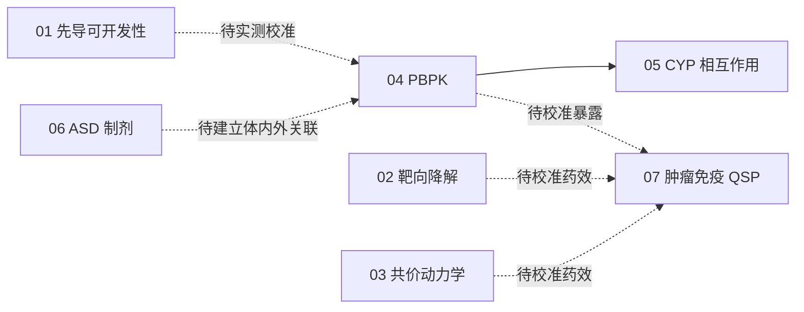

# AI4Pharm · Lead Developability Suite

从先导化合物可开发性到制剂、体内暴露与药效的七项可复现计算项目。

**先选择任务，再进入项目目录。** 每个项目的代码、输入、计算结果、图表和中英文技术报告集中保存；共享依赖、测试和维护工具统一放在根目录。

## 项目导航

| 任务 | 研究内容 | 项目入口 | 技术报告 |
|---|---|---|---|
| 01 · 先导可开发性 | 30 个结构的 MPO、ADMET 代理指标与构象分析 | [task01_lead_developability](projects/task01_lead_developability/) | [中文](projects/task01_lead_developability/DEVELOPABILITY_MPO_REPORT_ZH.md) · [EN](projects/task01_lead_developability/DEVELOPABILITY_MPO_REPORT_EN.md) |
| 02 · 靶向蛋白降解 | 三元复合物、协同性、钩状效应与连接子构象 | [task02_tpd](projects/task02_tpd/) | [中文](projects/task02_tpd/TPD_TERNARY_COOPERATIVITY_REPORT_ZH.md) · [EN](projects/task02_tpd/TPD_TERNARY_COOPERATIVITY_REPORT_EN.md) |
| 03 · 共价抑制剂 | 失活动力学、驻留时间、GSH 反应性与电子描述符 | [task03_covalent_kinetics](projects/task03_covalent_kinetics/) | [中文](projects/task03_covalent_kinetics/COVALENT_DRUG_KINETICS_REPORT_ZH.md) · [EN](projects/task03_covalent_kinetics/COVALENT_DRUG_KINETICS_REPORT_EN.md) |
| 04 · PBPK | IVIVE、组织分布、重复给药和暴露筛选 | [task04_pbpk](projects/task04_pbpk/) | [中文](projects/task04_pbpk/PBPK_DOSE_PREDICTION_REPORT_ZH.md) · [EN](projects/task04_pbpk/PBPK_DOSE_PREDICTION_REPORT_EN.md) |
| 05 · CYP 药物相互作用 | 可逆抑制、TDI、酶恢复及 Task 4 PBPK 联动 | [task05_cyp_ddi](projects/task05_cyp_ddi/) | [中文](projects/task05_cyp_ddi/CYP_DDI_KINETICS_REPORT_ZH.md) · [EN](projects/task05_cyp_ddi/CYP_DDI_KINETICS_REPORT_EN.md) |
| 06 · ASD 制剂 | 相容性、玻璃化转变、过饱和、析晶与吸收代理 | [task06_asd](projects/task06_asd/) | [中文](projects/task06_asd/ASD_FORMULATION_KINETICS_REPORT_ZH.md) · [EN](projects/task06_asd/ASD_FORMULATION_KINETICS_REPORT_EN.md) |
| 07 · 肿瘤免疫 QSP | 四方案动态模拟、Bliss/Loewe 与配对虚拟队列 | [task07_qsp](projects/task07_qsp/) | [中文](projects/task07_qsp/QSP_IMMUNO_ONCOLOGY_REPORT_ZH.md) · [EN](projects/task07_qsp/QSP_IMMUNO_ONCOLOGY_REPORT_EN.md) |

## 如何定位文件

```text
projects/          七个项目；各自 README 是代码、数据、图表与报告的入口
docs/              目录说明、科学解释、交付记录与历史档案
tests/             跨项目统一回归测试
tools/             目录、链接、产物与校验和检查工具
requirements.txt   全仓库共享依赖
.github/           持续集成配置
```

[详细目录与迁移说明](docs/REPOSITORY_LAYOUT.md) · [Task 5–7 计算交付](docs/TASK5_7_DELIVERY.md) · [原任务中的公式与证据修正](docs/SCIENTIFIC_NOTES.md) · [历史记录](docs/archive/README.md)

## 运行与复现

在仓库根目录使用已经具备依赖的 Python；新环境可先执行 `python -m pip install -r requirements.txt`。

```bash
# 示例：将新的计算放入独立输出目录
python projects/task05_cyp_ddi/run_task5_cyp_ddi_mechanism_based_inhibition.py --out work/task05_run

# 查看其他任务的命令、输入模板和参数
python projects/task01_lead_developability/run_task1_mpo_admet_developability.py --help

# 全仓库测试与目录检查
python -m unittest discover -s tests -v
python tools/validate_repository_layout.py --out work/layout_validation.json
```

各项目 README 提供完整运行命令。复算请显式指定新的 `work/` 输出目录，以保留已归档的计算。`work/` 不进入版本控制。Task 5 需要相邻 Task 4 模块，其他任务的依赖与运行限制见各自说明。

## 项目关系与证据范围



实线表示 Task 5 已实际调用 Task 4 的 PBPK 代码；虚线表示后续需要实测数据与校准的衔接方向。

仓库区分文献事实、实际执行的计算、假设参数与待验证结论。多数动力学、制剂与虚拟人群参数属于明确标注的机制演示，不能视为经过验证的临床预测；Task 1 的 ADMET 代理指标也不是临床概率。本次目录调整保留原始科学数据和图表，迁移证据见 [整改记录](docs/reorganization/README.md)。

Code and original documentation: [MIT License](LICENSE). Third-party sources retain their attribution. No regulatory or institutional endorsement is implied.
