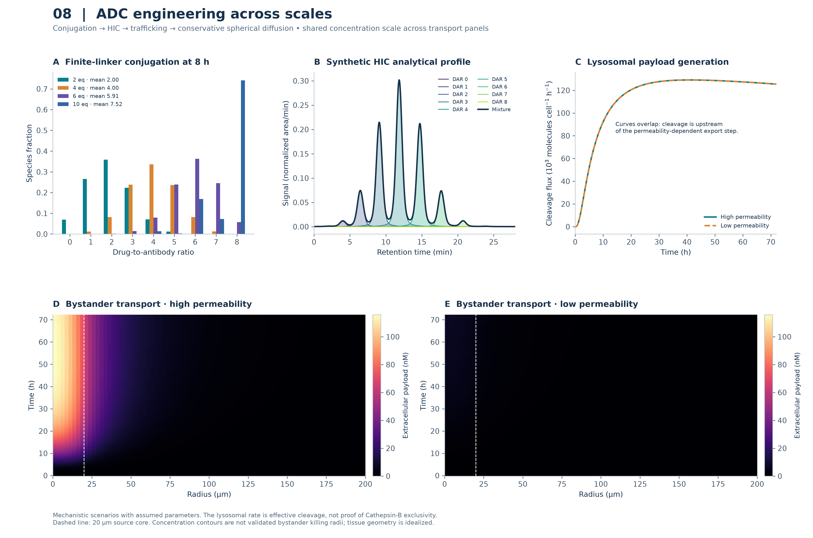
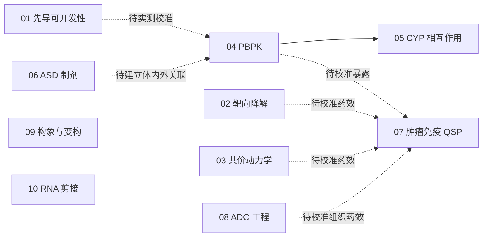

# AI4Pharm · 十维转化可开发性研究图谱

**10 个计算项目 · 10 张 300 DPI 综合图 · 中英文总报告 · 本机 CPU 全流程**

从先导化合物性质、作用机制、体内暴露与制剂，到系统药理、ADC、结构变构和 RNA 靶向。每个项目的代码、输入、结果、图与原始技术报告集中保存；新增统一入口、可追溯综合图和跨项目数学总报告。

[中文总报告](AI4PHARM_DECADE_TREATISE_ZH.md) · [English treatise](AI4PHARM_DECADE_TREATISE_EN.md) · [交互图谱文件](index.html) · [本次整合与复算记录](docs/omnibus/README.md)

交互图谱提供阶段筛选、全文搜索、高清图放大和逐图来源。**下载或克隆仓库后，双击根目录 `index.html` 即可使用**；GitHub 文件页面显示 HTML 源码，不会直接运行交互。图谱不依赖外部 JavaScript 库。



## 快速开始

在已有依赖的 Python 环境中，从仓库根目录运行；新环境可先执行 `python -m pip install -r requirements.txt`。

```bash
# 重新绘制全部综合图，生成交互页面、派生数据与 SHA256 溯源
python run_ai4pharm_omnibus_suite.py --out work/omnibus

# 使用本机 CPU 顺序重算全部十项，再生成新图谱；保留旧归档
python run_ai4pharm_omnibus_suite.py --mode recompute --out work/omnibus_fresh

# 软件回归、项目完整性及综合交付检查
python -m unittest discover -s tests -v
python tools/validate_repository_layout.py --out work/layout_validation.json
python tools/validate_omnibus.py --out work/omnibus_validation.json
```

所有输出必须使用**新的目录**。入口将数值库限制为单线程，顺序启动项目进程；每项默认上限 1,800 秒，可用 `--task-timeout` 调整。出错或超时立即停止并保留日志。Task 1 按单分子预算进行构象生成，部分收敛与缺失会保留。Task 10 使用 ViennaRNA 2.7.2；已有隔离安装可用 `--rna-library PATH`，不需要重新安装。

综合图默认读取冻结归档；`--mode recompute` 使用本次新计算结果。`--source-root PATH` 可重绘已有 `projects/` 输入树，**不会自动把任意输入树认证为执行过的复算**。输入哈希与执行状态分别记录。

## 项目导航

| 任务 | 研究内容 | 项目入口 | 技术报告 |
|---|---|---|---|
| 01 · 先导可开发性 | 30 个结构的 MPO、ADMET 代理指标与构象分析 | [task01_lead_developability](projects/task01_lead_developability/) | [中文](projects/task01_lead_developability/DEVELOPABILITY_MPO_REPORT_ZH.md) · [EN](projects/task01_lead_developability/DEVELOPABILITY_MPO_REPORT_EN.md) |
| 02 · 靶向蛋白降解 | 三元复合物、协同性、钩状效应与连接子构象 | [task02_tpd](projects/task02_tpd/) | [中文](projects/task02_tpd/TPD_TERNARY_COOPERATIVITY_REPORT_ZH.md) · [EN](projects/task02_tpd/TPD_TERNARY_COOPERATIVITY_REPORT_EN.md) |
| 03 · 共价抑制剂 | 失活动力学、驻留时间、GSH 反应性与电子描述符 | [task03_covalent_kinetics](projects/task03_covalent_kinetics/) | [中文](projects/task03_covalent_kinetics/COVALENT_DRUG_KINETICS_REPORT_ZH.md) · [EN](projects/task03_covalent_kinetics/COVALENT_DRUG_KINETICS_REPORT_EN.md) |
| 04 · PBPK | IVIVE、组织分布、重复给药和暴露筛选 | [task04_pbpk](projects/task04_pbpk/) | [中文](projects/task04_pbpk/PBPK_DOSE_PREDICTION_REPORT_ZH.md) · [EN](projects/task04_pbpk/PBPK_DOSE_PREDICTION_REPORT_EN.md) |
| 05 · CYP 药物相互作用 | 可逆抑制、TDI、酶恢复及 Task 4 PBPK 联动 | [task05_cyp_ddi](projects/task05_cyp_ddi/) | [中文](projects/task05_cyp_ddi/CYP_DDI_KINETICS_REPORT_ZH.md) · [EN](projects/task05_cyp_ddi/CYP_DDI_KINETICS_REPORT_EN.md) |
| 06 · ASD 制剂 | 相容性、玻璃化转变、过饱和、析晶与吸收代理 | [task06_asd](projects/task06_asd/) | [中文](projects/task06_asd/ASD_FORMULATION_KINETICS_REPORT_ZH.md) · [EN](projects/task06_asd/ASD_FORMULATION_KINETICS_REPORT_EN.md) |
| 07 · 肿瘤免疫 QSP | 四方案动态模拟、Bliss/Loewe 与配对虚拟队列 | [task07_qsp](projects/task07_qsp/) | [中文](projects/task07_qsp/QSP_IMMUNO_ONCOLOGY_REPORT_ZH.md) · [EN](projects/task07_qsp/QSP_IMMUNO_ONCOLOGY_REPORT_EN.md) |
| 08 · ADC 工程 | DAR 分布、HIC、细胞内释放与旁观者扩散 | [task08_adc](projects/task08_adc/) | [中文](projects/task08_adc/ADC_TRANSLATIONAL_ENGINEERING_REPORT_ZH.md) · [EN](projects/task08_adc/ADC_TRANSLATIONAL_ENGINEERING_REPORT_EN.md) |
| 09 · 构象与变构 | 合成构象、模拟密度、MSM、口袋几何与 PRS | [task09_cryoem_allostery](projects/task09_cryoem_allostery/) | [中文](projects/task09_cryoem_allostery/CRYOEM_CRYPTIC_POCKET_REPORT_ZH.md) · [EN](projects/task09_cryoem_allostery/CRYOEM_CRYPTIC_POCKET_REPORT_EN.md) |
| 10 · RNA 剪接 | 配分函数、NMR 几何、结合与 U1 耦合热力学 | [task10_rna_splicing](projects/task10_rna_splicing/) | [中文](projects/task10_rna_splicing/RNA_TARGETED_CADD_REPORT_ZH.md) · [EN](projects/task10_rna_splicing/RNA_TARGETED_CADD_REPORT_EN.md) |

## 如何定位文件

```text
run_ai4pharm_omnibus_suite.py  十任务统一入口：归档绘图 / 本机重算
AI4PHARM_DECADE_TREATISE_*.md 十章中英文数学、药理与证据总报告
index.html         离线交互图谱：筛选、搜索、放大与来源导航
figures_omnibus/    本次十张综合图，每图对应一个任务
data_omnibus/       绘图派生表、来源哈希与本次精选复算数据
projects/          十个原始项目；独立代码、数据、图表与报告
omnibus/           统一绘图、目录与交互页面生成模块
docs/              目录说明、科学解释、交付记录与历史档案
tests/             跨项目统一回归测试
tools/             目录、链接、产物与校验和检查工具
requirements.txt   全仓库共享依赖
.github/           持续集成配置
```

[详细目录与迁移说明](docs/REPOSITORY_LAYOUT.md) · [Task 5–7 计算交付](docs/TASK5_7_DELIVERY.md) · [Task 8–10 计算交付](docs/TASK8_10_DELIVERY.md) · [原任务中的公式与证据修正](docs/SCIENTIFIC_NOTES.md) · [历史记录](docs/archive/README.md)

## 十张综合图

| 任务 | 图表入口 | 核心面板 |
|---|---|---|
| 01 | [MPO 与 ADMET](figures_omnibus/fig_task1_developability_mpo.png) | 分组小提琴、六轴雷达、bRo5 空间 |
| 02 | [三元协同性](figures_omnibus/fig_task2_tpd_hook_effect.png) | 钩状曲线、亲和力热图、连接子分布 |
| 03 | [共价动力学](figures_omnibus/fig_task3_covalent_kinetics.png) | kobs、洗脱恢复、QSSA/GSH Pareto |
| 04 | [PBPK](figures_omnibus/fig_task4_pbpk_pharmacokinetics.png) | IV/口服、组织分布、7 天 BID 与周期稳态 |
| 05 | [CYP DDI](figures_omnibus/fig_task5_cyp_ddi_mbi.png) | 预孵育、假设探针 PK、条件筛查矩阵 |
| 06 | [ASD 热力学](figures_omnibus/fig_task6_asd_supersaturation.png) | FH 混合/相界、Tg、过饱和 |
| 07 | [肿瘤免疫 QSP](figures_omnibus/fig_task7_qsp_immuno_oncology.png) | 四组肿瘤、Bliss、质量进展 KM |
| 08 | [ADC 多尺度工程](figures_omnibus/fig_task8_adc_multiscale.png) | DAR、HIC、释放通量、径向扩散 |
| 09 | [构象与 PRS](figures_omnibus/fig_task9_cryoem_allostery.png) | 合成流形、状态自由能、PRS |
| 10 | [RNA 结合与剪接代理](figures_omnibus/fig_task10_rna_targeted_cadd.png) | BPP、假设自由能、U1 占有率 |

[逐图来源与解释](data_omnibus/figure_provenance.json) · [输入 SHA256](data_omnibus/source_hashes.json) · [综合产物清单](manifest_omnibus.json)

## 运行与复现

在仓库根目录使用已经具备依赖的 Python；新环境可先执行 `python -m pip install -r requirements.txt`。

```bash
# 示例：将新的计算放入独立输出目录
python projects/task05_cyp_ddi/run_task5_cyp_ddi_mechanism_based_inhibition.py --out work/task05_run

# 查看其他任务的命令、输入模板和参数
python projects/task01_lead_developability/run_task1_mpo_admet_developability.py --help

# 全仓库测试与目录检查
python -m unittest discover -s tests -v
python tools/validate_repository_layout.py --out work/layout_validation.json
```

Task 10 使用 ViennaRNA 2.7.2 执行 RNA 最近邻热力学配分函数计算，已列入共享依赖；公开结构输入随项目保存，正常复算无需联网。

各项目 README 提供完整运行命令。复算请显式指定新的 `work/` 输出目录，以保留已归档的计算。`work/` 不进入版本控制。Task 5 需要相邻 Task 4 模块，其他任务的依赖与运行限制见各自说明。

## 项目关系与证据范围

## Advanced modalities · 本次发布范围

本次追加发布保留 8 个可执行模块：Task 12 染色质靶向降解、Task 13 BBB–TfR、Task 14 BiTE、Task 15 受体信号、Task 16 转运体 PBPK、Task 18 PGx、Task 19 三元界面原子模拟、Task 20 三维口袋分子生成。Task 11 与 Task 17 按本轮发布要求跳过，不进入代码、数据、图和计算入口；其编号保留用于路线图连续性。

统一入口：[run_ai4pharm_advanced_modalities_suite.py](run_ai4pharm_advanced_modalities_suite.py)。它默认运行上述 8 个任务，使用新输出目录，并生成 `data_advanced/`、`figures_advanced/`、执行记录和哈希清单；`tools/validate_advanced.py` 检查文件、图像 DPI、任务覆盖和关键证据字段。

| 任务 | 项目 | 300 DPI 图 |
|---|---|---|
| 12 | [染色质降解](projects/task12_chromatin/) | `fig12_epigenetic_chromatin_depletion.png` |
| 13 | [BBB–TfR](projects/task13_bbb_tfr/) | `fig13_bbb_tfr_transcytosis_profile.png` |
| 14 | [BiTE](projects/task14_bite/) | `fig14_bite_synapse_crosslinking_curve.png` |
| 15 | [受体信号](projects/task15_receptor_signaling/) | `fig15_receptor_proofreading_cytokine_balance.png` |
| 16 | [转运体 PBPK](projects/task16_transporters/) | `fig16_transporter_oatp_pgp_kinetics.png` |
| 18 | [PGx](projects/task18_pgx/) | `fig18_pgx_cyp2d6_phenotype_kinetics.png` |
| 19 | [三元界面](projects/task19_metadynamics/) | `fig19_ternary_metadynamics_pmf_landscape.png` |
| 20 | [三维口袋生成](projects/task20_denovo/) | `fig20_denovo_pareto_lead_optimization.png` |

Task 19 的 150,838 原子计算是短程 CPU pilot，PMF 和协同性仍为 `null`；Task 20 完成 100×20 演化、等预算随机对照和 12 个 Vina 子集对接，但不输出已校准 nM 亲和力、临床建议或合成证明。



实线表示 Task 5 已实际调用 Task 4 的 PBPK 代码；虚线表示后续需要实测数据与校准的衔接方向。

仓库区分文献事实、实际执行的计算、假设参数与待验证结论。多数动力学、制剂与虚拟人群参数属于明确标注的机制演示，不能视为经过验证的临床预测；Task 1 的 ADMET 代理指标也不是临床概率。本次目录调整保留原始科学数据和图表，迁移证据见 [整改记录](docs/reorganization/README.md)。


新增任务中，公开 X 射线/NMR 结构属于结构证据；合成构象轨迹、模拟 cryo-EM 密度、DAR/扩散参数及剪接响应假设分别标注。它们不等同于实验重构、已验证成药性或临床给药窗口。

Code and original documentation: [MIT License](LICENSE). Third-party sources retain their attribution. No regulatory or institutional endorsement is implied.
