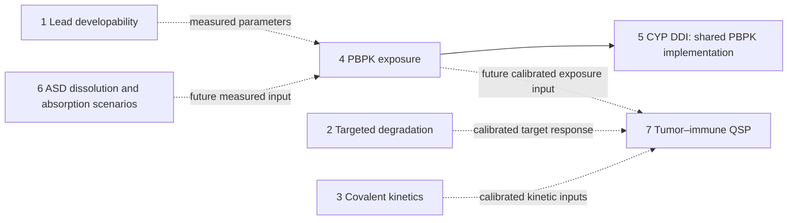
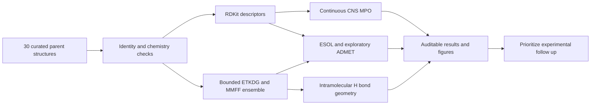
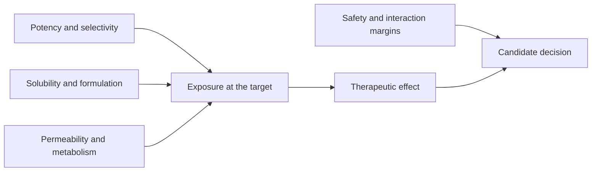

# AI4Pharm · Lead Developability Suite


**Seven-task suite: lead developability, targeted degradation, covalent kinetics, PBPK, CYP interactions, ASD formulation, and tumor–immune QSP.**

New: [Tasks 5–7 delivery and evidence](docs/TASK5_7_DELIVERY.md) · [Original task briefs and scientific corrections](docs/task5_7_prompts/README.md). Each new task keeps its driver, inputs, bilingual reports, figures, and results together in its own directory. Drug-named scenarios and virtual cohorts are simulations, not validated clinical predictions.

[Task 4 PBPK](#task-4-pbpk-and-dose-screening) · [Quick start](#quick-start) · [Workflow](#pharmaceutical-workflow) · [Benchmark](#benchmark-panel) · [Figures](#figures) · [Model card](MODEL_CARD.md) · [English report](DEVELOPABILITY_MPO_REPORT_EN.md) · [中文报告](DEVELOPABILITY_MPO_REPORT_ZH.md) · [Evidence](data/CLINICAL_EVIDENCE.md)

This repository provides an offline, reproducible assessment engine for 30 clinically relevant parent compounds. It combines continuous desirability scores, structural descriptors, explicitly exploratory ADMET estimates, and a bounded conformer workflow. Every structure has a PubChem CID, source URL, molecular formula, InChIKey, and retrieval timestamp.

**Scientific scope:** the CNS-MPO transformations and ESOL coefficients come from published methods; RDKit descriptor substitution and assumed ionization affect their outputs. The hERG, Caco-2, HIA, pKa/logD, and oral ranking models are **unvalidated, transparent heuristics**. They are not calibrated clinical probabilities or substitutes for experimental assays. An absolute chameleonic hydrogen-bond index cannot be inferred from this gas-phase ensemble; that field is explicitly missing, alongside a separately named geometric proxy.

## Task index

| Task | Standalone driver | Reports | Results |
|---|---|---|---|
| 1 · Lead developability | [MPO / ADMET engine](run_task1_mpo_admet_developability.py) | [EN](DEVELOPABILITY_MPO_REPORT_EN.md) · [中文](DEVELOPABILITY_MPO_REPORT_ZH.md) | [Task 1 results](results_task1/) |
| 2 · Targeted protein degradation | [TPD ternary engine](run_task2_tpd_ternary_cooperativity.py) | [EN](TPD_TERNARY_COOPERATIVITY_REPORT_EN.md) · [中文](TPD_TERNARY_COOPERATIVITY_REPORT_ZH.md) | [Task 2 data](data_task2/) · [Validation](validation_task2.json) |
| 3 · Covalent inhibitor kinetics | [Covalent kinetics engine](run_task3_covalent_kinetics_residence_time.py) | [EN](COVALENT_DRUG_KINETICS_REPORT_EN.md) · [中文](COVALENT_DRUG_KINETICS_REPORT_ZH.md) | [Task 3 data](data_task3/) · [Validation](data_task3/validation.json) |
| 4 · PBPK and dose screening | [PBPK / IVIVE engine](task4_pbpk/run_task4_pbpk_pharmacokinetics_dose_prediction.py) | [EN](task4_pbpk/PBPK_DOSE_PREDICTION_REPORT_EN.md) · [中文](task4_pbpk/PBPK_DOSE_PREDICTION_REPORT_ZH.md) | [Task 4 results](task4_pbpk/results_summary.json) · [Validation](task4_pbpk/verification.json) |
| 5 · CYP DDI and time-dependent inhibition | [CYP DDI engine](task5_cyp_ddi/run_task5_cyp_ddi_mechanism_based_inhibition.py) | [EN](task5_cyp_ddi/CYP_DDI_KINETICS_REPORT_EN.md) · [中文](task5_cyp_ddi/CYP_DDI_KINETICS_REPORT_ZH.md) | [Task 5 project](task5_cyp_ddi/) |
| 6 · ASD formulation and supersaturation | [ASD engine](task6_asd/run_task6_asd_formulation_supersaturation_kinetics.py) | [EN](task6_asd/ASD_FORMULATION_KINETICS_REPORT_EN.md) · [中文](task6_asd/ASD_FORMULATION_KINETICS_REPORT_ZH.md) | [Task 6 project](task6_asd/) |
| 7 · Tumor–immune QSP and combination effects | [QSP engine](task7_qsp/run_task7_qsp_tumor_immune_pkpd_synergy.py) | [EN](task7_qsp/QSP_IMMUNO_ONCOLOGY_REPORT_EN.md) · [中文](task7_qsp/QSP_IMMUNO_ONCOLOGY_REPORT_ZH.md) | [Task 7 project](task7_qsp/) |



The solid Task 4 → 5 connection denotes implemented code reuse. Dashed links denote future calibration interfaces; Task 6 absorption and Task 7 PK/PD assumptions are not already validated or automatically coupled into Task 4.

## Quick start

```bash
git clone https://github.com/songsiyi2006-chem/ai4pharm-lead-developability-suite.git
cd ai4pharm-lead-developability-suite
python -m venv .venv
# Activate: Windows PowerShell: .venv\Scripts\Activate.ps1
# Activate: macOS/Linux: source .venv/bin/activate
python -m pip install -r requirements.txt
python run_task1_mpo_admet_developability.py
python -m unittest discover -s tests -v
```

The script embeds the complete panel and can also run by itself after installing dependencies. Runtime does not require internet access, API keys, external pKa software, or trained-model downloads. Defaults: six ETKDGv3 conformers, seed `20260910`, 45 seconds maximum per isolated 3D worker. Slow conformers produce explicit missing geometry with a disclosed volume fallback. Use `--strict-3d` to make missing converged geometry fatal. Large macrocycles may need a larger timeout. The delivered figures use a 120-second worker budget; see [validation and reproduction details](VALIDATION.md).

```bash
# Fast descriptor-only mode; geometry fields remain null.
python run_task1_mpo_admet_developability.py --conformers 0 --output-dir quick_run

# More extensive sampling; still not a solvent-dependent chameleonicity assay.
python run_task1_mpo_admet_developability.py --conformers 20 --conformer-timeout 180 --output-dir expanded_run

# Replace ionization assumptions with sourced values.
python run_task1_mpo_admet_developability.py --ionization-overrides ionization.json
```

See [MODEL_CARD.md](MODEL_CARD.md) for the override schema, equations, units, normalization anchors, and failure behavior. Different sampling or 3D availability can affect volume, electrostatics, and therefore the exploratory ADMET scores. The run manifest records settings, versions, missingness, and artifact checksums. The reported pKa sensitivity envelope is a scenario range, not a statistical confidence interval.

## Task 4: PBPK and dose screening

The [standalone Task 4 script](task4_pbpk/run_task4_pbpk_pharmacokinetics_dose_prediction.py) connects microsomal IVIVE, a reduced seven-state PBPK model, single IV/oral dosing, repeated dosing, and QD/BID dose screening. Outputs include four 300-DPI figures, bilingual reports, editable inputs, concentration tables, sensitivity scenarios, and numerical verification records.

```bash
# From the repository root; results stay inside the Task 4 directory.
python task4_pbpk/run_task4_pbpk_pharmacokinetics_dose_prediction.py --self-test --out task4_pbpk

# Export an input template, then edit it for the selected compound.
python task4_pbpk/run_task4_pbpk_pharmacokinetics_dose_prediction.py --write-example compound.json
python task4_pbpk/run_task4_pbpk_pharmacokinetics_dose_prediction.py --config compound.json --out scratch/task4_custom
```

**Scientific scope:** the published example uses synthetic compound and toxicity inputs. Its seven states include a GI luminal depot; tissue partitioning uses a documented Poulin–Theil composition approximation with an ionization adaptation. These are research exposure scenarios, not validated clinical dose recommendations. Task 1 descriptors can be mapped into the JSON template, but a selected lead's measured binding, microsomal clearance and toxicology evidence are still required. Day 7 is checked against a separately computed periodic steady state, and AUC includes the tail beyond 48 hours. Optional saturable hepatic metabolism is enabled by supplying `km_unbound_mg_l`.

- [Task 4 guide and input schema](task4_pbpk/README.md)
- [English PBPK report](task4_pbpk/PBPK_DOSE_PREDICTION_REPORT_EN.md) / [中文 PBPK 报告](task4_pbpk/PBPK_DOSE_PREDICTION_REPORT_ZH.md)
- [Results](task4_pbpk/results_summary.json) / [25 numerical checks](task4_pbpk/verification.json) / [Nonlinear and figure verification](task4_pbpk/release_verification.json)
- [IV versus oral](task4_pbpk/figures_task4/fig1_pbpk_plasma_iv_vs_oral.png), [tissue distribution](task4_pbpk/figures_task4/fig2_tissue_distribution_biodistribution.png), [repeated doses](task4_pbpk/figures_task4/fig3_multidose_steady_state_regimen.png), [dose coverage](task4_pbpk/figures_task4/fig4_dose_titration_target_coverage.png)

## Pharmaceutical workflow





## Benchmark panel

| Archetype | n | Compounds |
|---|---:|---|
| Strictly Ro5-compliant oral references | 10 | Aspirin, Diazepam, Sildenafil, Gefitinib, Omeprazole, Metoprolol, Losartan, Warfarin, Fluconazole, Captopril |
| Clinical failures / toxicity withdrawals or restrictions | 10 | Terfenadine, Astemizole, Cisapride, Cerivastatin, Troglitazone, Rofecoxib, Nefazodone, Benoxaprofen, Ximelagatran, Fialuridine |
| bRo5 modalities and challenging comparators | 10 | Cyclosporine A, Venetoclax, ARV-110, Rifampicin, Paclitaxel, Tacrolimus, Sirolimus, Erythromycin, Azithromycin, Daclatasvir |

Here, **strict Ro5 compliance** means zero violations of MW ≤500, RDKit cLogP ≤5, HBD ≤5, HBA ≤10; **bRo5** means at least one violation. This operational definition is explicitly broader than definitions requiring multiple violations. The clinical archetypes are mutually exclusive study strata, not exhaustive chemical-space classes. Toxicity references can satisfy Ro5.

Imatinib and atorvastatin were not placed in the strictly compliant stratum because their parent molecular weights exceed 500 Da. The chosen oral references are not ranked by commercial sales. Paclitaxel is an intravenous comparator, venetoclax is nonmacrocyclic, and ARV-110 is an investigational PROTAC with incompletely specified stereochemistry in the selected PubChem record. No current approval or commercial-availability claim is made for that record. Toxic withdrawals are not collectively labeled hERG-positive or solubility-driven failures.

## Figures

All requested PNGs are **300 DPI**; SVG companions support vector export. Points are shown in the violin plot because each stratum contains only ten selected molecules. No significance tests or predictive-accuracy claims are made from this small, purposive panel.


The landscape’s MW/cLogP rectangle is a two-descriptor projection, not the full Ro5 or a proven boundary for oral success. The radar's safety axis is restricted to the hERG heuristic. Fixed normalization anchors make plots comparable across reruns; no cohort-dependent min/max scaling is used.

## Repository contents

```text
run_task1_mpo_admet_developability.py  Standalone CLI and embedded panel
data/reference_panel.json             Auditable frozen structure records
data/CLINICAL_EVIDENCE.md              Clinical interpretation and sources
MODEL_CARD.md                        Equations, assumptions, and limitations
DEVELOPABILITY_MPO_REPORT_EN.md       English technical report
DEVELOPABILITY_MPO_REPORT_ZH.md       Chinese technical report
figures_task1/                        Three PNGs plus SVG companions
results_task1/                        Per-compound JSON/CSV, summary, manifest
tests/test_task1.py                   Numerical, chemistry, CLI, artifact tests
.github/workflows/ci.yml              Python 3.10 / 3.12 automated checks
```

Scientific CSV/JSON results and final figures are intentionally versioned. Environments, caches, scratch runs, and private data are ignored. Reproducibility is numerical within a compatible RDKit environment; conformer behavior can differ across versions or operating systems. A recorded environment snapshot accompanies this delivery; the portable requirements support Python 3.10+ using compatible dependency versions.

## License and attribution

Code and original documentation are MIT-licensed; see [LICENSE](LICENSE). PubChem structure provenance and third-party scientific references retain their attribution. The badges describe this project's tooling and topic and do not imply endorsement by Pfizer, RDKit, or any regulator.

<!-- TASK2-GENERATED-START -->
## Task 2 · TPD ternary cooperativity engine

单文件可复现的三元平衡、钩状效应、RDKit 连接子构象与合成降解实验。
Reproducible mass-action equilibrium, linker ensembles and synthetic assay profiling.

### Run Task 2

```sh
python -m pip install -r requirements.txt
python run_task2_tpd_ternary_cooperativity.py
```

The root requirements support compatible dependency versions on Python 3.10+. `requirements_task2.txt` records exact versions from the delivered Python 3.14.6 run. Default output directory is the script's directory; set `--output-dir` to change it. All data are synthetic. No external file is required to generate the reports or figures. `--git-publish` stages only generated Task 2 files in an existing repository, creates the requested commit if needed, and pushes an already-configured upstream. It never invents a remote. A missing repository/upstream returns an explicit error after outputs are generated. Importing the script has no execution side effects.

### Task 2 deliverables

| Module | Artifact | Description |
|---|---|---|
| Driver | [Python script](run_task2_tpd_ternary_cooperativity.py) | All four modules, reporting, validation and optional publishing |
| 中文报告 | [中文报告](TPD_TERNARY_COOPERATIVITY_REPORT_ZH.md) | 推导、结果、假设与局限 |
| English report | [English report](TPD_TERNARY_COOPERATIVITY_REPORT_EN.md) | Methods, results and interpretation |
| Validation | [Validation JSON](validation_task2.json) | Independent solvers, mass balances, edge cases, ODE convergence |
| Reproducibility | [Manifest](manifest_task2.json) / [Log](run_task2.log) | Versions, parameters, SHA256, terminal metrics |
| Raw results | [Data directory](data_task2/) | Species, peaks, dose/time curves, readout replicates and SDF conformers |

### Task 2 equilibrium master table

| alpha | Peak EPT (nM) | Optimal total P (nM) | 80% low (nM) | 80% high (nM) |
|---:|---:|---:|---:|---:|
| 0.01 | 0.570646 | 131.623 | 70.7272 | 236.327 |
| 1 | 29.0536 | 131.623 | 68.3461 | 275.137 |
| 10 | 66.1477 | 131.623 | 69.2893 | 439.603 |
| 100 | 87.6755 | 131.623 | 73.6266 | 1287.53 |

### Task 2 synthetic degradation master table

| alpha | Dmax (%) | DC50 rising (nM) | Half-max hook-side (nM) | Optimal endpoint dose (nM) |
|---:|---:|---:|---:|---:|
| 0.01 | 14.4574 | 35.5407 | 423.919 | 129.829 |
| 1 | 99.8679 | 5.6381 | 3328.34 | 111.455 |
| 10 | 100 | 2.45349 | 32695.6 | 110.723 |
| 100 | 100 | 2.13609 | 326418 | 113.187 |

### Task 2 linker master table

| Linker | n | Mean r (A) | SD r (A) | Linker RMSF (A) | Mean Rg (A) | Compatible fraction |
|---|---:|---:|---:|---:|---:|---:|
| Flexible PEG | 100 | 9.6715 | 0.9577 | 0.7760 | 3.3518 | 96.00% |
| Rigid alkynyl | 100 | 9.6050 | 0.0000 | 0.0000 | 3.2967 | 100.00% |

### Task 2 scientific corrections

The general exact total-P optimum is derived in both reports. The supplied square-root total-concentration expression is retained only for comparison. Alpha changes equilibrium peak height/window width, with an unchanged equilibrium peak dose in this network. The high-alpha scenario is not a universal molecular-glue model. Linkers use mapped attachment-point proxies; no real warheads or protein exit-vector orientations were supplied. RMSF and histogram widths are not binding entropy. DC50 uses the rising half-maximum crossing; the single Hill fit is restricted to that limb. Both immunoblot and luminescence data are synthetic.

### Task 2 figure previews


<!-- TASK2-GENERATED-END -->

<!-- TASK3:BEGIN -->
## Task 3 — Covalent inhibitor kinetics and residence time

- [Standalone Python workflow](run_task3_covalent_kinetics_residence_time.py)
- [English technical report](COVALENT_DRUG_KINETICS_REPORT_EN.md)
- [中文技术报告](COVALENT_DRUG_KINETICS_REPORT_ZH.md)
- [Four publication-resolution figures](figures_task3/)
- [Results and parameter provenance](data_task3/warhead_results.csv)
- [Numerical validation](data_task3/validation.json)
- [Run manifest and file hashes](data_task3/run_manifest.json)

```sh
python -m pip install numpy scipy matplotlib rdkit pillow
python run_task3_covalent_kinetics_residence_time.py
python run_task3_covalent_kinetics_residence_time.py --self-test-only
# Optional external xTB installation:
python run_task3_covalent_kinetics_residence_time.py --quantum xtb --xtb xtb
# Optional commit/push from an existing main checkout with origin:
python run_task3_covalent_kinetics_residence_time.py --git-sync
```

Default outputs are written to the working-directory root, including
`./figures_task3/`. Use `--output-dir PATH` for a separate output root.
Orbital descriptors are calculated with EHT (or optional GFN2-xTB); kinetic inputs
and the barrier scenario are illustrative and uncalibrated. The 30-minute GSH flag
and shaded efficiency band are screening heuristics, not clinical/DILI predictions.
The reports distinguish KD, kinetic KI, fitted KI, chemical residence and turnover.
<!-- TASK3:END -->
