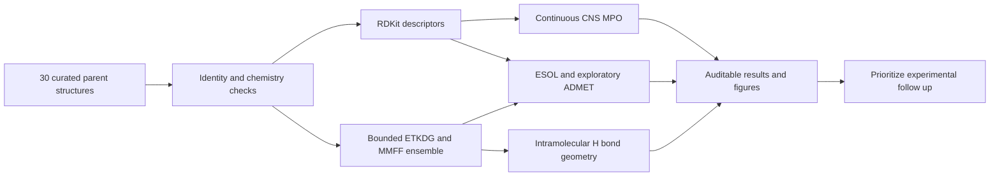
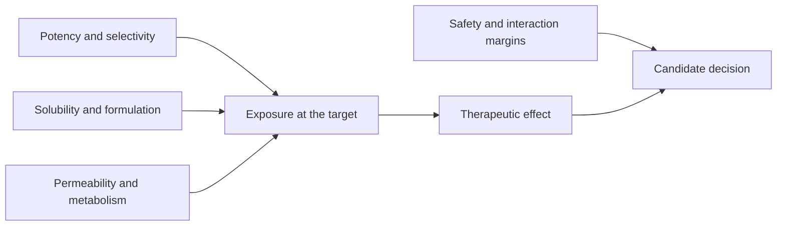
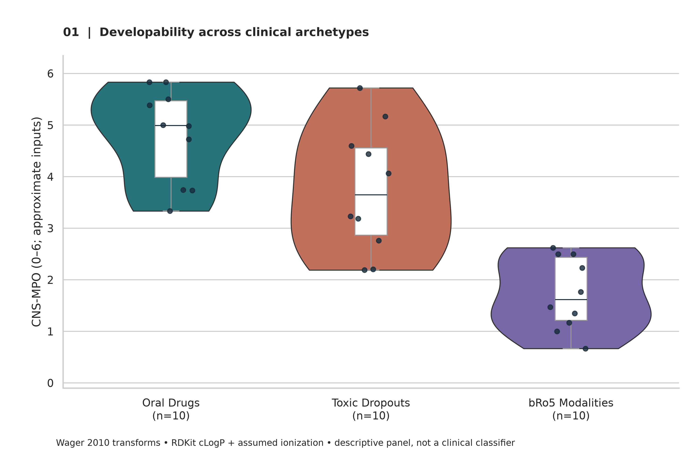
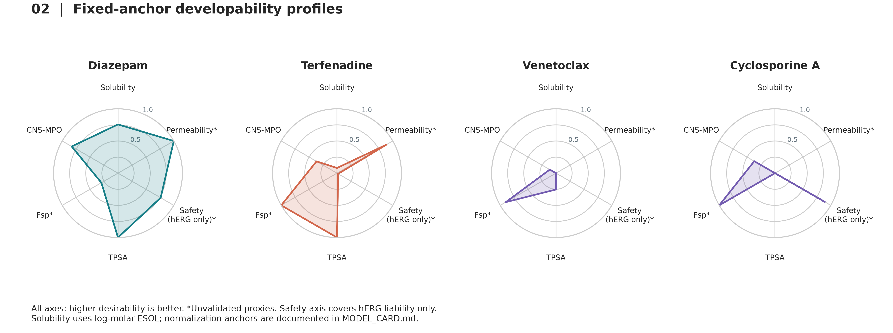
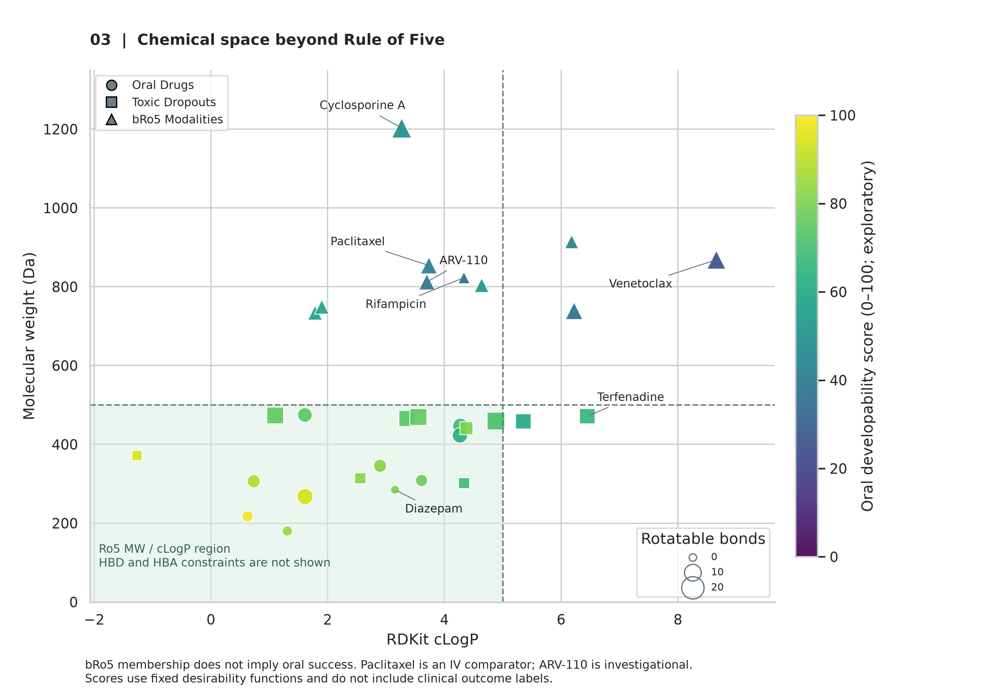

# AI4Pharm · Lead Developability Suite


**Phase 1: multi-parameter optimization, ADMET liabilities, and beyond-Rule-of-5 chemical space.**

[Quick start](#quick-start) · [Workflow](#pharmaceutical-workflow) · [Benchmark](#benchmark-panel) · [Figures](#figures) · [Model card](MODEL_CARD.md) · [English report](DEVELOPABILITY_MPO_REPORT_EN.md) · [中文报告](DEVELOPABILITY_MPO_REPORT_ZH.md) · [Evidence](data/CLINICAL_EVIDENCE.md)

This repository provides an offline, reproducible assessment engine for 30 clinically relevant parent compounds. It combines continuous desirability scores, structural descriptors, explicitly exploratory ADMET estimates, and a bounded conformer workflow. Every structure has a PubChem CID, source URL, molecular formula, InChIKey, and retrieval timestamp.

**Scientific scope:** the CNS-MPO transformations and ESOL coefficients come from published methods; RDKit descriptor substitution and assumed ionization affect their outputs. The hERG, Caco-2, HIA, pKa/logD, and oral ranking models are **unvalidated, transparent heuristics**. They are not calibrated clinical probabilities or substitutes for experimental assays. An absolute chameleonic hydrogen-bond index cannot be inferred from this gas-phase ensemble; that field is explicitly missing, alongside a separately named geometric proxy.

## Quick start

```bash
git clone https://github.com/songsiyi2006-chem/ai4pharm-lead-developability-suite.git
cd ai4pharm-lead-developability-suite
python -m venv .venv
# Activate: Windows PowerShell: .venv\Scripts\Activate.ps1
# Activate: macOS/Linux: source .venv/bin/activate
python -m pip install -r requirements.txt
python run_task1_mpo_admet_developability.py
python -m unittest discover -s tests -v
```

The script embeds the complete panel and can also run by itself after installing dependencies. Runtime does not require internet access, API keys, external pKa software, or trained-model downloads. Defaults: six ETKDGv3 conformers, seed `20260910`, 45 seconds maximum per isolated 3D worker. Slow conformers produce explicit missing geometry with a disclosed volume fallback. Use `--strict-3d` to make missing converged geometry fatal. Large macrocycles may need a larger timeout. The delivered figures use a 120-second worker budget; see [validation and reproduction details](VALIDATION.md).

```bash
# Fast descriptor-only mode; geometry fields remain null.
python run_task1_mpo_admet_developability.py --conformers 0 --output-dir quick_run

# More extensive sampling; still not a solvent-dependent chameleonicity assay.
python run_task1_mpo_admet_developability.py --conformers 20 --conformer-timeout 180 --output-dir expanded_run

# Replace ionization assumptions with sourced values.
python run_task1_mpo_admet_developability.py --ionization-overrides ionization.json
```

See [MODEL_CARD.md](MODEL_CARD.md) for the override schema, equations, units, normalization anchors, and failure behavior. Different sampling or 3D availability can affect volume, electrostatics, and therefore the exploratory ADMET scores. The run manifest records settings, versions, missingness, and artifact checksums. The reported pKa sensitivity envelope is a scenario range, not a statistical confidence interval.

## Pharmaceutical workflow





## Benchmark panel

| Archetype | n | Compounds |
|---|---:|---|
| Strictly Ro5-compliant oral references | 10 | Aspirin, Diazepam, Sildenafil, Gefitinib, Omeprazole, Metoprolol, Losartan, Warfarin, Fluconazole, Captopril |
| Clinical failures / toxicity withdrawals or restrictions | 10 | Terfenadine, Astemizole, Cisapride, Cerivastatin, Troglitazone, Rofecoxib, Nefazodone, Benoxaprofen, Ximelagatran, Fialuridine |
| bRo5 modalities and challenging comparators | 10 | Cyclosporine A, Venetoclax, ARV-110, Rifampicin, Paclitaxel, Tacrolimus, Sirolimus, Erythromycin, Azithromycin, Daclatasvir |

Here, **strict Ro5 compliance** means zero violations of MW ≤500, RDKit cLogP ≤5, HBD ≤5, HBA ≤10; **bRo5** means at least one violation. This operational definition is explicitly broader than definitions requiring multiple violations. The clinical archetypes are mutually exclusive study strata, not exhaustive chemical-space classes. Toxicity references can satisfy Ro5.

Imatinib and atorvastatin were not placed in the strictly compliant stratum because their parent molecular weights exceed 500 Da. The chosen oral references are not ranked by commercial sales. Paclitaxel is an intravenous comparator, venetoclax is nonmacrocyclic, and ARV-110 is an investigational PROTAC with incompletely specified stereochemistry in the selected PubChem record. No current approval or commercial-availability claim is made for that record. Toxic withdrawals are not collectively labeled hERG-positive or solubility-driven failures.

## Figures

All requested PNGs are **300 DPI**; SVG companions support vector export. Points are shown in the violin plot because each stratum contains only ten selected molecules. No significance tests or predictive-accuracy claims are made from this small, purposive panel.







The landscape’s MW/cLogP rectangle is a two-descriptor projection, not the full Ro5 or a proven boundary for oral success. The radar's safety axis is restricted to the hERG heuristic. Fixed normalization anchors make plots comparable across reruns; no cohort-dependent min/max scaling is used.

## Repository contents

```text
run_task1_mpo_admet_developability.py  Standalone CLI and embedded panel
data/reference_panel.json             Auditable frozen structure records
data/CLINICAL_EVIDENCE.md              Clinical interpretation and sources
MODEL_CARD.md                        Equations, assumptions, and limitations
DEVELOPABILITY_MPO_REPORT_EN.md       English technical report
DEVELOPABILITY_MPO_REPORT_ZH.md       Chinese technical report
figures_task1/                        Three PNGs plus SVG companions
results_task1/                        Per-compound JSON/CSV, summary, manifest
tests/test_task1.py                   Numerical, chemistry, CLI, artifact tests
.github/workflows/ci.yml              Python 3.10 / 3.12 automated checks
```

Scientific CSV/JSON results and final figures are intentionally versioned. Environments, caches, scratch runs, and private data are ignored. Reproducibility is numerical within a compatible RDKit environment; conformer behavior can differ across versions or operating systems. A recorded environment snapshot accompanies this delivery; the portable requirements support Python 3.10+ using compatible dependency versions.

## License and attribution

Code and original documentation are MIT-licensed; see [LICENSE](LICENSE). PubChem structure provenance and third-party scientific references retain their attribution. The badges describe this project's tooling and topic and do not imply endorsement by Pfizer, RDKit, or any regulator.

<!-- TASK3:BEGIN -->
## Task 3 — Covalent inhibitor kinetics and residence time

- [Standalone Python workflow](run_task3_covalent_kinetics_residence_time.py)
- [English technical report](COVALENT_DRUG_KINETICS_REPORT_EN.md)
- [中文技术报告](COVALENT_DRUG_KINETICS_REPORT_ZH.md)
- [Four publication-resolution figures](figures_task3/)
- [Results and parameter provenance](data_task3/warhead_results.csv)
- [Numerical validation](data_task3/validation.json)
- [Run manifest and file hashes](data_task3/run_manifest.json)

```sh
python -m pip install numpy scipy matplotlib rdkit pillow
python run_task3_covalent_kinetics_residence_time.py
python run_task3_covalent_kinetics_residence_time.py --self-test-only
# Optional external xTB installation:
python run_task3_covalent_kinetics_residence_time.py --quantum xtb --xtb xtb
# Optional commit/push from an existing main checkout with origin:
python run_task3_covalent_kinetics_residence_time.py --git-sync
```

Default outputs are written to the working-directory root, including
`./figures_task3/`. Use `--output-dir PATH` for a separate output root.
Orbital descriptors are calculated with EHT (or optional GFN2-xTB); kinetic inputs
and the barrier scenario are illustrative and uncalibrated. The 30-minute GSH flag
and shaded efficiency band are screening heuristics, not clinical/DILI predictions.
The reports distinguish KD, kinetic KI, fitted KI, chemical residence and turnover.
<!-- TASK3:END -->
