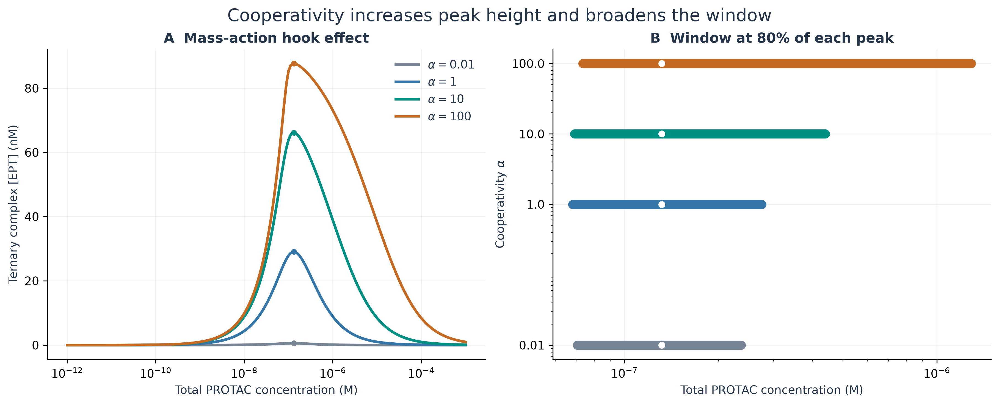
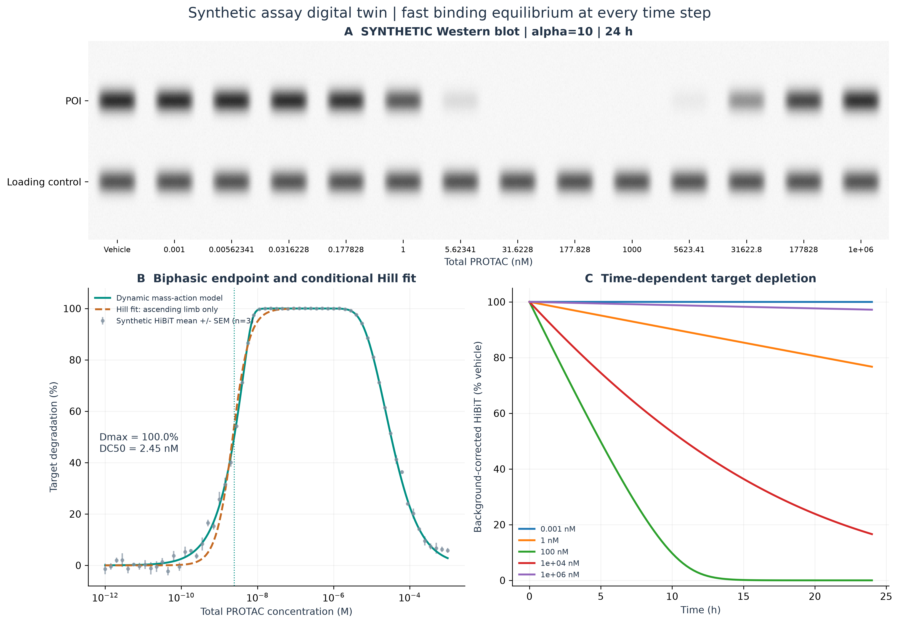

# 任务二：靶向蛋白降解、三元复合物协同性与钩状效应

## 研究范围与复现

本项目是可执行的合成生物物理模型，不是特定降解剂的经验证预测器，也不提供临床剂量建议。输入未包含实测亲和力、完整 PROTAC、蛋白结构或实验校准数据。默认参数为示例：E0=100 nM; T0=100 nM; Kd,E=10 nM; Kd,T=100 nM; Vmax=12 nM/h; Km=10 nM; endpoint=24 h; basal turnover=0 /h; seed=20260910. 100 nM 蛋白总量是任务指定的建模条件，不能代表所有细胞中的生理丰度。内部单位统一为 nM、小时和埃；1 nM=1e-9 M。总 PROTAC 扫描覆盖 1e-12–1e-3 M，共 181 个点；极高浓度不意味着细胞实验中可实现的暴露。

执行 `python run_task2_tpd_ternary_cooperativity.py` 即可再生四张 300 DPI 图、双语报告、CSV 数据、SDF 构象、校验文件、依赖版本、校验和与日志。全部逻辑包含在单个脚本内，不需要网络或外部模板；参数见 `--help`。固定随机种子并单线程构象采样，同一环境下可重复运行；不同 RDKit 版本可能改变构象结果。版本及文件哈希保存在 `manifest_task2.json`。

## 事件驱动与占有率驱动药理学

传统抑制剂通常通过持续占据靶点抑制功能。降解剂则可通过募集 E3、触发泛素化事件并移除靶蛋白，使效应持续时间超过单次结合事件。结构研究展示了被募集蛋白之间的新接触如何参与协同识别 [3]。但“形成三元复合物”并不等价于“必然产生有效降解”：泛素化几何、蛋白酶体处理、细胞通透性及选择性仍需验证。本模型假定全部三元复合物具有相同的有效降解贡献，并显式假设 PROTAC 可即时循环使用、E3 总量不变。

## 质量作用方程、精确解与峰位推导

小写 p、e、t 为游离浓度；K_E、K_T 为二元解离常数；C=[EPT]。alpha 是给定的热力学协同性参数，不能由连接子距离分布直接推断。两条三元形成路径满足同一热力学循环：

$$EP=ep/K_E,\quad PT=tp/K_T,\quad C=EPT=\alpha ept/(K_EK_T).$$
$$P_0=p+EP+PT+C,\quad E_0=e+EP+C,\quad T_0=t+PT+C.$$
$$K_{D,ET}=K_T/\alpha,\qquad K_{D,TE}=K_E/\alpha.$$
$$q(p)=\frac{(K_E+p)(K_T+p)}{\alpha p},\quad Cq=(E_0-C)(T_0-C).$$
$$C(p)=\frac{2E_0T_0}{E_0+T_0+q+\sqrt{(E_0-T_0)^2+2q(E_0+T_0)+q^2}}.$$
$$P_0(p)=p+(E_0-C)\frac{p}{K_E+p}+(T_0-C)\frac{p}{K_T+p}+C.$$
$$p_* = \sqrt{K_EK_T},\quad
P_{0,*}=\sqrt{K_EK_T}+\frac{E_0\sqrt{K_T}+T_0\sqrt{K_E}}{\sqrt{K_E}+\sqrt{K_T}}.$$

以上给出了完整代数消元，便于独立核查，并与三体平衡理论框架相衔接 [1,2]。固定游离 p 后可消去 e、t，得到 C 的二次方程；采用有理化的小根避免相近浮点数相减。稳定平衡体系中总浓度随游离浓度单调增加，所以在游离浓度坐标最大化 C 可定位总浓度坐标的峰值。

由于 q=(p+K_E+K_T+K_E K_T/p)/alpha，q 在 p=sqrt(K_E K_T) 时最小。此时两个二元占据分数之和为 1，总浓度式中 C 的系数抵消，得到上式的精确 P0,*。因此该模型中 **alpha 改变峰高和浓度窗口宽度，但不改变平衡峰对应的最优总 PROTAC 浓度**。

任务给出的 sqrt((K_E+E0)(K_T+T0)) 被保留为数据表中的 `supplied_formula_p_nm` 以供比较，不能当作一般恒等式。默认条件下它给出 **148.324 nM**，而精确总浓度最优值为 **131.623 nM**，游离最优值为 **31.6228 nM**。在 K_E=K_T 且 E0=T0 的完全对称特例中，两者相同。校验文件还包含蛋白总量不对称的案例，避免对称默认条件掩盖公式差异。

当 p 趋近于零，C~alpha E0 T0 p/(K_E K_T)，随浓度上升；当 p 足够大，C~alpha E0 T0/p，同时 EP、PT 趋近各自蛋白总量。因此本模型对任意有限正 alpha 最终均出现钩状效应。但这仅适用于 **两个二元结合臂均存在的反应网络**。alpha=100 表示高度协同的 PROTAC 情景，不能直接代表所有分子胶。缺少可测二元结合臂或存在预形成蛋白互作的分子胶，应使用不同反应网络；不能据此宣称所有分子胶或所有实验浓度区间必有钩状效应。

| alpha | Peak EPT (nM) | Optimal total P (nM) | 80% low (nM) | 80% high (nM) |
|---:|---:|---:|---:|---:|
| 0.01 | 0.570646 | 131.623 | 70.7272 | 236.327 |
| 1 | 29.0536 | 131.623 | 68.3461 | 275.137 |
| 10 | 66.1477 | 131.623 | 69.2893 | 439.603 |
| 100 | 87.6755 | 131.623 | 73.6266 | 1287.53 |

80% 窗口按每条曲线自身峰值定义，不是统一效力阈值，也不是治疗窗。亲和力热图在 Kd=0.1–1000 nM 范围内同时变化两个二元亲和力，分别绘制四个 alpha 面板，并共享对数色标。每个格点的最大 EPT 使用精确最优条件计算，而不是粗扫剂量取最大；另用数值寻峰作交叉核对。

## 求解器与数值可靠性

主剂量扫描在三个游离浓度的对数空间使用 `scipy.optimize.root`：先 hybr，再在必要时调用 Levenberg–Marquardt。残差为重建总量的对数与指定总量对数之差，使用 log-sum-exp 稳定求和。接受解之前必须检查质量守恒、非负性、有限性和三元复合物的化学计量上界，不能只信优化器状态码。

独立的一维 Brent 求解器利用消元后的二次解作为备选和交叉验证。ODE 每个时间步采用同一平衡方程的向量化对数二分法，并随靶蛋白总量下降重新求解三元浓度，未把初始 EPT 固定到整个实验终点。

校验结果：**PASS**。覆盖 120 个随机正参数体系、零剂量、零蛋白、四类非法输入、热力学循环、三种平衡求解路线、非对称体系峰位以及更严格容差的 ODE 复算。最大相对质量守恒误差为 3.232e-11，多维根与 Brent 的最大物种相对误差为 2.135e-11，ODE 终点靶蛋白比例差为 2.181e-13。这些检验支持已测试的参数范围，不构成对所有数值边界或真实生物过程的无误保证。

## 连接子构象与熵的解释边界

采用柔性 PEG 代理片段 `[CH3:1]COCCOCCOC[CH3:2]` 和刚性炔基代理片段 `[CH3:1]C#CC#CC#C[CH3:2]`，映射原子 1、2 定义连接位点。它们不含沙利度胺、VHL 配体或 POI warhead，因此所测是 **连接位点代理距离**，不是实测蛋白间距。真正的 exit vector 还包含方向；完整 warhead、蛋白结构及空间冲突检查均需要额外输入。刚性示例选择炔基，没有模拟哌嗪。

每种连接子生成 100 个显式加氢的 ETKDGv3 样本，并用 MMFF94s 最小化。为满足样本数关闭 RMS 去重，保留重复和对称等价极小值；这不是 100 个必然独立构象，也不是平衡玻尔兹曼分布。未收敛的力场优化会重试，仍未收敛则报错。每个样本的结构、距离、Rg、能量与优化状态均导出。

RMSF 在重原子迭代最小二乘叠合、去除平移和旋转后计算：每个原子的 RMSF 为其围绕构象平均位置的均方根偏移，汇总值为非锚点连接子重原子 RMSF 的均方根。距离标准差单独报告，不冒充原子 RMSF。Rg 使用含显式氢的所有原子的质量加权定义。预设的 8–12 埃兼容窗口仅用于示意，没有按照采样结果调参。

| Linker | n | Mean r (A) | SD r (A) | Linker RMSF (A) | Mean Rg (A) | Compatible fraction |
|---|---:|---:|---:|---:|---:|---:|
| Flexible PEG | 100 | 9.6715 | 0.9577 | 0.7760 | 3.3518 | 96.00% |
| Rigid alkynyl | 100 | 9.6050 | 0.0000 | 0.0000 | 3.2967 | 100.00% |

刚性化可能缩小游离态可访问构象集合，但也可能锁定不合适几何。只有在采样概率是热力学概率、几何窗口能代表真实结合兼容性时，才可把 -RT ln(p_comp) 解释为几何选择代价；本采样不满足这些前提。因此脚本不把直方图宽度或兼容比例换算成结合熵、alpha 或效力。独立实验确定的 alpha 可对应 ΔG_coop=-RT ln(alpha)，但它体现构象限制、应变、溶剂化与分子间接触的净效应，不能由一个距离分布决定 [3,4]。

## 合成 Western blot 与 HiBiT 数字孪生

实现 dT_total/dt=-Vmax C/(Km+C)。原任务将浓度变化率中的系数称作 k_deg，其量纲必须是浓度/时间；此处明确使用 Vmax，单位 nM/h，而不是一阶速率常数。可选基础周转项 k_base(T_initial-T_total) 代表恒定合成与一阶周转，默认取零以复现任务的无合成方程。

积分采用剩余靶蛋白比例的对数，保持正值；每一步重新计算平衡。假设结合平衡快于降解、细胞内 PROTAC 总量恒定、无清除、E3 稳定且 PROTAC 即时循环使用。该无合成模型在足够长时间下可能使低有效剂量也耗尽靶蛋白，因此 DC50 和 Dmax 均须附带实验时长。

Dmax 是 24 小时、指定剂量范围内的数值最优降解百分比。DC50 是 **上升支达到 Dmax 一半的浓度**，不一定等于绝对降解 50% 的浓度。钩状效应下降支的半最大交点另列；范围外交点输出 null。由于 T_total 随时间变化，终点最优降解剂量可以不同于初始平衡的 EPT 峰位。

| alpha | Dmax (%) | DC50 rising (nM) | Half-max hook-side (nM) | Optimal endpoint dose (nM) |
|---:|---:|---:|---:|---:|
| 0.01 | 14.4574 | 35.5407 | 423.919 | 129.829 |
| 1 | 99.8679 | 5.6381 | 3328.34 | 111.455 |
| 10 | 100 | 2.45349 | 32695.6 | 110.723 |
| 100 | 100 | 2.13609 | 326418 | 113.187 |

HiBiT 平均信号设为 500+100000×剩余靶蛋白比例 RLU。三次合成重复加入标准差为期望 RLU 的 3% 加 100 RLU 的高斯噪声；以已知背景和合成 vehicle 信号归一化，噪声结果不裁剪。仅对 alpha=10 的上升支拟合 Hill 函数，Dmax 固定为机理模型最大值；这是条件性经验拟合，不是对整条双相曲线强行套用单调 Hill 方程。拟合 DC50=2.2442 nM，Hill 系数=1.9615，上升支 RMSE=3.5418 个百分点。没有根据三次合成重复宣称实验置信区间。

Western blot 明确标为 **SYNTHETIC**：POI 条带深度与剩余靶蛋白成比例，内参条带固定，并显示 vehicle 和高剂量信号恢复。图中不存在真实实验记录。连接子构象和降解动力学为独立敏感性模块，没有未经验证的连接子到 alpha 的标定关系。

## 图像

## 参考文献

1. [Douglass et al. (2013), A Comprehensive Mathematical Model for Three-Body Binding Equilibria](https://doi.org/10.1021/ja311795d).
2. [A suite of mathematical solutions to describe ternary complex formation (2020)](https://pmc.ncbi.nlm.nih.gov/articles/PMC7650257/).
3. [Gadd et al. (2017), Structural basis of PROTAC cooperative recognition](https://doi.org/10.1038/nchembio.2329).
4. [Affinity and cooperativity modulate ternary complex formation (2023)](https://www.nature.com/articles/s41467-023-39904-5).
5. [RDKit ETKDG and embedding API](https://www.rdkit.org/docs/source/rdkit.Chem.rdDistGeom.html).
6. [RDKit MMFF conformer optimization API](https://www.rdkit.org/docs/source/rdkit.Chem.rdForceFieldHelpers.html).

