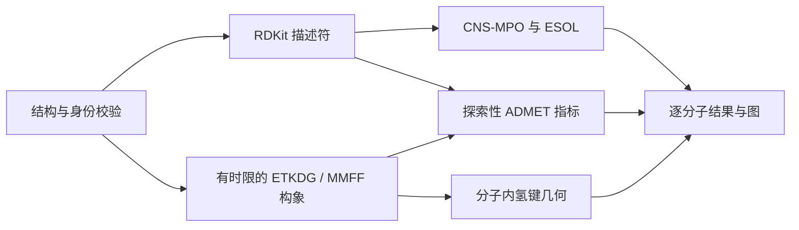

# Task 01 · 先导可开发性与 MPO / Lead developability

[返回七任务总览](../../README.md)

对 30 个有结构来源记录的药物母体，计算 RDKit 描述符、连续 CNS-MPO、ESOL，以及明确标注为探索性的 ADMET 和构象几何指标。项目代码、结构输入、结果、图和技术报告全部集中在本目录。

| 需要查找 | 入口 |
|---|---|
| 执行代码 | [run_task1_mpo_admet_developability.py](run_task1_mpo_admet_developability.py) |
| 结构输入和来源 | [30 个母体结构](data/reference_panel.json) · [临床背景与证据](data/CLINICAL_EVIDENCE.md) |
| 公式与参数约定 | [MODEL_CARD.md](MODEL_CARD.md)，包含电离覆盖输入格式、单位、归一化和缺失处理 |
| 技术报告 | [中文](DEVELOPABILITY_MPO_REPORT_ZH.md) · [English](DEVELOPABILITY_MPO_REPORT_EN.md) |
| 每个分子的结果 | [完整精度 JSON](results_task1/developability_results.json) · [CSV](results_task1/developability_results.csv) |
| 分组与复现记录 | [分组摘要](results_task1/group_summary.csv) · [运行清单](results_task1/run_manifest.json) · [历史验证记录](VALIDATION.md) |
| 图像 | [figures_task1/](figures_task1/)，3 张 300 DPI PNG 及 SVG |
| 软件检查与依赖 | [Task 1 测试](../../tests/test_task1.py) · [仓库依赖](../../requirements.txt) · [原运行版本](requirements-observed.txt) |

## 从仓库根目录运行

使用已有的 Python 环境；本模块需要 RDKit、NumPy、pandas、Matplotlib、seaborn 和 Pillow。完整结构面板已内置，运行时不需要联网、API Key 或模型下载。

```sh
# 快速复现描述符与图；3D 字段保持缺失，不覆盖归档结果。
python projects/task01_lead_developability/run_task1_mpo_admet_developability.py --conformers 0 --output-dir work/task01_descriptor

# 使用原交付所采用的较长单分子构象预算。
python projects/task01_lead_developability/run_task1_mpo_admet_developability.py --conformer-timeout 120 --strict-3d --output-dir work/task01_reproduction

# 使用有来源说明的电离参数覆盖；输入格式见模型卡。
python projects/task01_lead_developability/run_task1_mpo_admet_developability.py --ionization-overrides work/ionization.json --output-dir work/task01_custom

python -m unittest discover -s tests -p test_task1.py -v
```

省略 `--output-dir` 时，结果写到**脚本所在的项目目录**，不再写入当前工作目录。已有同名结果可能被覆盖，建议始终给独立的 `work/...` 目录。默认设置为 6 个 ETKDGv3 构象、种子 `20260910`、每个独立 3D 子进程最多 45 秒；大环可能需要更长时间。`--strict-3d` 要求每个分子至少有一个收敛构象，不等于充分构象采样。

## 计算如何连接



## 基准面板

| 分层 | n | 分子 |
|---|---:|---|
| 严格 Ro5 口服参照 | 10 | Aspirin、Diazepam、Sildenafil、Gefitinib、Omeprazole、Metoprolol、Losartan、Warfarin、Fluconazole、Captopril |
| 临床失败、撤市或受限参照 | 10 | Terfenadine、Astemizole、Cisapride、Cerivastatin、Troglitazone、Rofecoxib、Nefazodone、Benoxaprofen、Ximelagatran、Fialuridine |
| bRo5 与困难对照 | 10 | Cyclosporine A、Venetoclax、ARV-110、Rifampicin、Paclitaxel、Tacrolimus、Sirolimus、Erythromycin、Azithromycin、Daclatasvir |

这里的严格 Ro5 指 MW≤500、RDKit cLogP≤5、HBD≤5、HBA≤10 均满足；bRo5 指至少违反一项。分层是本研究的操作约定，不是完整化学空间分类。毒性参照不是统一 hERG 阳性集合；紫杉醇是静脉用药困难对照；ARV-110 所选数据库记录的立体化学不完整。详细限制保留在模型卡和双语报告中。

## 图像速览与证据边界


CNS-MPO 变换及 ESOL 系数来自已发表方法，描述符替换和电离假设仍影响输出。hERG、Caco-2、HIA、pKa/logD 与口服排序均为**未经生物学验证的启发式模型**；分数不是临床概率。气相构象不能证明溶剂依赖变色龙性，`absolute_chameleonic_hb_index` 保留为空。图中 MW/cLogP 矩形仅是两个描述符的投影，不能当成口服成功边界。

同一环境下数值可复现；RDKit 版本、平台和超时可能改变几何与代理分数。归档结果、图和科学说明的整理不代表重新计算。代码与原创文档使用仓库 [MIT 许可证](../../LICENSE)，第三方结构和研究保留各自归属。
