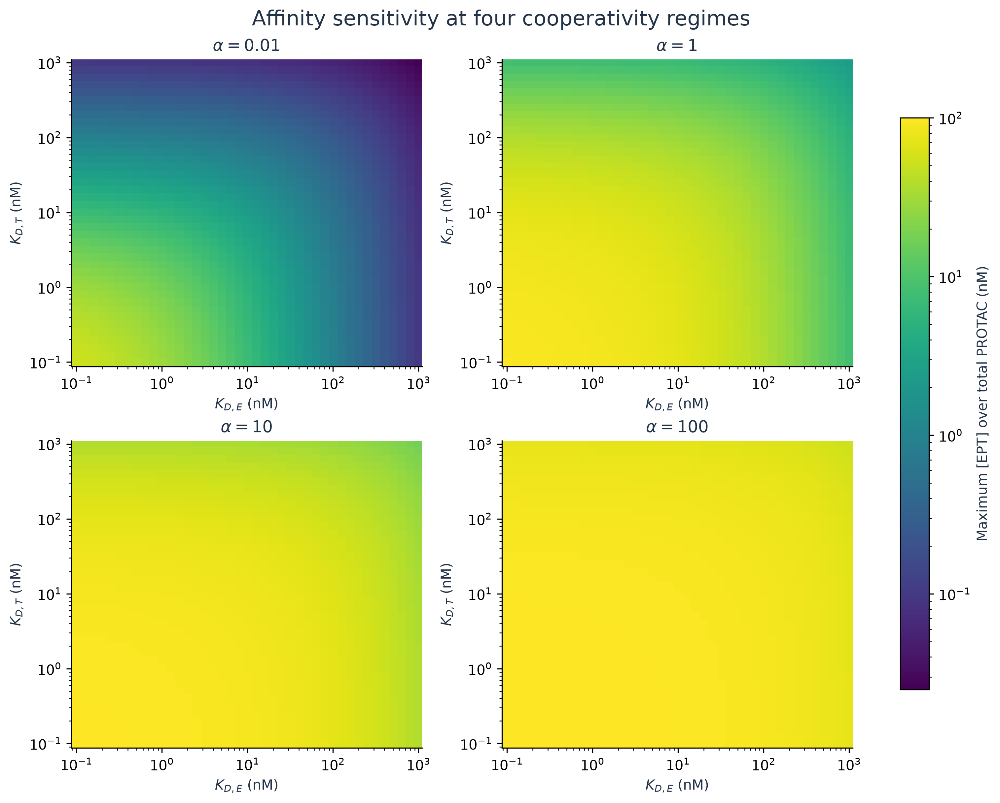
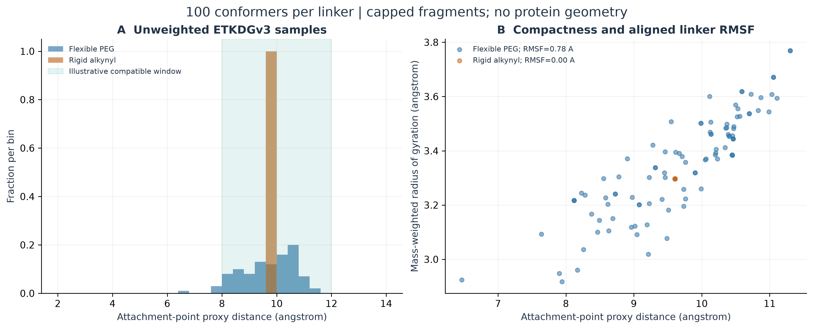

# Task 02 · 靶向蛋白降解与三元协同性 / TPD

[返回七任务总览](../../README.md)

从 E3–PROTAC–靶蛋白的质量作用平衡出发，计算协同性、钩状效应、连接子构象与合成降解读数。下面按代码、输入、结果、图和报告定位，原科学数据保持归档。

| 需要查找 | 入口 |
|---|---|
| 执行代码与内置输入 | [run_task2_tpd_ternary_cooperativity.py](run_task2_tpd_ternary_cooperativity.py)，`Config` 提供 CLI 参数 |
| 本次完整参数 | [manifest_task2.json](manifest_task2.json) 的 `parameters` 与软件版本 |
| 技术报告 | [中文](TPD_TERNARY_COOPERATIVITY_REPORT_ZH.md) · [English](TPD_TERNARY_COOPERATIVITY_REPORT_EN.md) |
| 平衡与钩状效应 | [物种浓度](data_task2/equilibrium_species.csv) · [峰值和窗口](data_task2/equilibrium_metrics.csv) · [亲和力/协同性扫描](data_task2/affinity_cooperativity_heatmap.csv) |
| 动力学与合成测定 | [降解时间曲线](data_task2/degradation_timecourses.csv) · [降解指标](data_task2/degradation_metrics.csv) · [HiBiT 合成重复](data_task2/synthetic_hibit_replicates.csv) · [合成条带](data_task2/synthetic_western_lanes.csv) |
| 连接子构象 | [摘要](data_task2/linker_summary.csv) · [构象表](data_task2/linker_conformers.csv) · [柔性 PEG SDF](data_task2/flexible_peg_conformers.sdf) · [刚性炔基 SDF](data_task2/rigid_alkynyl_conformers.sdf) |
| 4 张 300 DPI 图 | [figures_task2/](figures_task2/) |
| 检查与运行环境 | [validation_task2.json](validation_task2.json) · [仓库兼容依赖](../../requirements.txt) · [历史精确版本](requirements_task2.txt) |

## 从仓库根目录运行

运行依赖 NumPy、SciPy、Matplotlib、RDKit，使用现有环境即可。输入内置在脚本中，不需要下载外部模板；具体可覆盖参数由 `--help` 列出。

```sh
python projects/task02_tpd/run_task2_tpd_ternary_cooperativity.py --help
python projects/task02_tpd/run_task2_tpd_ternary_cooperativity.py --output-dir work/task02_reproduction
```

省略 `--output-dir` 时，输出写到脚本所在的本项目目录，并覆盖相应生成文件；复现建议使用新的 `work/...` 目录。脚本会在输出目录集中生成 CSV/SDF、图、报告、校验清单和日志，并复制独立驱动文件。

`requirements_task2.txt` 记录旧交付的精确版本，不是要求升级现有环境；项目公共兼容范围见仓库 `requirements.txt`。固定种子与单线程构象采样提供环境内可复现性，不能保证不同 RDKit 版本产生完全相同构象。

## 四个模块

1. **平衡**：三体质量守恒与独立求解交叉检查，输出总浓度下的峰位置和浓度窗口。
2. **协同性**：扫描亲和力与 alpha，区分峰高、窗口宽度和峰剂量。
3. **连接子**：生成、最小化并对齐构象，计算端点距离、RMSF 与 Rg。
4. **合成降解**：动态靶蛋白周转、钩状降解曲线及合成 HiBiT/条带读数。







## 科学范围与发布说明

所有降解实验读数均为合成数据；连接子只有映射的连接点代理，没有真实双端 warhead 或蛋白出口向量。构象 RMSF 和直方图宽度不等于结合熵。精确总浓度最优值推导、上升支 DC50 与单 Hill 拟合范围见双语报告。高 alpha 情景不等同于通用分子胶模型。

可选 `--git-publish` 仅在已有 Git 仓库和配置上游时发布生成路径，并拒绝夹带已有暂存改动。嵌套输出先发现仓库根，再从根处理相对路径；普通运行没有 Git 发布动作。本次目录整理没有调用发布选项，也没有重新生成历史科学结果。
