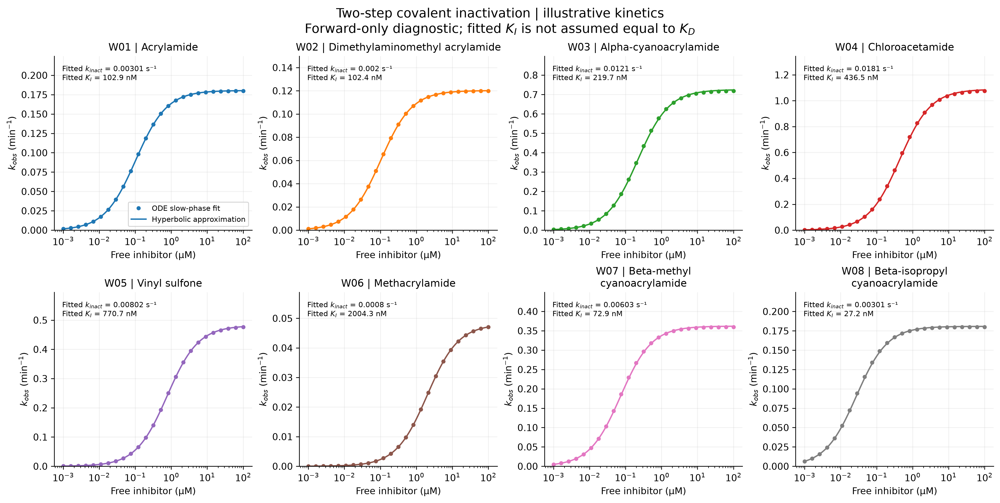
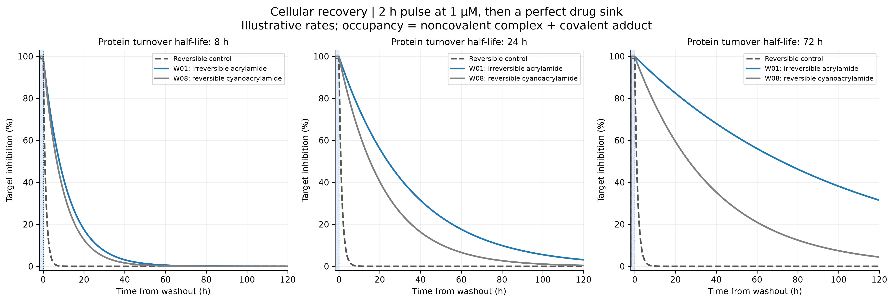
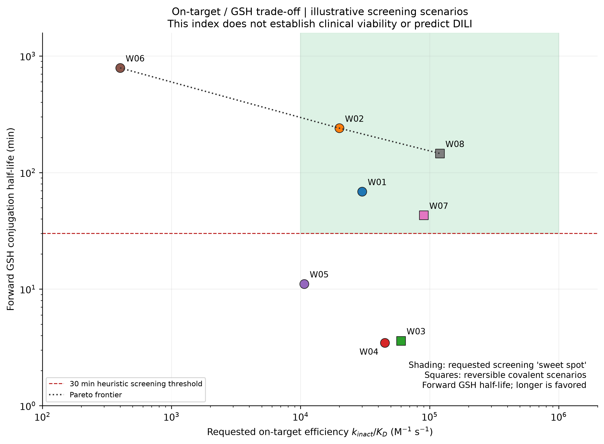
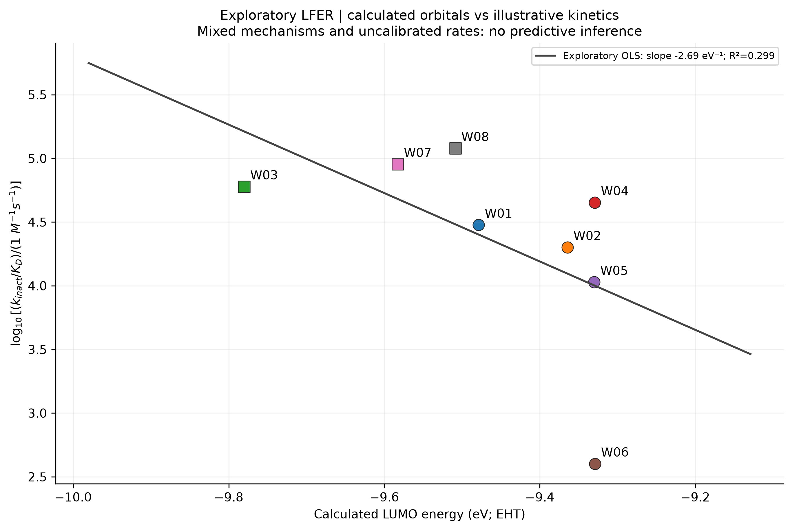

# Task 03 · 共价抑制动力学与驻留时间 / Covalent kinetics

[返回七任务总览](../../README.md)

对八个示例亲电 warhead，连接近似电子结构、二步共价失活动力学、GSH 反应性以及靶蛋白周转和洗脱恢复。该项目独立保存代码、输入模板、原始结果、结构、图和双语报告。

| 需要查找 | 入口 |
|---|---|
| 执行代码 | [run_task3_covalent_kinetics_residence_time.py](run_task3_covalent_kinetics_residence_time.py) |
| 输入模板 | [parameters_template.json](data_task3/parameters_template.json)，允许附来源的部分参数覆盖 |
| 技术报告 | [中文](COVALENT_DRUG_KINETICS_REPORT_ZH.md) · [English](COVALENT_DRUG_KINETICS_REPORT_EN.md) |
| 汇总结果 | [warhead_results.csv](data_task3/warhead_results.csv) · [residence_summary.csv](data_task3/residence_summary.csv) |
| 电子结构与分子 | [原子前线轨道指标](data_task3/atomic_frontier_descriptors.csv) · [SDF/XYZ](data_task3/structures/) |
| 失活动力学 | [kobs 浓度关系](data_task3/kobs_concentration.csv) · [固定浓度轨迹](data_task3/clamped_concentration_trajectories.csv) · [动态暴露](data_task3/dynamic_drug_exposure.csv) |
| GSH 与恢复 | [GSH 结合](data_task3/gsh_conjugation.csv) · [洗脱轨迹](data_task3/washout_trajectories.csv) · [简化周转轨迹](data_task3/reduced_turnover_trajectories.csv) |
| 4 张 300 DPI 图 | [figures_task3/](figures_task3/) |
| 验证与来源记录 | [validation.json](data_task3/validation.json) · [run_manifest.json](data_task3/run_manifest.json) · [LFER 回归](data_task3/lfer_regression.json) · [仓库依赖](../../requirements.txt) |

## 从仓库根目录运行

使用已有 NumPy、SciPy、Matplotlib、RDKit 和 Pillow 环境。默认 EHT/YAeHMOP 路径无需外部量化程序；只有选择 xTB 时才需要可用的 xTB 可执行文件。

```sh
python projects/task03_covalent_kinetics/run_task3_covalent_kinetics_residence_time.py --self-test-only

python projects/task03_covalent_kinetics/run_task3_covalent_kinetics_residence_time.py --output-dir work/task03_reproduction

# 编辑模板副本后，以来源说明覆盖对应速率参数。
python projects/task03_covalent_kinetics/run_task3_covalent_kinetics_residence_time.py --parameters work/task03_parameters.json --output-dir work/task03_custom

# 已有 xTB 时的可选电子结构路径。
python projects/task03_covalent_kinetics/run_task3_covalent_kinetics_residence_time.py --quantum xtb --xtb xtb --output-dir work/task03_xtb
```

省略 `--output-dir` 时，结果写到**脚本所在的本项目目录**，不再写入当前工作目录；已有同名生成文件可能被覆盖。上面的独立 `work/...` 路径便于比较新运行与归档结果。`--self-test-only` 不执行完整科学计算。模板中的部分覆盖不会自动使其余演示参数变成实测数据，来源说明应明确区分。

## 图像速览









## 科学范围与发布说明

EHT 是实际执行的低层次近似计算，**不是 DFT**；可选 GFN2-xTB 也不构成反应过渡态或自由能验证。动力学常数和势垒模型是未校准的情景。30 分钟 GSH 标记及效率阴影区属于筛选规则，不能解释为临床安全或 DILI 预测。报告分别讨论 KD、动力学 KI、拟合 KI、化学驻留和靶蛋白周转，避免混同。

可选 `--git-sync` 要求已有 `main` 检出和 `origin`，仅暂存生成路径，不切分支或强制推送。嵌套项目路径已改为从仓库根解释；普通运行不发布。本次整理未调用发布功能，也没有重新计算八个 warhead 的科学结果。
