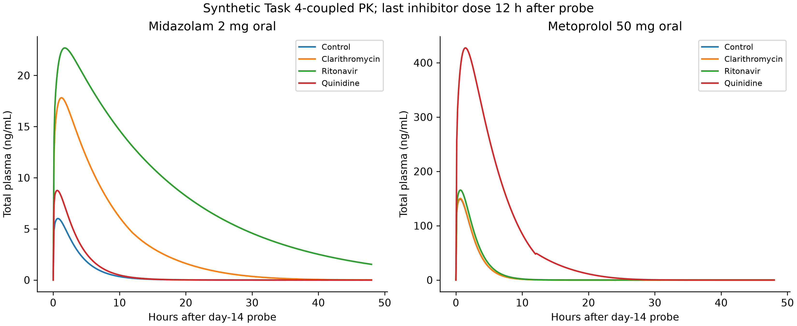
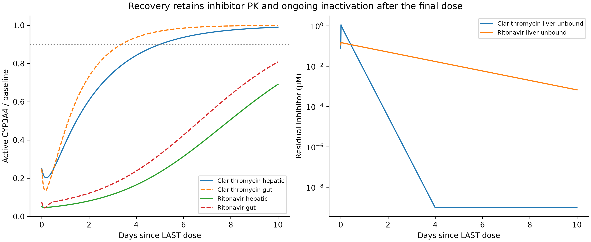

# CYP DDI 动力学、机制性失活与酶恢复

本任务完成可重复运行的机制模型：六个命名情景、三个 CYP 亚型、连续十四个给药日 BID 共 28 次给药、两种口服探针，以及停药后十天的酶恢复计算。模型实际调用仓库 Task 4 的循环、分布、吸收和清除导数。所有主要药物动力学和抑制参数均为**构造的研究情景**；结果不是这些药物的临床预测，没有据此认定安全、禁忌或推荐洗脱时间。

## 1. 已执行的内容与数据来源

| 证据类别 | 本次内容 |
|---|---|
| 一手文献/监管事实 | FDA/ICH M12 的抑制筛选、官方 CYP 示例表、CYP3A4 蛋白/血红素修饰实验 |
| 已发表模型估计 | Quinney 等 Table 2：克拉霉素 KI = 5.3 µM；肝 kinact = 0.4 h⁻¹；肠 kinact = 4 h⁻¹ |
| 用户指定 | 咪达唑仑 2 mg、美托洛尔 50 mg 口服；三 CYP 面板与十四天 BID；肝 CYP3A4 kdeg = 0.019 h⁻¹ 作为示例 |
| 假设 | 六药完整 PK、Ki/KI/kinact 面板、其他周转率、组织 Kp = 1、肠游离浓度近似、探针清除组成 |
| 已执行计算 | 24 个动态 AUCR、18 个酶筛选条目、36 个酶恢复条目、三种周转率情景、无噪声预孵育参数恢复 |
| 尚缺 | 实测结合率与动力学、临床浓度/相互作用数据、参数可辨识性与外部验证、个体差异与患者安全边界 |

文献的三个参数是作者模型估计，不能当成新测得的体外数据。`literature_parameter_response.csv` 计算两部位、三种恒定浓度、41 个时间点，共 246 行传递函数响应；没有把文献 KI 重新解释为已测游离 KI，也没有把这些参数直接混入主要 PBPK 情景。该计算并非重现原研究的临床拟合或实验曲线。[Quinney 等，2010](https://pmc.ncbi.nlm.nih.gov/articles/PMC2812061/)

六个情景是 Ketoconazole、Clarithromycin、Ritonavir、Fluconazole、Quinidine、Amoxicillin。前三者分别展示明显可逆抑制、失活、两者共存；氟康唑和奎尼丁展示不同亚型偏好。阿莫西林情景的零失活和极大 Ki 是人为设定的近零抑制对照，**不构成对该药物所有相互作用的排除**。角色参考 [FDA CYP 示例表](https://www.fda.gov/drugs/drug-interactions-labeling/drug-development-and-drug-interactions-table-substrates-inhibitors-and-inducers)，没有从角色推断任何数值参数。美托洛尔按用户指定作为 CYP2D6 探针情景，不宣称它是本指南指定的敏感指数底物。

## 2. 化学机制及其可识别范围

可逆抑制会随游离抑制剂浓度变化而快速变化；时间依赖性活性下降还可能包含代谢活化、紧密配位或共价修饰。血红素铁配位、卟啉破坏和脱辅基蛋白共价加成不是同一种化学事件。单凭随时间下降的活性曲线不能区分这些机制，ODE 中的 kinact 是有效失活速率，不是原子级机制证明。

Ritonavir 的重组体系研究报告了血红素损失/血红素相关加成；另一研究以放射性示踪与质谱支持 CYP3A4 Lys257 蛋白加成。应分别保留体系和实验依据，不能把其中一种机制宣布为所有人体条件下唯一过程。[Lin 等，2013](https://pmc.ncbi.nlm.nih.gov/articles/PMC3781371/)，[Rock 等，2014](https://pubmed.ncbi.nlm.nih.gov/25274602/)

证明 MBI 应结合 NADPH 依赖、时间/浓度依赖、去除游离药物后的恢复、代谢物/蛋白或血红素加成证据，并排查酶不稳定、抑制剂耗竭和非特异吸附。本次 Fig. 1 是已知参数生成的无噪声指数曲线，然后恢复参数的数值演示；不是一个新的体外失活实验，也不能证明参数在真实噪声下可辨识。

## 3. 纠正静态公式与监管含义

用户原提示的净 AUCR 式在 `R_hepatic > 1`、`R_gut > 1` 时可随抑制增强而下降，方向不符合这里的抑制模型，因此没有照抄。基本筛选量和暴露比必须分开：

\[
R_1=1+C_{max,u}/K_i,\quad
R_2=1+\frac{k_{inact}\,5C_{max,u}}{k_{deg}(K_I+5C_{max,u})}.
\]

采用 M12 的 `5 × Cmax,u`。R1 的 1.02、R2 的 1.25，以及口服 CYP3A 肠筛选的 `(Dose/0.250 L)/Ki = 10` 是进一步评估的筛选边界，不能直接代替 AUCR。这里的 Cmax 只是第十四日模拟周期的 0.25 h 网格峰值，未声称已证明达到稳态。该三酶子集不是完整监管检测面板。[FDA/ICH M12，§2.1.2](https://www.fda.gov/media/161199/download)

在忽略诱导的静态近似下，先定义剩余活性 `a = [kdeg/(kdeg+kobs)] / (1+I/Ki)`。本实现单独保留 M12 简化极限：

\[
AUCR_{M12}=\frac{1}{a_g(1-F_g)+F_g}\frac{1}{a_h f_m+(1-f_m)}.
\]

此式的 fm 是受抑酶占肝清除的比例，且需要相应清除假设。另一个 `generalized_constant_mean_static_aucr` 列从本模型的 well-stirred 肝、肠首过和肾清除推导，不能称为完全相同的官方式。其单次口服 AUC 为：

\[
x=f_{u,p}CL_{int}s_h/R_b,\quad F_h=Q_h/(Q_h+x),\quad
CL_{h,p}=R_bQ_hx/(Q_h+x),
\]
\[
F'_g=[1+(1/F_g-1)s_g]^{-1},\quad
AUC=Dose\,F_aF'_gF_h/(CL_{h,p}+CL_{renal}).
\]

`s_h = 1 − Σw_i + Σw_i a_hi`，权重是**内在肝清除份额**，不冒充已测全身 fm。独立测试将恒定活性下 ODE 积分结果与上述解析 AUC 比较。正常活性时 AUCR 回到 1；完全抑制并取 fm=0.9、Fg=0.5 的官方极限为 20，方向检查也通过。

AUCR 1.25、2、5 在结果中只命名为 `weak_range / moderate_range / strong_range`。临床分类建立在合适研究上，是否禁忌还依赖底物暴露–效应关系、治疗窗和具体标签；本模型不输出“禁忌”或“安全”。

## 4. 动态耦合、单位与守恒

抑制剂采用 Task 4 的 11 状态实现：七个药量状态（血、肝、胃肠腔药库、肾、脑、肺、其余组织），加肝清除、肾清除、未入循环损失与 AUC 的积分状态。肺与全身循环串联。新增六个无量纲 CYP 池分别表示肝/肠三个亚型，基线为 1：

\[
\dot E_i=k_{deg,i}(1-E_i)-k_{inact,i}\frac{I_u(t)}{K_{I,i}+I_u(t)}E_i.
\]

两个探针分开模拟、共用相同的抑制剂/酶历史，不包含探针之间的影响，因此不是验证过的临床鸡尾酒模型。每个探针直接调用 Task 4 导数，再成对调整肝代谢与首过通量，损失积分同步更新。Task 4 的 `FEC` 在此作为“未吸收加肠首过损失”的总账，不全是粪便排泄。

剂量/药量为 mg，时间为 h，浓度为 mg/L；`µM = mg/L × 1000 / MW(g/mol)`。肝游离浓度由肝药量、组织 Kp 和 fu,p 得出。肠浓度采用 `I_gut,u = I_plasma,u + fu_gut Fa ka A_depot / Qgut` 转成 µM；这只是明确的流量近似，**没有虚构 Task 4 原本不存在的灌流肠壁室**。所有组织 Kp 设为 1，是人为情景，并非真实组织数据。

28 次给药时间为 0、12、…、324 h；末次给药后观察到 564 h。探针在首次给药时刻 0 h 或第十四日开始 312 h 给一次。各自对照使用同一观察时窗，AUC 分别积分 564 h 与 252 h。第十四日探针给药后 12 h 还有最后一次抑制剂给药，随后保留残余浓度与失活过程。

## 5. 实际计算结果

下表全部为**构造参数下的计算值**。静态列冻结第十四日末次前周期的网格平均肝/肠游离浓度，并假设相应酶池达到该恒定浓度的平衡。

| 情景 | 第十四日咪达唑仑动态 AUCR | 对应广义静态 AUCR | 美托洛尔动态 AUCR |
|---|---:|---:|---:|
| Ketoconazole | 11.6746 | 11.7784 | 1.0555 |
| Clarithromycin | 6.4009 | 6.5416 | 1.0094 |
| Ritonavir | 16.9622 | 17.1904 | 1.1569 |
| Fluconazole | 2.1647 | 1.5792 | 1.0224 |
| Quinidine | 1.4253 | 1.1207 | 6.2996 |
| Amoxicillin 近零对照 | 1.0000 | 1.0000 | 1.0000 |

动态和平均浓度静态计算并不恒等；肠内给药峰、探针给药相位、酶历史和抑制剂末次给药后的衰减都会影响差异。氟康唑情景的 2.1647 对 1.5792 是模型结构/时序效应，不能拿作该药实际临床 AUCR 的纠错或验证。

恢复时间定义为末次给药后最后一次向上穿过 90% 的时间，后续所有 0.1 h 网格样本保持 ≥90%，并对最后跨越区间做根求解。克拉霉素情景肝 CYP3A4 为 4.9976 天、肠为 3.3666 天；利托那韦两池在十天窗口内未恢复到 90%，记录为右删失，不能填成十天。单纯可逆情景的酶量恢复为零天，但这**不意味着药物已消失或清除功能已完全恢复**。

`ln(2)/kdeg` 是无持续失活时的酶周转半衰期，不是恢复到 90% 的时间。将克拉霉素情景的周转率乘 0.5、1、2，咪达唑仑 AUCR 分别为 8.9494、6.4009、4.4326；肝酶恢复分别为十天未达到、4.9976 天、2.5349 天。这显示周转率的不确定性足以改变阈值分档，没有为任一患者给出洗脱建议。

## 6. 先导优化与可证伪实验

呋喃可以发生代谢活化而产生反应性中间体；例如 bergamottin 的 CYP3A4 蛋白修饰有直接研究支持。[原始研究](https://pmc.ncbi.nlm.nih.gov/articles/PMC3336797/) 对候选先导，可提出呋喃→饱和含氧环或其他等排体、苯胺→降低氧化敏感性的杂芳环/酰胺、亚甲二氧基苯→拆分或替换等 **SAR 假说**。这些替换可能同时改变靶点活性、pKa、溶解性、清除和代谢通路，不能预设一定降低 MBI，更不能靠结构警示直接判定有毒。

有判别力的下一步是同批次对照下的 Ki 与 NADPH 预孵育失活矩阵，测定游离分数、抑制剂耗竭和多个底物依赖性；对失活阳性化合物进行去药后恢复、代谢物捕获与蛋白/血红素质谱。再取得肝细胞诱导、主要循环代谢物、真实口服 PK 和受体药 DDI 数据，分开估计后外部验证。当前模块没有诱导、抑制剂自抑制、活性代谢物、转运体或遗传表型，利托那韦等多机制药尤其不能按本简化模型直接外推。

## 7. 复现与质量检查

运行方法及文件链接见 [模块 README](README.md)。`--config` 读取六药固定标识的 JSON 输入，完整参数和继承的 Task 4 配置会导出；未知字段被拒绝，证据标签保持假设。`--out` 必须是新目录，`--self-test` 不改变冻结结果。没有联网、安装包或自动 Git 操作。

本轮 11 项测试覆盖浓度单位、非法参数、监管因子 5、无抑制/完全抑制极限、恒定浓度酶解析解、Task 4 零扰动一致性、质量守恒、解析 PBPK AUC、恢复与删失、分档边界。更严格容差复算的克拉霉素–咪达唑仑 AUC 相对变化为 8.60×10⁻⁸；六药最大质量误差 2.58×10⁻⁷ mg，探针最大 3.11×10⁻⁸ mg，末端剩余探针比例最大 4.94×10⁻¹⁵。以上是数值正确性证据，不是临床有效性证据。四张 300 DPI PNG 已逐图查看；数值输出附 SHA256，原 Task 4 脚本哈希记录在摘要中。
