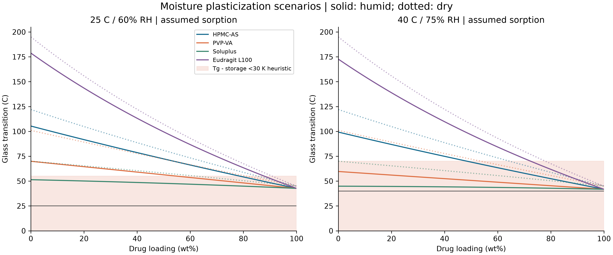

# Task 6: ASD thermodynamics, glass transition and supersaturation kinetics

Computed 2026-09-20. **Evidence level: executed hypothetical mechanistic scenarios, with primary sources supporting methods and two typical polymer glass-transition values.** There is no compound-specific experimental fit, shelf-life validation or human exposure prediction.

## 1. Findings and delivered scope

The completed calculation contains 324 dry binary phase-grid rows, 32 storage scenarios, 69 ODE integrations, four 300-dpi figures, raw concentration/mass trajectories, a 27-scenario paired sensitivity grid and 14 physical/numerical tests.

Under the specified assumptions, the 20% HPMC-AS candidate gives a closed-vessel AUC of 0.319124 mg·h/mL, 7.997 times the crystalline baseline. Its six-hour absorption-sink mass ratio is 8.795. **These are simulation ratios, not measured improvements in human oral bioavailability.** The 30% candidate has a larger closed-vessel AUC, so the prespecified 20% candidate is not established as optimal.

The prompt's blanket claim that more than 70% of candidates belong to BCS II/IV was not verified for a defined pipeline, sample or date. BCS also depends on permeability; high lipophilicity alone does not establish a BCS class. This report therefore uses the qualitative formulation challenge without presenting an unsupported prevalence estimate.

## 2. Inputs and provenance

The API is deliberately hypothetical: neutral, molecular weight 390 g/mol, density 1.30 g/cm³, molar volume 300 cm³/mol, dry Tg 45°C, crystalline solubility 0.01 mg/mL and amorphous/crystalline solubility ratio 10. Its assumed Hansen triplet is (20, 9, 10) MPa^0.5. It is not a surrogate dataset for an identified marketed drug.

| Carrier scenario | Hansen triplet, MPa^0.5 | Density, g/cm³ | Effective Np | Dry Tg, °C | Numerical evidence |
|---|---|---:|---:|---:|---|
| HPMC-AS | 18.5, 11, 12 | 1.20 | 100 | 122 | Tg: manufacturer typical value; other values assumed |
| PVP-VA | 18, 12, 7 | 1.18 | 80 | 101 | Tg: manufacturer typical value; other values assumed |
| Soluplus | 18, 8, 8 | 1.10 | 120 | 70 | All numerical values assumed |
| Eudragit L100 | 17.5, 12, 8 | 1.25 | 150 | 195 | All numerical values assumed |

The HPMCAS value is a typical DSC result under the manufacturer's stated conditions, not a batch-specific measurement; substitution grades also have different opening pH ranges. [Shin-Etsu primary brochure](https://www.setylose.com/fileadmin/download_pfmd/49.pdf). The copovidone value of 101°C appears on page 13 of the primary BASF technical information, which also discusses ASD processing and moisture-related limitations. [BASF technical information](https://download.basf.com/p1/EN_StaticDocuments_6145/en/Technical_Information_Technical_Information_English.pdf).

The Soluplus product page supports its carrier identity and matrix/solubilizer roles, not every numerical parameter used here. [BASF product page](https://pharmaceutical.basf.com/global/en/pharma-solutions/products/soluplus). The Eudragit L100 page supports release above pH 6.0; its model Tg, density and Hansen parameters remain assumptions. [Evonik product page](https://www.evonik.com/en/products/hc/pr_52000884.html).

Hydrogen-bond donor/acceptor complementarity can motivate an experimental screen, but a Hansen distance does not demonstrate a bond geometry, binding strength or a winning real formulation. Carrier names here label reproducible scenarios, not measured rankings. All sorption, VFT, transport, nucleation, growth and absorption values are analyst assumptions exported in the parameter file.

## 3. Module 6A: common-tangent phase equilibrium

Drug mass fraction is converted to volume fraction before applying Flory–Huggins:

\[
\phi_d=\frac{w_d/\rho_d}{w_d/\rho_d+(1-w_d)/\rho_p},\qquad
\chi=\frac{V_d[(\Delta\delta_D)^2+0.25(\Delta\delta_P)^2+0.25(\Delta\delta_H)^2]}{RT}.
\]

MPa·cm³=J, making χ dimensionless with Vd in cm³/mol. The implemented f=ΔGmix/(RT) is normalized per reference lattice site. Nd=1; Np is an assumed effective segment count. The weighted Hansen approximation omits composition dependence, specific binding equilibria and additional entropic contributions. Experimental work demonstrates that χ can depend substantially on both composition and temperature. [Original composition/temperature study](https://pubmed.ncbi.nlm.nih.gov/31430958/).

Spinodals solve f''=1/(Ndφ)+1/[Np(1−φ)]−2χ=0. The critical interaction parameter is 0.5(1/√Nd+1/√Np)². For Np=100, the critical **drug** volume fraction is approximately 0.909, not 0.091. Binodals are independently solved through equality of both chemical potentials, equivalent to a common tangent of f. Logit coordinates preserve the polymer-rich/drug-rich endpoint logarithms. Solutions must lie outside the spinodals; subcritical cases return no phase boundary. The largest common-tangent residual is **6.07×10⁻¹¹**. Extremely drug-rich exported mass fractions can round to one in double precision while the internal chemical-potential calculation retains stable logarithms.

At 25°C the assumed χ values are 0.514, 1.029, 0.635 and 1.150 for HPMC-AS, PVP-VA, Soluplus and Eudragit L100. There are 186 two-phase rows among the 324 rows over 0–150°C. Outside the binodal the homogeneous amorphous state is stable against AAPS; between binodal and spinodal it is metastable; inside the spinodal it is unstable. The equilibrium state inside the binodal is phase coexistence. This is **not** a crystal–amorphous equilibrium diagram: absence of AAPS does not establish resistance to crystallization. Compound-specific thermal studies provide the relevant experimental-validation route. [Original thermal-phase-diagram study](https://pubmed.ncbi.nlm.nih.gov/21416468/).


## 4. Module 6B: glass transition, moisture and the VFT domain

Gordon–Taylor calculations use Kelvin throughout, with K≈ρdTgd/(ρpTgp). Relative humidity is not water mass fraction. An explicit assumed dry-basis sorption law q=a·RH/(1−0.5RH), with a dry-mass weighted coefficient, gives wet-basis water fraction ww=q/(1+q). A second Gordon–Taylor operation uses assumed water Tg=136 K and Kwater=5. This sequential approximation is not a calibrated ternary phase model or a DVS dataset.

For the 20% HPMC-AS scenario, assumed water contents are 1.136% at 25°C/60% RH and 1.583% at 40°C/75% RH. Corresponding Tg values are 91.70°C and 86.84°C. A Tg−storage margin below 30 K is only a screening heuristic, not a release specification.

The hypothetical VFT curve uses τ0=10⁻¹⁴ s, T0=Tg−50 K and τ(Tg)=100 s. An assumed factor tind/τ=10⁶ links relaxation to an illustrative induction proxy. Calculations are performed only when T>T0; **12 of 32 rows are outside that mathematical domain and return null values**. Even formally in-domain results can have log10(hours) in the hundreds. These retained logarithms expose extreme extrapolation, not credible lifetimes. No dielectric, calorimetric relaxation or isothermal-crystallization calibration exists. **None of the rows validates shelf life.**



## 5. Module 6C: finite-dose dissolution and precipitation

The hypothetical vessel contains 100 mg drug in 900 mL at 37°C and nominal pH 6.8. Crystalline saturation capacity is 9 mg, below the dose. Bile-salt/phospholipid concentrations, ionic strength and micellar partitioning are unspecified; this is **not a validated FaSSIF experiment**. pH is descriptive for the neutral hypothetical API, not an implemented ionization model.

State variables are undissolved drug U, molecularly dissolved drug L, newly precipitated crystals X, absorbed-sink mass A and a dimensionless effective growth-site activation z. C=L/V and:

\[
\dot U=-J_d,\quad \dot L=J_d-J_p+J_r-J_a,\quad
\dot X=J_p-J_r,\quad \dot A=J_a,\quad U+L+X+A=100\ {\rm mg}.
\]

The Noyes–Whitney **mass** flux is Jd=(D/h)S0(U/U0)^(2/3)(Csource−C)+. A concentration equation must divide this by V; integrating masses prevents a missing-volume error. Precipitated crystals can redissolve below crystalline saturation. Particle area, boundary layer and diffusivity are assumptions, not hydrodynamic or size-distribution fits.

For the pure amorphous material, Csource=Ccrys exp(ΔGcrys/RT), with assumed ΔGcrys=RT ln10. A homogeneous HPMC-AS blend additionally multiplies this value by the drug activity computed from its dry FH chemical potential. At 20% loading, activity is 0.58089 and source solubility is 0.058089 mg/mL. This implements the trade-off whereby polymer mixing can lower drug chemical potential while delaying crystallization, rather than forcing every ASD to have a higher peak than the pure amorphous drug. [Original supersaturation study](https://pmc.ncbi.nlm.nih.gov/articles/PMC5972073/).

The dimensionless homogeneous CNT barrier is:

\[
\frac{\Delta G^*}{k_BT}=\frac{16\pi\gamma^3v^2}{3(k_BT)^3(\ln S)^2},\quad
v=V_m/N_A,\quad S=C/C_{crys}>1.
\]

Here γ is in J/m² and v in m³. Nucleation is disabled for S≤1. The site-activation rate contains exp(−ΔG*/kBT); crystal growth depends on activated sites, excess concentration and a polymer inhibition factor. The site variable is phenomenological, not a particle population calibrated by microscopy, and embryo mass is neglected. Polymer concentration is assumed immediately available and constant at total added polymer/volume, an approximation that omits polymer-release, surface-coverage and micellar-binding kinetics.

Operational induction is the first time precipitated mass reaches 1% of dose. It is not the appearance of the first molecular nucleus. Cases not crossing the threshold by six hours are right-censored.

| Closed-vessel formulation | Cmax, µg/mL | AUC0–6h, mg·h/mL | First 1 mg precipitated, h | Time above S=1.05, h |
|---|---:|---:|---:|---:|
| Micronized crystal | 9.369 | 0.039904 | >6, censored | 0 |
| Pure amorphous | 58.446 | 0.104538 | 0.296 | 2.186 |
| 20% HPMC-AS | 57.707 | 0.319124 | 4.242 | 5.921 |

This selected parameter set produces a supersaturated interval exceeding four hours. That is a conditional simulation result, not experimental confirmation or a universal formulation guarantee. Figure 3 separates a closed dissolution vessel from the same vessel with an imposed uptake sink.


## 6. Module 6D: loading comparison and translation limits

The sink assumes Ja=kaL with ka=0.30 h⁻¹. It does not implement human intestinal area, effective permeability, segmented transit, transporters, first-pass metabolism or systemic clearance. Six-hour absorbed masses are 7.691, 24.438 and 67.640 mg for crystal, amorphous drug and 20% HPMC-AS. ERabs is a **matched-dose sink-mass ratio**. With constant ka and V, A=kaV∫Cdt, so uptake mass and the corresponding sink-system AUC are mathematically linked, not independent validation. Closed-vessel AUC refers to a different system.

HPMC-AS loadings of 10%, 20%, 30% and 50% yield AUC values of 0.190907, 0.319124, 0.370222 and 0.236468 mg·h/mL. Operational induction times are >6 (censored), 4.242, 1.633 and 0.785 h. More polymer slows precipitation but reduces drug activity. The 30% candidate outperforms 20% on this one closed-vessel endpoint; there is no validated optimum across loading, manufacturability, storage stability, dosage mass or cost.

The sensitivity grid varies γ by {0.8,1,1.2}, the nucleation coefficient by {0.1,1,10} and the absorption coefficient by {0.5,1,2}. Each of the 27 combinations uses a crystalline comparator with the same absorption coefficient, requiring 54 ODE solves. ERabs spans **5.961–8.803**. This is an analyst-defined scenario range, **not a confidence interval**, and does not cover all model uncertainty.


Translation requires distinguishing free molecules from micelle-bound and colloidal drug: an increase in total measured concentration need not yield the same transmembrane flux. The present single-free-concentration model does not resolve those partitions. A credible next stage would identify the API/crystal form/polymer grade, measure DSC/XRPD and DVS, quantify free versus total concentration and precipitate in a specified medium, jointly fit nucleation/growth with held-out experiments, and calibrate permeability and first-pass/PK components. These calculations can inform that experimental design but cannot substitute for it.

## 7. Reproduction and verification

[Standalone driver](run_task6_asd_formulation_supersaturation_kinetics.py), [parameters](inputs/parameters.json), [source registry](inputs/sources.json), [summary](results/summary.json), [phase boundaries](results/phase_boundaries.csv), [storage scenarios](results/storage_scenarios.csv), [raw mass trajectories](results/concentration_mass_timeseries.csv), [formulation summary](results/formulation_summary.csv), [loading comparison](results/loading_summary.csv), [sensitivity](results/sensitivity_27_scenarios.csv), [solver refinement](results/solver_refinement.csv).

From the repository root:

```bash
python projects/task06_asd/run_task6_asd_formulation_supersaturation_kinetics.py --self-test
python projects/task06_asd/run_task6_asd_formulation_supersaturation_kinetics.py --out work/task6_reproduction
```

The output directory must not exist. Defaults are embedded and exported; execution is offline. `--write-example work/task6_parameters.json` exports editable inputs, and `--config work/task6_parameters.json --out work/task6_custom` reads the complete schema back with physical/design validation. Nd=1 is explicitly required rather than silently ignored. Carrier identities, prescribed loading grid and endpoint definitions are fixed by this experiment. Edited physical parameters require reassessment of the homogeneous-ASD assumption; the default 20% HPMC-AS candidate is in the dry FH single-phase region. Being outside the VFT domain means the formula is unavailable, not that the material is unstable. Seed 20260920 is recorded but unused because no random sampling occurs. [The manifest](manifest.json) records actual package versions, script SHA256 and generated-file hashes. Narrative reports are separately versioned repository documents.

The 69 integrations comprise six reference, three additional loading, 54 paired sensitivity and six tighter-tolerance runs. Maximum mass error is **1.28×10⁻¹³ mg**. Raw numerical trajectories can contain boundary undershoots around 10⁻⁹ mg; these are retained rather than silently replaced with manufactured observations. Reducing solver tolerances tenfold and maximum steps by √10 changed reference concentrations by at most **5.37×10⁻¹⁰ mg/mL**. Fourteen tests cover common tangent/convex envelope, critical-composition orientation, χ/CNT units, RH conversion, VFT poles, finite-dose conservation, crystalline saturation, absorption integration and the volume factor. All four 300-dpi figures were visually inspected. These checks validate implementation of the stated equations, **not the assumed materials, shelf life or clinical efficacy**.
