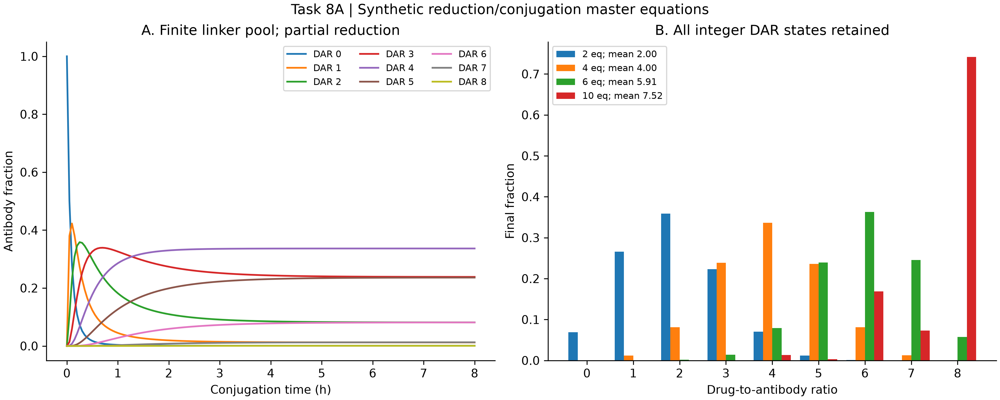
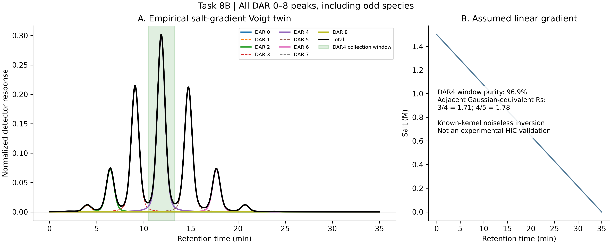
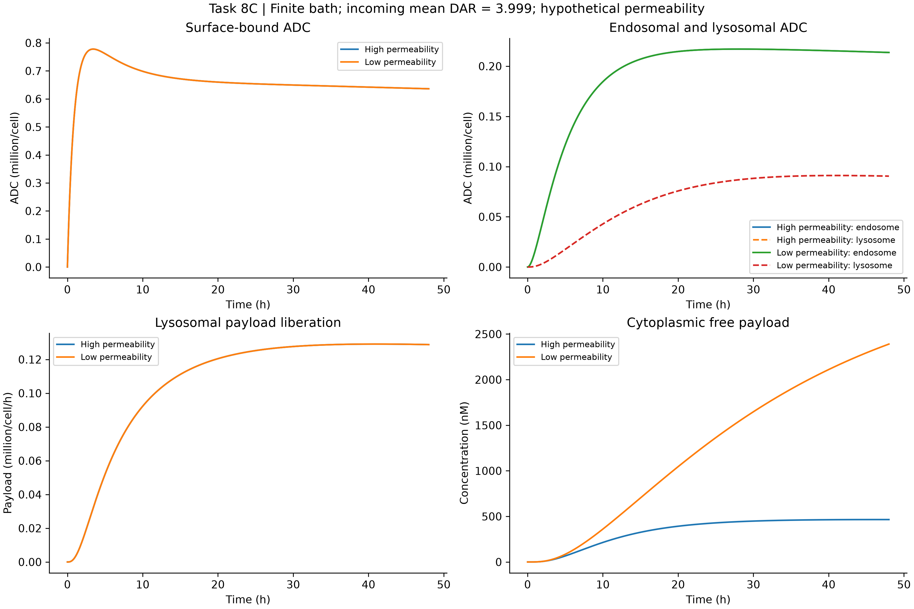
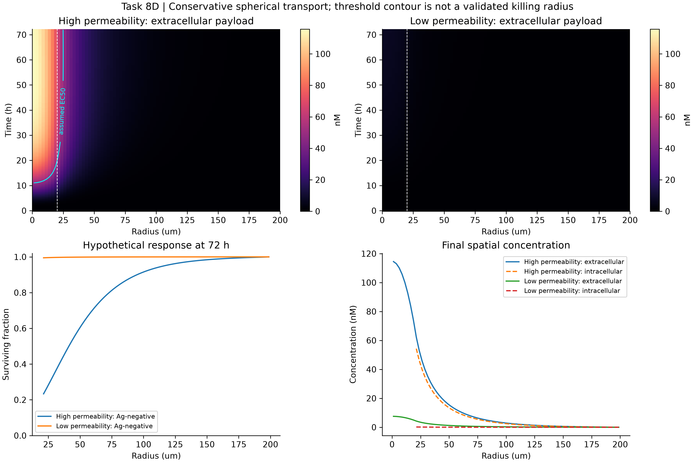

# Task 08 · ADC multiscale engineering

Executed, reproducible **hypothetical** ADC calculations: finite-linker DAR formation → HIC separation → receptor trafficking and effective lysosomal cleavage → spherical payload transport and an assumed exposure-response law. The original request is preserved in [TASK.md](TASK.md).

| Find | Artifact |
|---|---|
| Monolithic executable | [run_task8_adc_dar_cleavage_bystander_dynamics.py](run_task8_adc_dar_cleavage_bystander_dynamics.py) |
| Chinese report | [ADC_TRANSLATIONAL_ENGINEERING_REPORT_ZH.md](ADC_TRANSLATIONAL_ENGINEERING_REPORT_ZH.md) |
| English report | [ADC_TRANSLATIONAL_ENGINEERING_REPORT_EN.md](ADC_TRANSLATIONAL_ENGINEERING_REPORT_EN.md) |
| Parameters and sources | [config.json](config.json), [parameter_provenance.csv](parameter_provenance.csv), [SOURCES.md](SOURCES.md) |
| Numerical results | [summary.json](summary.json), [sensitivity.json](sensitivity.json), [data](data/) |
| Verification/provenance | [verification.json](verification.json), [run_metadata.json](run_metadata.json), [manifest.json](manifest.json) |
| Four 300-DPI figures | [figures_task8](figures_task8/) |

From the repository root, using an environment with NumPy≥2, SciPy and Matplotlib:

```powershell
python projects/task08_adc/run_task8_adc_dar_cleavage_bystander_dynamics.py --out work/task8_reproduce
python projects/task08_adc/run_task8_adc_dar_cleavage_bystander_dynamics.py --write-example work/task8_parameters.json
python projects/task08_adc/run_task8_adc_dar_cleavage_bystander_dynamics.py --config work/task8_parameters.json --out work/task8_custom
python projects/task08_adc/run_task8_adc_dar_cleavage_bystander_dynamics.py --self-test
python -m unittest discover -s tests -p test_task8.py -v
```

Output destinations must be empty/nonexistent, preventing accidental replacement of archived evidence. Partial configuration objects may override default keys; unknown keys, nonfinite numbers, incompatible time grids and invalid geometry are rejected. `--self-test` checks physical/numerical invariants; it does not train a model or validate efficacy. The archived reports interpret the default run and are versioned documents, rather than automatically rewritten after arbitrary parameter changes.

The default run contains four conjugation conditions, 24 Gillespie replicates of 1,000 antibodies, two cellular/tissue permeability scenarios, two tissue refinements and four diffusion/clearance sensitivity runs. The spatial data contain 23,200 rows. **DAR4 is a chosen collection target; its clinical optimality is not assumed.** The mean downstream DAR is 3.99932, while the hypothetical high/low permeability scenarios give mean Ag-negative surviving fractions of 0.958800 and 0.999848 at 72 h. These are simulated numbers, not measurements or treatment recommendations.

The shell model is spherically symmetric in three-dimensional geometry, not an anatomically reconstructed 3D tumor. The cyan concentration contour uses an assumed threshold; it is not a measured or validated killing radius.





