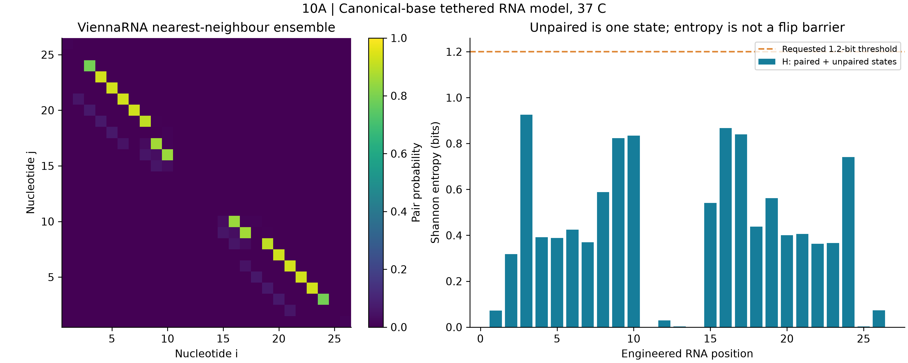
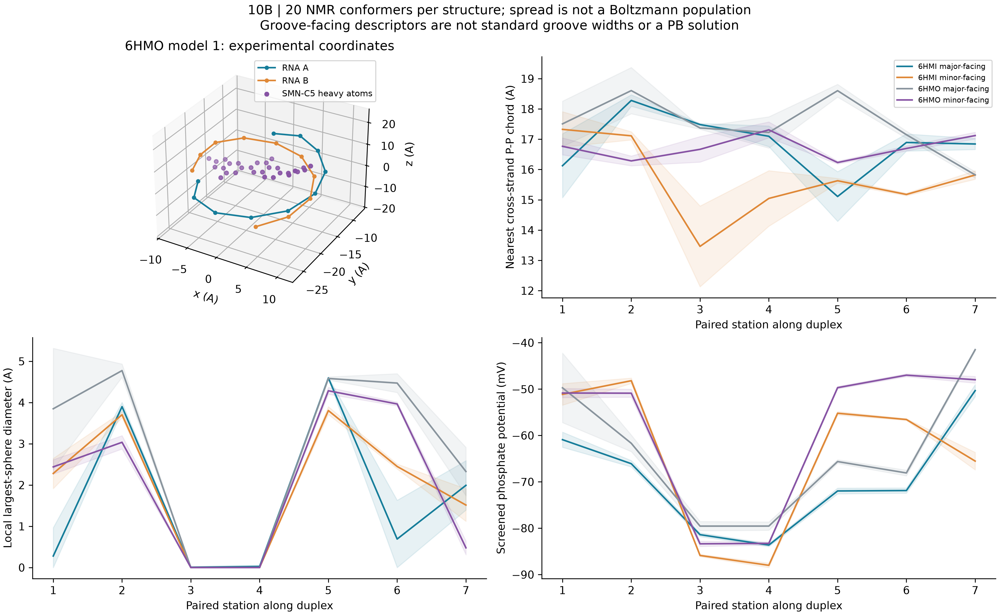
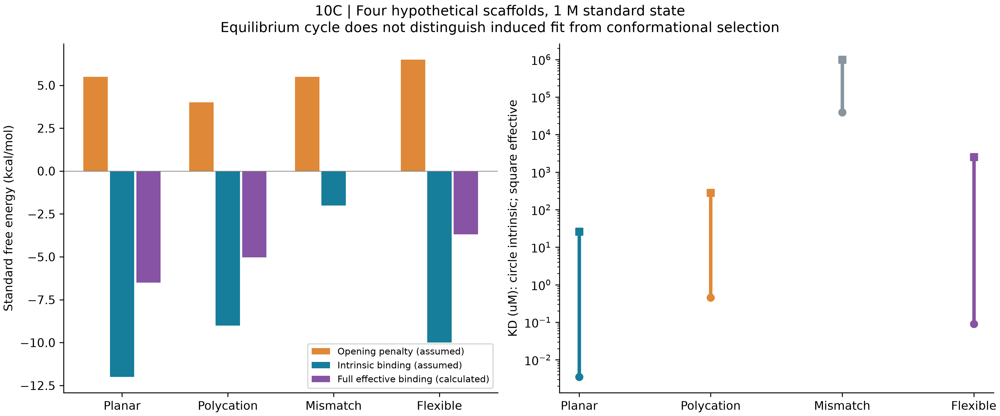
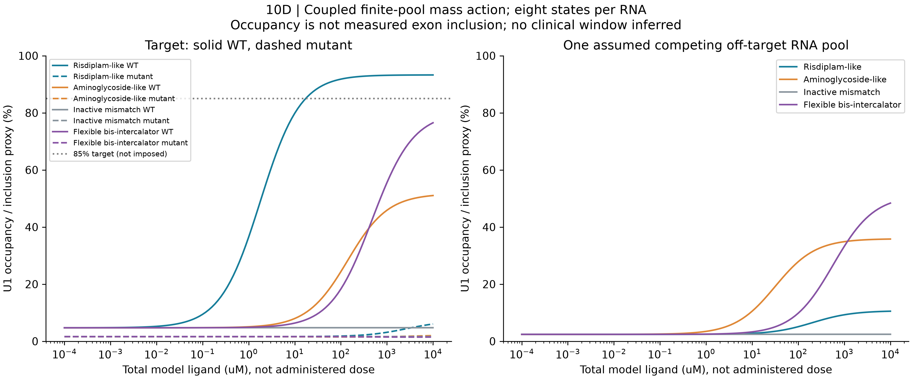

# RNA-targeted CADD and pre-mRNA splicing thermodynamics

**Executed scope:** genuine RNA secondary-structure partition functions, public atomistic NMR ensembles, four hypothetical ligand thermodynamic cycles, and finite-pool RNA–ligand–U1 equilibrium. The calculation is a reproducible research baseline. It is not a clinical digital twin or a validated prediction of risdiplam efficacy.

## 1. Scientific motivation and evidence

RNA drug discovery connects sequence-dependent folding, local recognition and larger cellular assemblies. A negatively charged groove can attract a polycation while still failing to provide sequence specificity; apparent local affinity alone does not establish therapeutic selectivity. Water displacement, counterions and conformational heterogeneity complicate an interpretation based only on static coordinates.

The public 6HMI/6HMO structures provide an experimentally grounded example: the SMN-C5 analogue associates with the RNA duplex relevant to SMN2 exon-7 recognition and stabilizes a bulged adenine. SMN-C5 and risdiplam are different compounds. We analyze the deposited coordinates; we do not assign their experimental activity to our hypothetical planar scaffold. The underlying study involved academic and Roche researchers, illustrating a relevant industry-facing problem: connect structural recognition to selective splice correction. [Campagne et al., 2019](https://doi.org/10.1038/s41589-019-0384-5), [6HMI](https://www.rcsb.org/structure/6HMI), [6HMO](https://www.rcsb.org/structure/6HMO).

The U1 complex contributes more than an isolated RNA duplex. Reconstituted single-molecule work identifies an important role for U1-C in **branaplam** modulation; that kinetic sequence is not automatically applicable to every risdiplam analogue. U1-A and U1-C must not be treated as interchangeable binding-site proteins. The present stationary equilibrium assumes an effective U1 pool and does not reconstruct protein recruitment kinetics. [White et al., 2024](https://www.nature.com/articles/s41467-024-53124-5).

## 2. Module 10A: an explicitly engineered RNA ensemble

The 26-nt sequence is `AUACUUACCUGUUCGGGAGUAAGUCU`: chain A of 6HMI with pseudouridine replaced by U, an artificial UUCG linker, and chain B. A18C is a computational sequence control. This tethered hairpin is not native SMN2 pre-mRNA and is not the same physical ensemble as the two-strand experimental duplex. Secondary and tertiary calculations therefore remain separate evidence streams.

ViennaRNA 2.7.2 runs its nearest-neighbour partition algorithm with default Turner parameters, dangles=2 and monovalent salt 0.15 M. Seven temperatures (20–60 C) and two sequence variants give 14 runs. We export the symmetric base-pair matrix, unpaired probabilities, minimum-free-energy structure and ensemble free energy. [ViennaRNA partition documentation](https://viennarna.readthedocs.io/en/latest/partfunc/global.html).

For each position, `p_unpaired(i) = 1 − Σj Pij`. Entropy includes that state:

`Hi = −Σj Pij log2(Pij) − p_unpaired(i) log2[p_unpaired(i)]`.

At 37 C the engineered WT ensemble free energy is **−4.84048 kcal/mol**, with MFE structure `..((((((((.....)).))))))..`. The highest positional entropy is **0.92540 bits**, so **no position exceeds the requested 1.2-bit threshold**. This is retained as a negative result. A thermally populated unpaired base is not necessarily a solvent-exposed, ligand-competent flipped base. Consequently the 4–7.5 kcal/mol opening interval is tested as an external hypothesis, not “extracted” from positional entropy. There is no tertiary free-energy surface or flip transition-state calculation here.

## 3. Module 10B: experimental coordinates and operational geometry

Each public structure contains 20 NMR models and 22 RNA residues. We retain pseudouridines and original atom coordinates. These NMR conformers are not equally weighted equilibrium populations and are not sequential MD frames. No arbitrary 3–10 A major-groove range is imposed.

For seven specified paired stations, a principal axis is obtained from base-pair centers. Hoogsteen-facing and sugar-facing atom centroids define local major-facing and minor-facing directions. A probe is placed 4 A beyond each face centroid, perpendicular to the axis. This operational definition is fixed across the 40 conformers. The output has **560 rows** and reports distinct descriptors:

- Nearest cross-strand phosphate **center-to-center chord** at the probe;
- Largest van der Waals free sphere **at that specified point**, with zero when occupied;
- Clearance after subtracting a 1.4 A water-probe radius;
- Projected base-edge-to-backbone depth;
- Screened phosphate potential.

These quantities are not interchangeable, and neither the chord nor local sphere diameter is a standardized Curves+/3DNA groove width or a demonstrated solvent-access path. Some probe sites are blocked; zeros are meaningful under the chosen geometry. Figure ribbons show model spread (one SD, nonnegative bound for diameters), not measurement confidence intervals. Donor/acceptor annotations identify chemical faces under standard base protonation assumptions, not proven ligand hydrogen bonds. Bulged B14 adenine ring distances and plane angles are tabulated against neighbouring and inter-strand purines; proximity is not a computed stacking free energy.

The Debye length is **8.0111 A** at the assumed 0.15 M and 310.15 K. Electrostatics treats each phosphate as −1e in uniform dielectric 78.5. Several potentials have magnitude well above `kBT/e ≈ 26.7 mV`, limiting the quantitative validity of linear Debye–Hückel theory. These are coarse electrostatic descriptors; ions, water-mediated interactions, magnesium, atom charges and dielectric boundaries require a more complete treatment.

## 4. Module 10C: binding thermodynamic cycle

Four scaffold archetypes receive explicit **assumed** stacking, hydrogen-bond, electrostatic, desolvation and entropy contributions. There is no docking, quantum-energy calculation, free-energy perturbation or fitted structure-to-affinity model. Different opening penalties refer to different ligand-competent substates, not four inconsistent values for a single universal RNA transition.

Let `q = exp(−ΔGconf/RT)`, `p_comp = q/(1+q)`, and `KO = 1 M × exp(ΔGbind,O/RT)`. If only the competent state binds, `KD,eff = KO/p_comp`. Allowing weak closed-state binding with `KC` gives the exact binary ensemble result:

`KD,eff = (1+q)/(1/KC + q/KO)`.

The alternative closed-bound route obeys `ΔGconf,bound = ΔGconf + ΔGbind,O − ΔGbind,C`. Both paths therefore have identical total free energy. An equilibrium cycle alone **cannot distinguish induced fit from conformational selection kinetically**.

| Hypothetical scaffold | Opening penalty, kcal/mol | Intrinsic binding, kcal/mol | Competent fraction | Full effective KD, uM |
|---|---:|---:|---:|---:|
| Risdiplam-like planar | 5.5 | −12 | 0.00013317 | 26.2809 |
| Aminoglycoside-like polycation | 4.0 | −9 | 0.00151622 | 283.237 |
| Inactive mismatch | 5.5 | −2 | 0.00013317 | 996727 |
| Flexible bis-intercalator | 6.5 | −10 | 0.00002629 | 2547.27 |

The mismatch model illustrates why the open-only approximation can fail: its full effective affinity is dominated by the weak closed-state channel. These values are not published affinities of named drugs.

## 5. Module 10D: finite-pool mass action, not an imposed Hill curve

For each RNA pool the states are `C, O, CL, OL, CU, OU, CLU, OLU`. With free ligand `L`, free U1 `U`, `u=U/KU`, and cooperative factor `α=exp(−ΔΔGsplice/RT)`, their unnormalized weights are:

`[1, q, L/KC, qL/KO, u, qu, Lu/KC, qL u α/KO]`.

Normalization yields state probabilities. The same α alters conditional ligand and U1 affinities, satisfying detailed balance. Two scalar root solves enforce both conserved totals across target and one off-target pool:

`Ltotal = Lfree + Σr Rr,total × Pr(ligand bound)`;

`Utotal = Ufree + Σr Rr,total × Pr(U1 bound)`.

Defaults are 2 nM target RNA, 30 nM aggregate off-target RNA, 100 nM U1, and target U1 KD 2 uM. U1 occupancy times 100 is called an **inclusion proxy**. The mapping is an unvalidated assumption; actual splicing has irreversible, ATP-dependent and kinetic steps. We do not fit a Hill slope or impose a maximum of 85%.

The equilibrium “mutant” changes opening penalty by +1.5 kcal/mol, intrinsic KD by ×10, U1 KD by ×3, and caps favorable splice coupling at −1 kcal/mol. Those are counterfactual parameters, **not derived from the A18C partition-function change**. The inactive control retains zero coupling after mutation. The off-target pool has separately assumed affinity and cooperativity.

The main grid has zero plus 121 logarithmic concentrations (0.1 nM–10 mM), four ligands and WT/mutant scenarios: **976 conditions**. Upper concentrations are numerical exploration and are not claimed physically soluble or clinically attainable. Forty opening/coupling pairs, evaluated at three concentrations, add **120 sensitivity conditions**.

| WT model | Baseline proxy | Analytic saturating proxy | Total-concentration EC50 |
|---|---:|---:|---:|
| Planar | 4.72469% | 93.27945% | 1.78816 uM |
| Polycation | 4.72469% | 51.69347% | 139.635 uM |
| Inactive | 4.72469% | 4.72469% | Not identifiable |
| Flexible | 4.72469% | 80.13613% | 473.049 uM |

Saturating occupancy uses the analytic `L → infinity` weights with finite U1 conservation. EC50 is reported only for a monotonic enhancing response that crosses half its baseline-to-asymptote change in the sampled domain. For nonmonotonic controls all detected adjacent-grid midpoint crossings and their directions are retained without assigning a misleading EC50. For example, the flexible mutant has a downward crossing near **157.672 uM** and is nonmonotonic.

Only the planar scenario meets the arbitrary combination of target proxy ≥85% and off-target increase ≤10 percentage points. Its first qualifying sampled concentration is **18.4785 uM**; qualification continues to the grid edge, so the upper boundary is **right-censored**, not a safe upper dose. Bands contain contiguous sampled points only. One generic RNA pool cannot establish global transcriptome safety or a therapeutic window. [Context-dependent splice-modulator study](https://www.nature.com/articles/s41467-024-46090-5).

## 6. Validation, limitations and development decisions

Fourteen dedicated tests check exhaustive short-sequence partition agreement, normalized BPP/entropy, modified-base structure parsing, SI screening units, both thermodynamic paths, finite ligand/U1 mass balance, zero-U1 and no-ligand limits, inactive-mutant invariance, saturation, nonmonotonic responses, disjoint selectivity bands, configuration rejection and overwrite protection. In the default run the log-partition error against five enumerated structures is **3.71 × 10−9**. Maximum main-grid ligand and U1 mass residuals are **8.67 × 10−19 M** and **2.42 × 10−20 M**. These checks validate implementation of the stated model, not its biological calibration.

Industry-relevant follow-up requires measured RNA/ligand affinity under matched salt, SHAPE/DMS or NMR constraints, splice-reporter concentration responses, protein dependence, and transcriptome-wide off-target profiles. Synthesis-specific compound identity, permeability, exposure, toxicity and formulation would then connect to other suite tasks. Longer explicit-solvent simulations and experimental restraints could test which competent substate is populated. Until those data exist, the outputs prioritize hypotheses and expose assumptions; they do not justify an efficacy claim, dosage recommendation, or publication-readiness label.

See [README](README.md) for reproduction, [sources](SOURCES.md) for parameter provenance and [verification](results/verification.json) for machine-readable checks.
