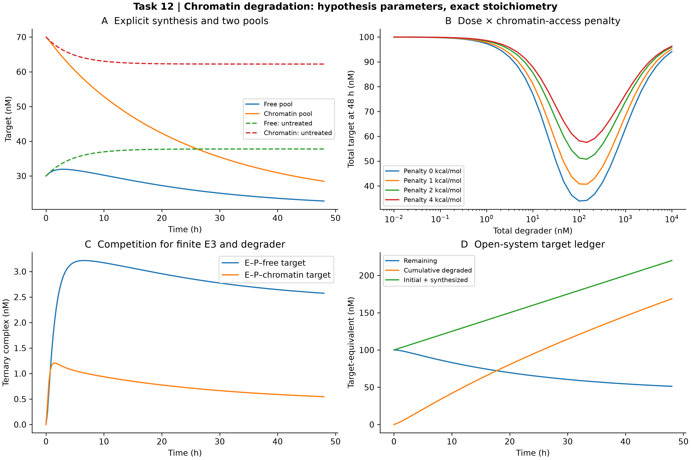

# Task 12 · Chromatin degradation / 染色质环境靶蛋白降解

**已执行有限 E3/降解剂的竞争反应网络；未实验校准。** 显式包含两类环境、九种化学物种、靶蛋白合成和损失账本。152 次剂量/罚能动力学与 152 组结合平衡；名义 100 nM 降解剂使 48 h 总靶蛋白剩余 51.2557%。环境池变化使用匹配未给药对照，避免将自发基线再分布误作药效。

[中文报告](REPORT_ZH.md) · [English report](REPORT_EN.md) · [轨迹](outputs/trajectories.csv) · [剂量网格](outputs/dose_penalty_grid.csv) · [结合平衡](outputs/binding_equilibria.csv) · [参数](outputs/config.json) · [核验](outputs/verification.json) · [一手来源](sources.md) · [返回项目目录](../README.md)



从仓库根目录运行；输出目录必须尚不存在：

```bash
python projects/task12_chromatin/driver.py --out work/task12_reproduction
python -m unittest discover -s tests -p test_advanced_11_14.py
```

依赖 NumPy、SciPy、Matplotlib；CPU 即可。Python 接口 `run(out: Path) -> dict` 生成所有数值和 300 DPI 四面板图。`simulate` 可改变总剂量、染色质罚能与催化降解速率，`equilibrium` 独立求解精确结合平衡。没有实际核小体结构、占据实验或原子级解耦能，不将假设罚能描述为实验参数。
