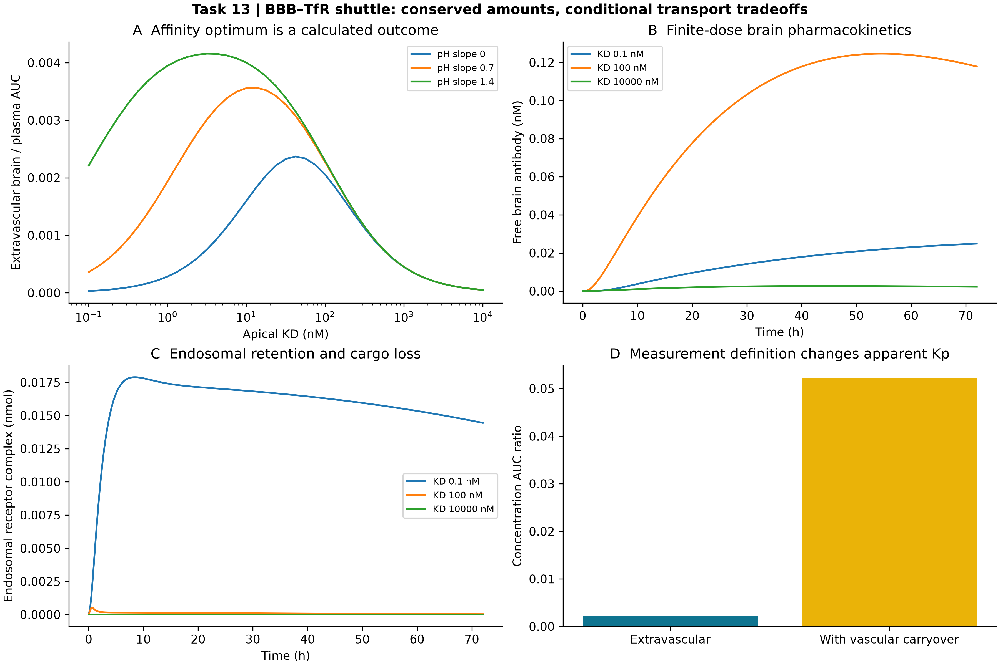

# Task 13 · BBB–TfR brain shuttle / 血脑屏障受体转运

**已执行有限抗体/受体及清除账本；未实验校准。** 内吞、pH 依赖解离、循环、溶酶体降解和脑释放共同决定暴露。328 次敏感性 ODE；名义 0–72 h 血管外 Kp=0.00227242，网格最优 KD=13.3352 nM，保留其偏离指定 50–500 nM 窗口的结果。混入血管抗体后表观 Kp=0.0522724，展示测量定义的影响。

[中文报告](REPORT_ZH.md) · [English report](REPORT_EN.md) · [轨迹](outputs/trajectories.csv) · [敏感性网格](outputs/affinity_sensitivity.csv) · [参数](outputs/config.json) · [核验](outputs/verification.json) · [一手来源](sources.md) · [返回项目目录](../README.md)



从仓库根目录运行；输出目录必须尚不存在：

```bash
python projects/task13_bbb_tfr/driver.py --out work/task13_reproduction
python -m unittest discover -s tests -p test_advanced_11_14.py
```

仅需 NumPy、SciPy、Matplotlib。Python 接口 `run(out: Path) -> dict`；`simulate` 支持亲和力、初浓度、pH 斜率、受体量和内吞速率扰动。当前没有转铁蛋白竞争、脑靶点结合、受体下调或临床校准，不能据此制定人体剂量或宣称普适最佳亲和力。
