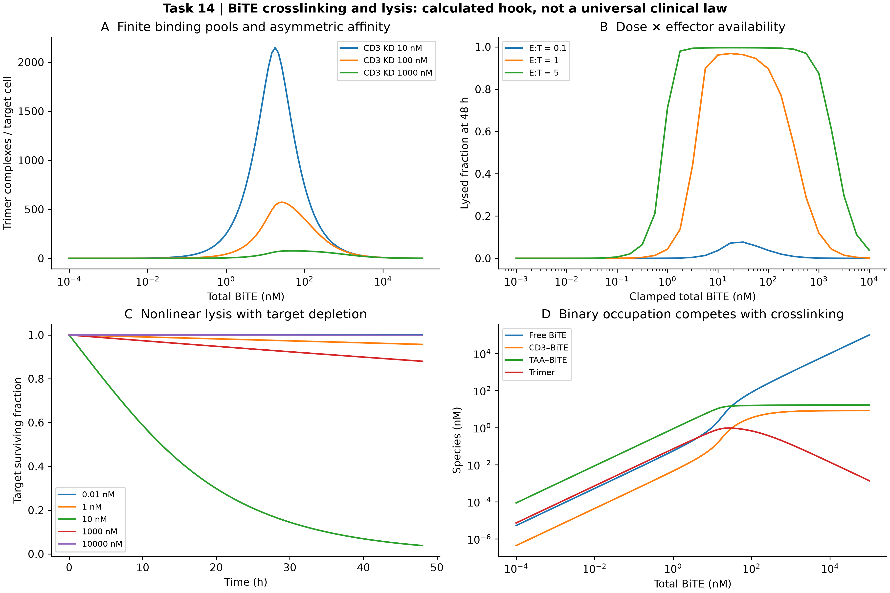

# Task 14 · BiTE crosslinking / T 细胞接合器交联与裂解

**已执行三体有限总量平衡与细胞损失账本；未实验校准。** 981 个结合平衡点和 270 次裂解 ODE。名义交联峰位于总 BiTE=26.1016 nM，每靶细胞 572.752 个分子三元复合物。高剂量 hook 是该模型的计算结果，不是所有 TCE 的临床普适规律。有效接触体积和可及受体拷贝数均明示为假设。

[中文报告](REPORT_ZH.md) · [English report](REPORT_EN.md) · [结合平衡](outputs/binding_grid.csv) · [裂解网格](outputs/lysis_grid.csv) · [时间轨迹](outputs/trajectories.csv) · [参数](outputs/config.json) · [核验](outputs/verification.json) · [一手来源](sources.md) · [返回项目目录](../README.md)



从仓库根目录运行；输出目录必须尚不存在：

```bash
python projects/task14_bite/driver.py --out work/task14_reproduction
python -m unittest discover -s tests -p test_advanced_11_14.py
```

依赖 NumPy、SciPy、Matplotlib，使用 CPU。Python 接口 `run(out: Path) -> dict` 生成原始数据和 300 DPI 四面板图。`equilibrium` 支持任意非负物料总量、正解离常数和非负协同性；`simulate` 支持暴露、E:T、TAA 表达和亲和力扰动。暴露由外部维持，无药代、耗竭或细胞因子毒性，分子交联数也不等同于完整免疫突触数。
