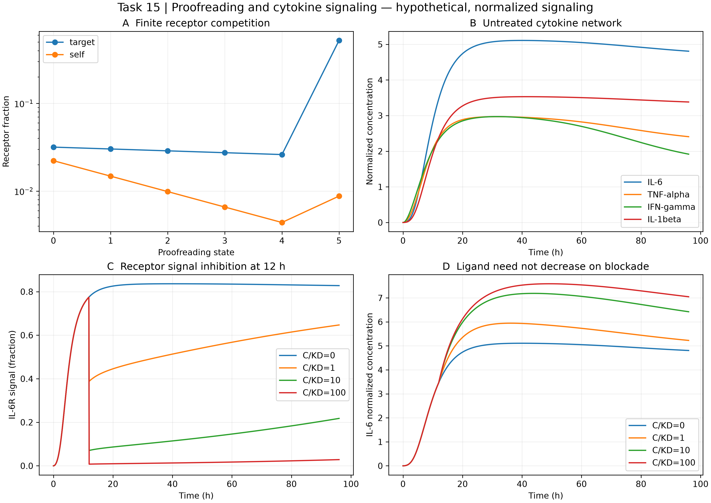

# Task 15 · Engineered receptor proofreading and cytokine modulation

五步动力学校对、有限受体竞争、T细胞/巨噬细胞与IL6/TNF/IFN/IL1网络。已执行本机计算；拮抗剂抑制IL6R信号，但不保证IL6配体浓度下降，也不据此宣称恢复稳态。

| Entry | Location |
|---|---|
| Reproducible program | [driver.py](driver.py) |
| Technical reports | [中文](REPORT_ZH.md) · [English](REPORT_EN.md) |
| Evidence and all biological assumptions | [sources.md](sources.md) |
| Executed parameters / results / checks | [config](outputs/config.json) · [summary](outputs/summary.json) · [verification](outputs/verification.json) |
| Data | [cytokine trajectories](outputs/cytokine_trajectories.csv) · [proofreading sensitivity](outputs/proofreading_sensitivity.csv) |

From repository root, using Python with NumPy, SciPy and Matplotlib:

```powershell
python projects/task15_receptor_signaling/driver.py --out work/task15_reproduction
```

The output directory must be new. All calculations use one process; thread counts can be bounded through `OMP_NUM_THREADS=1`, `OPENBLAS_NUM_THREADS=1`, and `MKL_NUM_THREADS=1`. No network access or experiment data is needed during reproduction.


