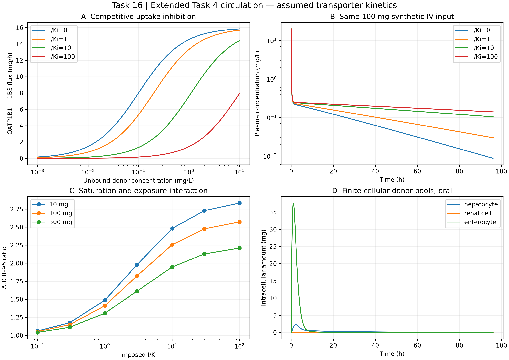

# Task 16 · OATP / P-gp / BCRP transport in existing PBPK

实际扩展任务4循环，引入有限肝/肾/肠细胞药量、竞争性摄取和饱和外排，移除旧肝清除避免重复计数。已执行静脉/口服DDI与剂量敏感性；所有转运体参数均为假设。

| Entry | Location |
|---|---|
| Reproducible program | [driver.py](driver.py) |
| Technical reports | [中文](REPORT_ZH.md) · [English](REPORT_EN.md) |
| Evidence / assumptions | [sources.md](sources.md) |
| Parameters / results / checks | [config](outputs/config.json) · [summary](outputs/summary.json) · [verification](outputs/verification.json) |
| Data | [PBPK trajectories](outputs/pbpk_transporter_trajectories.csv) · [dose/inhibition scan](outputs/dose_inhibition_sensitivity.csv) |
| Reused circulation | [Task 4](../task04_pbpk/README.md) |

From repository root:

```powershell
python projects/task16_transporters/driver.py --out work/task16_reproduction
```

Requires NumPy, SciPy and Matplotlib plus the existing Task 4 module. Output must be a new directory. AUCR is truncated at 96 h; high-inhibition scenarios retain substantial drug at the horizon and are not AUC0–infinity predictions.


