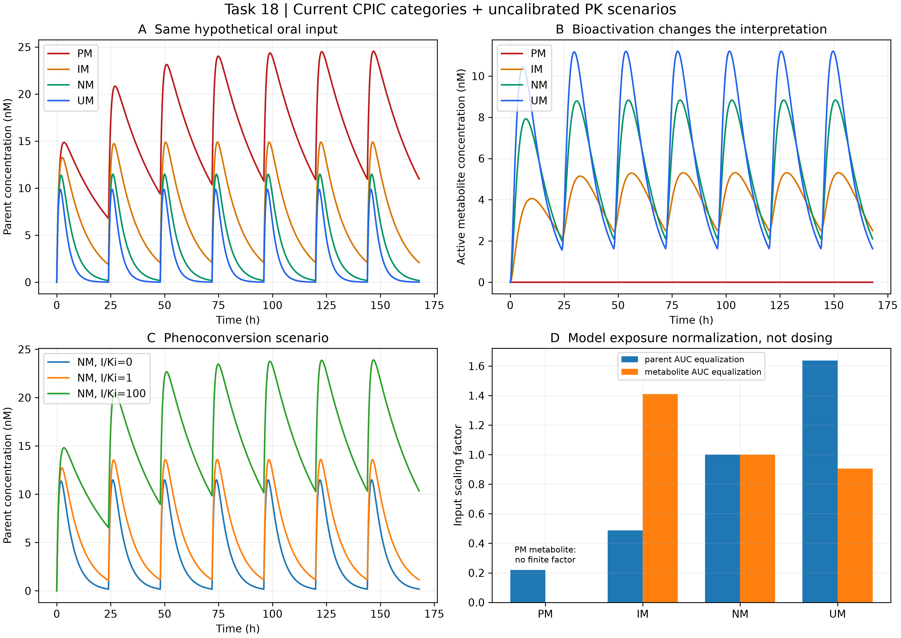

# Task 18 · Pharmacogenomic translation and parent/metabolite exposure

采用当前CPIC CYP2D6分界及独立CYP2C19规则。已执行九组基因型、三种抑制条件的假想母药/活性代谢物PK。活性评分不是通用线性清除率；计算不输出临床给药方案。

| Entry | Location |
|---|---|
| Reproducible program | [driver.py](driver.py) |
| Technical reports | [中文](REPORT_ZH.md) · [English](REPORT_EN.md) |
| CPIC evidence / assumed PK factors | [sources.md](sources.md) |
| Parameters / results / checks | [config](outputs/config.json) · [summary](outputs/summary.json) · [verification](outputs/verification.json) |
| Data | [genotype translation](outputs/genotype_translation.csv) · [trajectories](outputs/parent_metabolite_trajectories.csv) · [exposure normalization](outputs/exposure_normalization_factors.csv) · [sensitivity](outputs/enzyme_fraction_sensitivity.csv) |

From repository root:

```powershell
python projects/task18_pgx/driver.py --out work/task18_reproduction
```

Requires NumPy, SciPy and Matplotlib; output must be new. Unknown alleles return indeterminate. The output factors only equalize one model AUC under its assumed linearity; zero bioactivation has no finite factor. Fatal toxicity, therapeutic adequacy and patient dose recommendations are not estimated.


