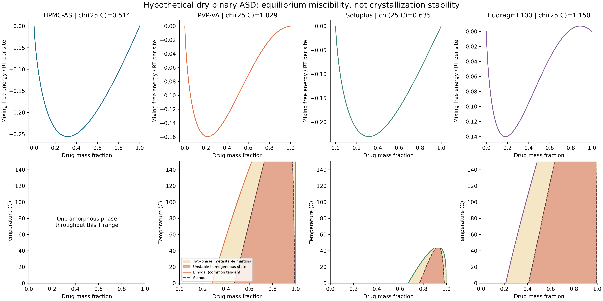
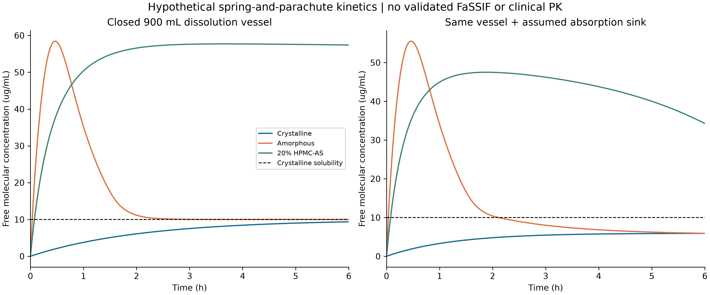
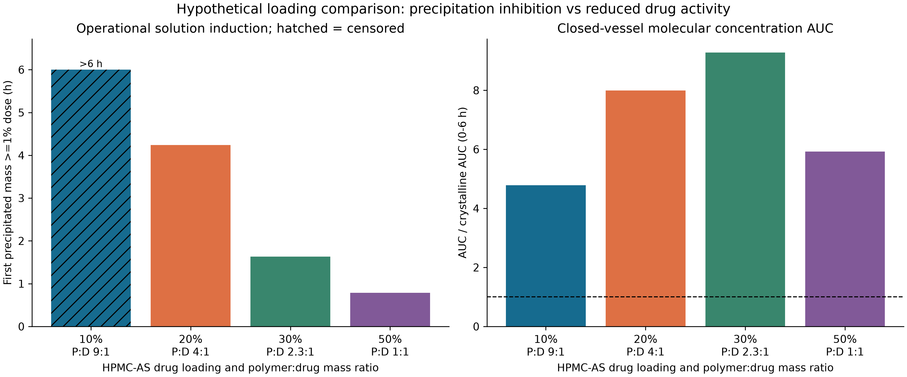

# 任务六：无定形固体分散体的热力学、玻璃化与过饱和动力学

计算日期：2026-09-20。证据类型：**公开来源支持方法及部分物性，其余为明确标注的假设参数；本机实际执行确定性计算。** 本任务没有实验原始数据，没有对具体药物进行参数拟合，也没有临床暴露验证。

## 1. 结论与交付范围

完成了 4 种载体 × 81 个温度点的干燥二元相图、4 种载体 × 4 种载药量 × 2 个储存条件的玻璃化/迁移率情景，以及 69 次有限剂量 ODE 积分。输出 4 张 300 dpi 图片、逐时质量轨迹、27 组配对敏感性结果和 14 项物理/数值测试。

在本组假设下，20% HPMC-AS 处方的闭合溶出杯 AUC 为 0.319124 mg·h/mL，是晶态基线的 7.997 倍；加入假设吸收汇后，6 小时吸收质量比为 8.795。**这些是模拟比例，不是人体生物利用度提高倍数。** 30% HPMC-AS 的闭合杯 AUC 更高，说明预设 20% 处方不能被称为已优化处方。

用户提示词中的“超过 70% 候选药物均属于 BCS II/IV”没有在本任务中被验证为适用所有研发管线的统计事实。BCS 分类同时取决于溶解度和渗透性，不能由高脂溶性单独推出。此处使用“难溶候选药物存在处方开发需求”的定性背景，不据此构造规模或成功率数据。

## 2. 参数来源与研究对象

模型药物是一个**假设中性 API**：分子量 390 g/mol、密度 1.30 g/cm³、摩尔体积 300 cm³/mol、干燥 Tg 45°C、晶态溶解度 0.01 mg/mL、无定形/晶态溶解度比 10。其 Hansen 参数为 (20, 9, 10) MPa^0.5。这些值不是任何已批准药物的数据。

| 载体情景 | Hansen 参数，MPa^0.5 | 密度，g/cm³ | 有效链段数 Np | 干燥 Tg，°C | 数值证据 |
|---|---|---:|---:|---:|---|
| HPMC-AS | 18.5, 11, 12 | 1.20 | 100 | 122 | Tg 来自生产商典型值；其他值为假设 |
| PVP-VA | 18, 12, 7 | 1.18 | 80 | 101 | Tg 来自生产商典型值；其他值为假设 |
| Soluplus | 18, 8, 8 | 1.10 | 120 | 70 | 全部数值为情景假设 |
| Eudragit L100 | 17.5, 12, 8 | 1.25 | 150 | 195 | 全部数值为情景假设 |

Shin-Etsu 资料中的 122°C 是指定 DSC 条件下的典型值；HPMCAS 不同取代等级的溶解 pH 也不同，不能据此认定任意批次、含水量或加工史均有相同 Tg。[Shin-Etsu 原始产品资料](https://www.setylose.com/fileadmin/download_pfmd/49.pdf)。Copovidone 的 101°C 来源为 BASF 技术资料第 13 页；同一资料说明其 ASD 应用和吸湿相关限制。[BASF 原始技术资料](https://download.basf.com/p1/EN_StaticDocuments_6145/en/Technical_Information_Technical_Information_English.pdf)。

Soluplus 的产品身份与增溶/基质用途由生产商页面核实，页面未支持本模型使用的全部数值。[BASF Soluplus](https://pharmaceutical.basf.com/global/en/pharma-solutions/products/soluplus)。Eudragit L100 的公开产品信息支持 pH 6.0 以上释放的用途；本模型的 Tg、密度与 Hansen 参数仍是独立假设。[Evonik EUDRAGIT L100](https://www.evonik.com/en/products/hc/pr_52000884.html)。

氢键供受体互补可能帮助稳定药物–聚合物相互作用，但不能从一个 Hansen 距离直接证明氢键数量、方向、强度或具体处方优劣。四个载体名称在这里代表可复现的情景标签；需要实测 DSC、DVS、水活度、溶解度与相分离边界后才能比较真实材料。

## 3. 模块 6A：真正的共切线相平衡

Flory–Huggins 使用的是体积分数。先通过密度把载药质量分数 w 转换为：

\[
\phi_d=\frac{w_d/\rho_d}{w_d/\rho_d+(1-w_d)/\rho_p}.
\]

采用用户指定的 Hansen 加权形式：

\[
\chi(T)=\frac{V_d}{RT}\{(\Delta\delta_D)^2+0.25(\Delta\delta_P)^2+0.25(\Delta\delta_H)^2\}.
\]

这里 MPa×cm³=J，Vd 用 cm³/mol、R 用 J/(mol·K)，所以 χ 无量纲。它是受假设参数限制的近似相互作用模型，不包含额外的熵项、特定氢键平衡或 χ 的组成依赖。真实药物体系中存在显著的温度/组成依赖，需要实验确定。[原始研究：χ 的温度与组成依赖](https://pubmed.ncbi.nlm.nih.gov/31430958/)。

自由能 f=ΔGmix/(RT) 按**每参考晶格位点**归一化，Nd=1、Np 为所列有效链段数。spinodal 满足 f''=1/(Ndφ)+1/[Np(1−φ)]−2χ=0。临界值 χc=0.5(1/√Nd+1/√Np)²；当 Np=100 时，临界药物体积分数约 0.909，而不是 0.091。

binodal 通过两相化学势同时相等求解，等价于自由能的共切线条件。算法在 logit(φ) 坐标求解，保证两个根位于 spinodal 外側；不把 spinodal 当 binodal。亚临界 χ 输出 `two_phase=false` 和空边界。用数值残差及自由能低凸包关系验证，全部相图网格的最大共切线残差为 **6.07×10⁻¹¹**。极接近纯药物的相组成可能在导出双精度质量分数中舍入为 1，内部化学势用稳定对数计算。

25°C 的 χ 情景值分别为 HPMC-AS 0.514、PVP-VA 1.029、Soluplus 0.635、Eudragit L100 1.150。在 0–150°C 网格中有 186/324 行具有两相区。图 1 的 binodal 内侧是两相共存平衡区；binodal 与 spinodal 之间的均匀态为亚稳，spinodal 内侧均匀态不稳定。外侧为单一无定形相稳定区。**这不是晶体–无定形平衡图**；没有建模晶体化学势、晶种或加工动力学，因此“无 AAPS”不等于“不会结晶”。已有特定药物/共聚物热分析研究展示了相图模型与实验结合的路线，而不是允许所有载体共用一组未拟合参数。[原始研究：热相图预测](https://pubmed.ncbi.nlm.nih.gov/21416468/)。



## 4. 模块 6B：温度、湿度与迁移率边界

二元 Gordon–Taylor 计算全部使用 Kelvin，K≈ρdTgd/(ρpTgp)。RH 不是含水质量分数；模型另外假设干基吸湿等温线 q=a·RH/(1−0.5RH)，a 为药物与载体按干质量加权的系数，再用 ww=q/(1+q) 转换湿基水分。第二次 Gordon–Taylor 混合使用假设水 Tg=136 K、Kwater=5。它是顺序近似，不是完整三元相平衡，也没有获得实际 DVS 数据。

20% HPMC-AS 在 25°C/60%RH 下假设含水量 1.136%，Tg 91.70°C；在 40°C/75%RH 下为 1.583%，Tg 86.84°C。Tg−Tstorage<30 K 仅用作图示风险筛查阈值，不能充当产品稳定性放行标准。

VFT 设置 τ0=10⁻¹⁴ s，T0=Tg−50 K，并用 τ(Tg)=100 s 锚定曲线；这两个锚点及 tind/τ=10⁶ 均为假设。只在 T>T0 的数学域内计算 log10τ 与 log10tind，32 行中 **12 行位于域外，输出空值**。域内某些外推数值同样极大，例如可达 log10小时数百；保留对数是为了展示参数敏感和外推失效，绝不将其解读为可实现的储存寿命。当前没有经过介电谱、量热松弛或等温结晶数据标定的 VFT 曲线，因此**所有行均不能给出已验证的货架期**。


## 5. 模块 6C：质量守恒的有限剂量“弹簧–降落伞”

100 mg 药物置于 900 mL、37°C、名义 pH 6.8 的假设介质。晶态饱和容量为 9 mg，小于剂量，满足非漏槽情景。没有指定胆盐/磷脂浓度、离子强度或实测结合分配，故不能称为验证过的 FaSSIF 实验；pH 不进入本中性假设 API 的电离平衡。

状态变量为未溶固体 U、分子溶解药物 L、析出晶体 X、吸收汇 A，以及不直接携带药物质量的有效生长位点变量 z。浓度 C=L/V，守恒式：

\[
\dot U=-J_d,\quad \dot L=J_d-J_p+J_r-J_a,\quad
\dot X=J_p-J_r,\quad \dot A=J_a,\quad U+L+X+A=100\ {\rm mg}.
\]

Noyes–Whitney 的质量通量 Jd=(D/h)S0(U/U0)^(2/3)(Csource−C)+；若直接写浓度变化，必须再除以 V。代码以质量积分，避免遗漏 900 mL 体积因子。析出晶体在欠饱和时按晶态溶解度重新溶解。面积、扩散层、粒子形貌缩放均为假设，没有搅拌或真实粒径分布拟合。

纯无定形源溶解度为 Ccrys·exp(ΔGcrys/RT)，本情景 ΔGcrys=RT ln10。均匀 HPMC-AS 的源溶解度还乘以由干燥 FH 药物化学势得到的活度；20% 下 a=0.58089、Csource=0.058089 mg/mL。该耦合反映“聚合物抑制结晶的同时也可能降低药物化学势”，没有强迫所有 ASD 比纯无定形具有更高峰值。[原始研究：Tailoring supersaturation](https://pmc.ncbi.nlm.nih.gov/articles/PMC5972073/)。

经典均匀成核的无量纲势垒正确写为：

\[
\frac{\Delta G^*}{k_BT}=\frac{16\pi\gamma^3v^2}{3(k_BT)^3(\ln S)^2},\quad v=V_m/N_A,\ S=C/C_{crys}>1.
\]

S≤1 时关闭成核。表面能 γ 的单位为 J/m²，分子体积 v 为 m³；不能把未定义量直接放入不一致量纲的指数。z 的生成率含 exp(−ΔG*/kBT)，晶体增长与 z、过饱和度及聚合物抑制项耦合。z 是现象学激活变量，不是经粒度分布标定的晶核个数；晶核质量相对总剂量被忽略。聚合物浓度按总加入量/体积设为常量，意味着快速释放抑制剂的近似，未模拟聚合物溶解、胶束结合或表面覆盖动力学。

“诱导时间”定义为首次 X≥1% 剂量的时刻，是可复现的操作性指标，并非第一个分子晶核的出现时间。6 小时未越过阈值的结果为右删失，不写成无穷大或真实 6 小时。

| 闭合溶出杯处方 | Cmax，µg/mL | AUC0–6h，mg·h/mL | 首次析出 1 mg，h | S>1.05 的累计时间，h |
|---|---:|---:|---:|---:|
| 微粉化晶态 | 9.369 | 0.039904 | >6，删失 | 0 |
| 纯无定形 | 58.446 | 0.104538 | 0.296 | 2.186 |
| 20% HPMC-AS | 57.707 | 0.319124 | 4.242 | 5.921 |

这组参数自然产生了超过 4 小时的过饱和，但该时长不是实验发现，也不是所有药物/介质的保证。对参数进行扰动后结果会改变。图 3 并列展示闭合杯与加入吸收汇的两种系统，避免把吸收消耗误写成体外溶出本身。



## 6. 模块 6D：处方比较与转化限制

吸收汇仅假设 Ja=kaL、ka=0.30 h⁻¹，没有人体肠面积、有效渗透率、分段转运、肠道时间、首过代谢或系统清除。晶态、纯无定形、20% HPMC-AS 的 6 小时吸收质量分别为 7.691、24.438、67.640 mg。ERabs 是同一模型、同一剂量下的**吸收汇质量比**。在恒定 ka 和 V 下，A=kaV∫Cdt，因此吸收汇结果与对应吸收系统中的 AUC 不是独立验证证据；闭合杯 AUC 又属于不同系统。

HPMC-AS 的 10%、20%、30%、50% 载药量比较得到 AUC 分别为 0.190907、0.319124、0.370222、0.236468 mg·h/mL；阈值诱导时间分别为 >6（右删失）、4.242、1.633、0.785 h。增加聚合物一方面延缓析晶，另一方面降低药物活度；本情景 30% 的 AUC 高于 20%，不存在支持“20% 最优”的证据。没有同时优化制剂质量、剂量体积、加工温度、贮藏性和成本。

27 组敏感性采用 γ×{0.8,1,1.2}、成核系数×{0.1,1,10}、吸收系数×{0.5,1,2}，每一组都有相同吸收系数的晶态对照，共 54 次积分。所得 ERabs 范围 **5.961–8.803**。这只是规定网格的情景范围，**不是统计置信区间**，也未覆盖全部参数不确定性。



要向临床转化，需要区分游离分子、胶束增溶药物及胶体颗粒；总浓度增加并不必然产生同等跨膜通量。本脚本只有单一分子态浓度，未声称解决这些分配过程。需要建立物性–溶出/渗透联合实验–吸收模型–体内 PK 的连接后，才能讨论临床暴露增益。

建议的实验交接为：明确 API/晶型/聚合物等级；用 DSC/XRPD 和 DVS 验证相态与含水量；在成分确定的介质中测自由药物、总浓度、析晶和粒径；跨浓度测成核/生长，进行共同拟合并保留外部验证集；用渗透/PK 数据标定吸收和首过环节。公开计算结果可以支持这些实验的设计，不能替代它们。

## 7. 可复现性与验收

代码：[完整驱动脚本](run_task6_asd_formulation_supersaturation_kinetics.py)。输入：[parameters.json](inputs/parameters.json)、[sources.json](inputs/sources.json)。结果：[summary.json](results/summary.json)、[相边界](results/phase_boundaries.csv)、[储存情景](results/storage_scenarios.csv)、[完整质量轨迹](results/concentration_mass_timeseries.csv)、[处方结果](results/formulation_summary.csv)、[载药量结果](results/loading_summary.csv)、[敏感性](results/sensitivity_27_scenarios.csv)、[求解器精化](results/solver_refinement.csv)。

在仓库根目录运行：

```bash
python task6_asd/run_task6_asd_formulation_supersaturation_kinetics.py --self-test
python task6_asd/run_task6_asd_formulation_supersaturation_kinetics.py --out work/task6_reproduction
```

输出路径必须不存在，防止覆盖证据。驱动脚本包含默认输入，运行不联网、不下载模型。`--write-example work/task6_parameters.json` 可导出可编辑输入，`--config work/task6_parameters.json --out work/task6_custom` 可实际读回全部参数，并验证结构、单位相关物性约束和固定实验设计。Nd=1 被显式强制，避免接受但忽略链段值；四种载体、载药量网格和终点定义保持任务约定。用户更改物性后须重新评估均匀 ASD 假设；当前默认 20% HPMC-AS 在干燥 FH 模型中位于单相区域。VFT 域外只表示公式不可用，并不表示材料不稳定。种子 20260920 被记录但未使用，因为所有网格与积分均为确定性。`manifest.json` 保存脚本 SHA256、依赖版本及生成文件哈希；报告不是由脚本自动生成的实验记录，另由仓库版本管理。

执行环境：Python/NumPy/SciPy/Matplotlib 的实际版本见 [manifest](manifest.json)。69 次积分包含 6 次基准、3 次额外载药量、54 次敏感性配对以及 6 次更严格容差复算。最大质量误差 **1.28×10⁻¹³ mg**；浮点/ODE 边界可出现约 10⁻⁹ mg 的微小负值，未将原始状态偷偷截断为实验量。六个基准轨迹在容差缩小 10 倍、最大步长缩小 √10 倍后，最大浓度差 **5.37×10⁻¹⁰ mg/mL**。14 项测试包括共切线/凸包、临界组成方向、χ 与 CNT 量纲、RH 转换、VFT 极点、有限剂量守恒、欠饱和晶态行为、吸收积分及体积因子。四张图均以 300 dpi 输出并逐张视觉检查。上述验收证明实现按既定方程运行，**不证明材料参数、货架期或临床效果正确**。
